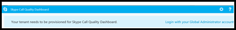
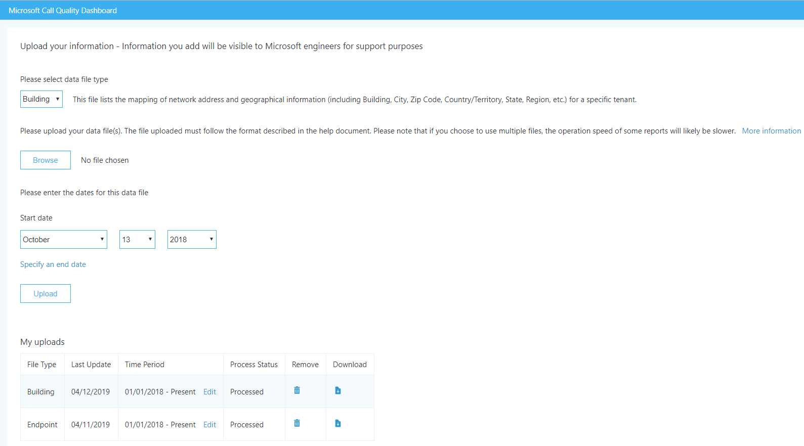
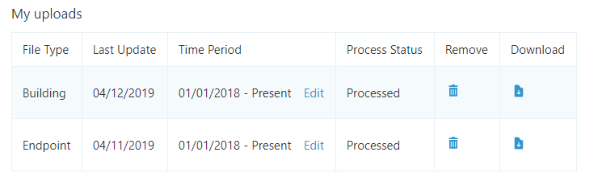

# <a name="turn-on-and-use-call-quality-dashboard-for-microsoft-teams-and-skype-for-business-online"></a><span data-ttu-id="8ddc1-103">Microsoft 팀 및 비즈니스용 Skype Online에 대 한 통화 품질 대시보드 켜기 및 사용</span><span class="sxs-lookup"><span data-stu-id="8ddc1-103">Turn on and use Call Quality Dashboard for Microsoft Teams and Skype for Business Online</span></span>

<span data-ttu-id="8ddc1-104">통화 품질 대시보드를 사용 하 여 통화 품질을 모니터링 하도록 Office 365 조직을 구성 하는 방법을 알아봅니다.</span><span class="sxs-lookup"><span data-stu-id="8ddc1-104">Learn how to configure your Office 365 organization to use the Call Quality Dashboard to monitor call quality.</span></span>
  
<span data-ttu-id="8ddc1-105">CQD (통화 품질 대시보드)는 Microsoft 팀과 비즈니스용 Skype Online 서비스를 사용 하 여 발생 하는 통화의 품질에 대 한 통찰력을 제공 합니다.</span><span class="sxs-lookup"><span data-stu-id="8ddc1-105">Call Quality Dashboard (CQD) provides insight into the quality of calls made using Microsoft Teams and Skype for Business Online services.</span></span> <span data-ttu-id="8ddc1-106">이 항목에서는 통화 품질 문제를 해결 하는 데 사용할 수 있는 데이터 수집을 시작 하는 단계에 대해 설명 합니다.</span><span class="sxs-lookup"><span data-stu-id="8ddc1-106">This topic describes the steps to start collecting data you can use to troubleshoot call quality issues.</span></span>

<span data-ttu-id="8ddc1-107">현재 CQD 버전 3과 CQD 버전 2는 둘 다 사용할 수 있습니다.</span><span class="sxs-lookup"><span data-stu-id="8ddc1-107">Currently, CQD version 3 and CQD version 2 are both available for use.</span></span> <span data-ttu-id="8ddc1-108">CQD v3은에서 <span>https://cqd.teams.microsoft.com</span>사용할 수 있습니다.</span><span class="sxs-lookup"><span data-stu-id="8ddc1-108">CQD v3 is available at <span>https://cqd.teams.microsoft.com</span>.</span></span> <span data-ttu-id="8ddc1-109">Microsoft 팀 관리자 자격 증명을 사용 하 여 로그인 합니다.</span><span class="sxs-lookup"><span data-stu-id="8ddc1-109">Log in with your Microsoft Teams administrator credentials.</span></span>

## <a name="latest-changes-and-updates"></a><span data-ttu-id="8ddc1-110">최신 변경 및 업데이트</span><span class="sxs-lookup"><span data-stu-id="8ddc1-110">Latest changes and updates</span></span>

<span data-ttu-id="8ddc1-111">CQD 버전 3은 거의 실시간 CQD 대시보드 (지연 시간은 30 분)를 제공 하 고, EUII (최종 사용자 식별 가능 정보)를 사용 하 여 관리자에 게 사용자 수준 확대 기능을 제공 합니다.</span><span class="sxs-lookup"><span data-stu-id="8ddc1-111">CQD version 3 delivers a near real-time CQD dashboard (latency close to 30 minutes), and uses End User Identifiable Information (EUII), giving admins the ability to zoom in to the user level.</span></span> <span data-ttu-id="8ddc1-112">또한 다음과 같은 새로운 시나리오를 지원 하기 위해 대화형 작업이 보고 됩니다.</span><span class="sxs-lookup"><span data-stu-id="8ddc1-112">There is also and report interactivity to support new scenarios such as:</span></span>

- <span data-ttu-id="8ddc1-113">지역별 통화 음질:</span><span class="sxs-lookup"><span data-stu-id="8ddc1-113">Call Quality by Region:</span></span>
  - <span data-ttu-id="8ddc1-114">국가별 날짜</span><span class="sxs-lookup"><span data-stu-id="8ddc1-114">date-by-region</span></span>
  - <span data-ttu-id="8ddc1-115">시간별로 집계-지역별</span><span class="sxs-lookup"><span data-stu-id="8ddc1-115">aggregated down to hour-by-region</span></span>
  - <span data-ttu-id="8ddc1-116">특정 위치</span><span class="sxs-lookup"><span data-stu-id="8ddc1-116">specific locations</span></span>
  - <span data-ttu-id="8ddc1-117">특정 서브넷</span><span class="sxs-lookup"><span data-stu-id="8ddc1-117">specific subnet</span></span>
  - <span data-ttu-id="8ddc1-118">영향을 받는 사용자 또는 사용자</span><span class="sxs-lookup"><span data-stu-id="8ddc1-118">impacted user or users</span></span>

- <span data-ttu-id="8ddc1-119">지역에의 한 호출 안정성/실패:</span><span class="sxs-lookup"><span data-stu-id="8ddc1-119">Call Reliability/Failure by Region:</span></span>
  - <span data-ttu-id="8ddc1-120">국가별 날짜</span><span class="sxs-lookup"><span data-stu-id="8ddc1-120">date-by-region</span></span>
  - <span data-ttu-id="8ddc1-121">시간별로 집계-지역별</span><span class="sxs-lookup"><span data-stu-id="8ddc1-121">aggregated down to hour-by-region</span></span>
  - <span data-ttu-id="8ddc1-122">특정 위치</span><span class="sxs-lookup"><span data-stu-id="8ddc1-122">specific locations</span></span>
  - <span data-ttu-id="8ddc1-123">특정 서브넷</span><span class="sxs-lookup"><span data-stu-id="8ddc1-123">specific subnet</span></span>
  - <span data-ttu-id="8ddc1-124">영향을 받는 사용자 또는 사용자</span><span class="sxs-lookup"><span data-stu-id="8ddc1-124">impacted user or users</span></span>

- <span data-ttu-id="8ddc1-125">지역에 따라 내 통화 (RMC) 평가: 지역 별 집계에서 낮은 RMC 등급을 제공 하는 사용자에 게 특정 위치로 내림 합니다.</span><span class="sxs-lookup"><span data-stu-id="8ddc1-125">Rate My Call (RMC) by Region: from month-by-region aggregated down to specific locations to users who provide low RMC ratings.</span></span> <span data-ttu-id="8ddc1-126">CQD v3에는 약어 피드백도 포함 됩니다.</span><span class="sxs-lookup"><span data-stu-id="8ddc1-126">CQD v3 also includes verbatim feedback.</span></span>
- <span data-ttu-id="8ddc1-127">헬프데스크: P2P 통화 또는 모임에서 특정 사용자가 사용할 수 있으며, 모든 참가자 및 통화 내역에 대 한 정보를 제공 합니다.</span><span class="sxs-lookup"><span data-stu-id="8ddc1-127">Helpdesk: available for a specific user on P2P calls or Meetings, or for all participants and call details.</span></span> <span data-ttu-id="8ddc1-128">네트워크 위치, 장치 또는 펌웨어를 기반으로 하는 시스템 문제를 식별 하는 데 도움이 됩니다.</span><span class="sxs-lookup"><span data-stu-id="8ddc1-128">Helps identify possible system issues based on network location, devices, or firmware.</span></span>  
- <span data-ttu-id="8ddc1-129">클라이언트 버전: 세션 및 사용자를 각 클라이언트 버전에 대해 계산 하거나 각 클라이언트 버전에 대 한 사용자 이름 드릴 다운을 봅니다.</span><span class="sxs-lookup"><span data-stu-id="8ddc1-129">Client Versions: View the Session and Users counts for each Client Version, or drill down to User names for each client version.</span></span> <span data-ttu-id="8ddc1-130">제품 및 클라이언트 종류에 대 한 미리 작성 된 필터는 특정 클라이언트에 버전을 집중 하는 데 도움이 됩니다.</span><span class="sxs-lookup"><span data-stu-id="8ddc1-130">Pre-built filters for Product and Client Type help focus the versions to specific clients.</span></span>
- <span data-ttu-id="8ddc1-131">끝점: PC/Mac의 Make/Model에 매핑된 기계 끝점을 표시 합니다.</span><span class="sxs-lookup"><span data-stu-id="8ddc1-131">Endpoints: Shows Machine Endpoints mapped to Make/Model of the PC/Mac.</span></span> <span data-ttu-id="8ddc1-132">만들기/모델 별로 집계 된 품질을 표시 합니다.</span><span class="sxs-lookup"><span data-stu-id="8ddc1-132">Shows aggregated quality by Make/Model.</span></span> <span data-ttu-id="8ddc1-133">매핑 데이터는 데이터 구축과 유사 하 게 업로드 됩니다.</span><span class="sxs-lookup"><span data-stu-id="8ddc1-133">Mapping data is uploaded similar to Building data.</span></span>

<span data-ttu-id="8ddc1-134">또한 버전 3에서는 EUII 액세스를 사용할 수 없는 경우에 RBAC 지원도 제공 합니다.</span><span class="sxs-lookup"><span data-stu-id="8ddc1-134">Version 3 also provides RBAC support, in case EUII access is not available.</span></span>  

<span data-ttu-id="8ddc1-135">관리자는 CQD 버전 3을 통해 비즈니스용 skype 서버 2019 (비즈니스용 Skype Online 및 Microsoft 팀만 해당)을 관리할 수 있습니다.</span><span class="sxs-lookup"><span data-stu-id="8ddc1-135">An admin can manage Skype for Business Server 2019 (not just Skype for Business Online and Microsoft Teams) through CQD version 3.</span></span> <span data-ttu-id="8ddc1-136">이를 위해서는 하이브리드 구현과 Call Data Connector를 사용 해야 합니다.</span><span class="sxs-lookup"><span data-stu-id="8ddc1-136">This requires a hybrid implementation and the use of Call Data Connector.</span></span> <span data-ttu-id="8ddc1-137">자세한 내용은 [통화 데이터 커넥터 계획](/SkypeForBusiness/hybrid/plan-call-data-connector) 을 참조 하세요.</span><span class="sxs-lookup"><span data-stu-id="8ddc1-137">See [Plan Call Data Connector](/SkypeForBusiness/hybrid/plan-call-data-connector) for more information.</span></span>

<span data-ttu-id="8ddc1-138">CQD 버전 2 추가 됨:</span><span class="sxs-lookup"><span data-stu-id="8ddc1-138">CQD version 2 added:</span></span>

- <span data-ttu-id="8ddc1-139">Microsoft 팀 및 비즈니스용 Skype Online에 대 한 데이터</span><span class="sxs-lookup"><span data-stu-id="8ddc1-139">Data for Microsoft Teams and Skype for Business Online</span></span>
- <span data-ttu-id="8ddc1-140">요약 보고서에는 모든 데이터, Microsoft 팀 데이터 또는 비즈니스용 Skype Online 데이터를 선택 하는 제품 필터가 포함 되어 있습니다.</span><span class="sxs-lookup"><span data-stu-id="8ddc1-140">Summary reports include a product filter to select all data, Microsoft Teams data, or Skype for Business Online data</span></span>
- <span data-ttu-id="8ddc1-141">비디오 및 VBSS 스트림 품질 분류 논리를 업데이트 했습니다.</span><span class="sxs-lookup"><span data-stu-id="8ddc1-141">Updated Video and VBSS stream quality classification logic.</span></span> <span data-ttu-id="8ddc1-142">[호출 품질 대시보드에서](stream-classification-in-call-quality-dashboard.md) 분류자 정의에 대 한 스트림 분류를 참조 하세요.</span><span class="sxs-lookup"><span data-stu-id="8ddc1-142">Refer to [Stream Classification in Call Quality Dashboard](stream-classification-in-call-quality-dashboard.md) for the classifier definitions.</span></span>

<span data-ttu-id="8ddc1-143">[통화 품질 대시보드에서 사용할 수 있는 차원 및 측정값](dimensions-and-measures-available-in-call-quality-dashboard.md)목록은이 문서를 참조 하세요.</span><span class="sxs-lookup"><span data-stu-id="8ddc1-143">Refer to this article for a list of [Dimensions and measures available in Call Quality Dashboard](dimensions-and-measures-available-in-call-quality-dashboard.md).</span></span>
  
> [!NOTE]
> <span data-ttu-id="8ddc1-144">대시보드에 대 한 업데이트 및 변경 내용에 대 한 정보를 보려면 좋은 뉴스의 링크를 클릭 **하세요.**</span><span class="sxs-lookup"><span data-stu-id="8ddc1-144">To see information about updates and changes to the dashboard,  click the link in the **Good news!**</span></span> <span data-ttu-id="8ddc1-145">배너가 대시보드에 표시 되는 경우</span><span class="sxs-lookup"><span data-stu-id="8ddc1-145">banner when it displays on the dashboard.</span></span>

<span data-ttu-id="8ddc1-146">CQD 버전 1에서 비즈니스용 Skype Server 2015 관리자에 게 제공 되는 기능은 다음과 같습니다.</span><span class="sxs-lookup"><span data-stu-id="8ddc1-146">CQD version 1 provided Skype for Business Server 2015 admins the following features:</span></span>

- <span data-ttu-id="8ddc1-147">빠른 액세스를 위해 캐시 된 보고서 데이터에 액세스</span><span class="sxs-lookup"><span data-stu-id="8ddc1-147">Access to cached report data for fast access</span></span>
- <span data-ttu-id="8ddc1-148">공유 및 게시 정보에 대 한 보고서 페이지의 상세 링크</span><span class="sxs-lookup"><span data-stu-id="8ddc1-148">Deep links to report pages for sharing and publishing information</span></span>
- <span data-ttu-id="8ddc1-149">효율적인 보고서 편집 및 만들기 및 보고서 설명 용 편집 가능한 메타 데이터</span><span class="sxs-lookup"><span data-stu-id="8ddc1-149">Streamlined report editing and creation, and editable metadata for report descriptions</span></span>
- <span data-ttu-id="8ddc1-150">사용자 지정 대시보드에서 사용할 큐브 데이터에 프로그래밍 방식으로 액세스할 수 있도록 하는 웹 Api</span><span class="sxs-lookup"><span data-stu-id="8ddc1-150">Web APIs that give programmatic access to the cube data for use in custom dashboards</span></span>

## <a name="cqd-near-real-time-nrt-data"></a><span data-ttu-id="8ddc1-151">CQD 근거리 실시간 (NRT) 데이터</span><span class="sxs-lookup"><span data-stu-id="8ddc1-151">CQD Near-Real-Time (NRT) Data</span></span>

<span data-ttu-id="8ddc1-152">CQD v3은 근거리 실시간 데이터 피드를 이용 합니다.</span><span class="sxs-lookup"><span data-stu-id="8ddc1-152">CQD v3 utilizes a near-real-time data feed.</span></span> <span data-ttu-id="8ddc1-153">통화 기록은 통화 종료 후 30 분 이내에 CQD 포털에서 사용할 수 있습니다.</span><span class="sxs-lookup"><span data-stu-id="8ddc1-153">Call Records are available at the CQD portal within 30 minutes of the end of the call.</span></span> <span data-ttu-id="8ddc1-154">NRT 파이프라인의 통화 레코드는 일부 달에만 사용할 수 있으며 데이터 집합에서 제거 됩니다.</span><span class="sxs-lookup"><span data-stu-id="8ddc1-154">Call Records from the NRT pipeline are only available for a few months before they are removed from the data set.</span></span> <span data-ttu-id="8ddc1-155">CQD v3은 v3 파이프라인의 NRT 데이터를 사용 하 여 현재 v2 파이프라인의 데이터를 병합 합니다.</span><span class="sxs-lookup"><span data-stu-id="8ddc1-155">CQD v3 merges data from the current v2 pipeline with NRT data from the v3 pipeline.</span></span> <span data-ttu-id="8ddc1-156">보관 기간의 데이터에 대 한 v2 및 v3 포털의 쿼리는 동일한 결과를 생성 합니다.</span><span class="sxs-lookup"><span data-stu-id="8ddc1-156">Queries on the v2 and v3 portals for the data from the Archival period produce the same results.</span></span> <span data-ttu-id="8ddc1-157">NRT 데이터 및 NRT 데이터 + PII 기간에 대 한 V2 및 v3 데이터 쿼리는 서로 다릅니다.</span><span class="sxs-lookup"><span data-stu-id="8ddc1-157">V2 and v3 data queries for the NRT Data and NRT Data + PII periods will be different.</span></span>

### <a name="piieuii-data"></a><span data-ttu-id="8ddc1-158">PII/EUII 데이터</span><span class="sxs-lookup"><span data-stu-id="8ddc1-158">PII/EUII Data</span></span>

<span data-ttu-id="8ddc1-159">PII 또는 EUII 데이터는 v3 파이프라인 에서만 제공 됩니다.</span><span class="sxs-lookup"><span data-stu-id="8ddc1-159">PII or EUII data only comes from the v3 pipeline.</span></span> <span data-ttu-id="8ddc1-160">규정 준수 이유 때문에 PII/EUII 데이터는 30 일간 유지 됩니다.</span><span class="sxs-lookup"><span data-stu-id="8ddc1-160">Due to compliance reasons, PII/EUII data is only kept for 30 days.</span></span> <span data-ttu-id="8ddc1-161">NRT 데이터가 30 일 표시로 교차 됨에 따라 PII/EUII 필드는 지워지고 PII-free NRT 데이터를 생성 합니다.</span><span class="sxs-lookup"><span data-stu-id="8ddc1-161">As NRT data crosses the 30-day mark, the PII/EUII fields are cleared out, resulting in PII-free NRT data.</span></span> <span data-ttu-id="8ddc1-162">PII/EUII 필드는 다음과 같습니다.</span><span class="sxs-lookup"><span data-stu-id="8ddc1-162">The PII/EUII fields are:</span></span>

- <span data-ttu-id="8ddc1-163">전체 IP 주소</span><span class="sxs-lookup"><span data-stu-id="8ddc1-163">Full IP address</span></span>
- <span data-ttu-id="8ddc1-164">MAC (미디어 액세스 제어) 주소</span><span class="sxs-lookup"><span data-stu-id="8ddc1-164">Media Access Control (MAC) Address</span></span>
- <span data-ttu-id="8ddc1-165">기본 BSSID (서비스 집합 id)</span><span class="sxs-lookup"><span data-stu-id="8ddc1-165">Basic Service Set identifier (BSSID)</span></span>
- <span data-ttu-id="8ddc1-166">SIP (세션 초기화 프로토콜) URI (비즈니스용 Skype에만 해당)</span><span class="sxs-lookup"><span data-stu-id="8ddc1-166">Session Initiation Protocol (SIP) URI (Skype for Business only)</span></span>
- <span data-ttu-id="8ddc1-167">UPN (사용자 계정 이름)</span><span class="sxs-lookup"><span data-stu-id="8ddc1-167">User Principal Name (UPN)</span></span>
- <span data-ttu-id="8ddc1-168">컴퓨터 끝점 이름</span><span class="sxs-lookup"><span data-stu-id="8ddc1-168">Machine Endpoint Name</span></span>
- <span data-ttu-id="8ddc1-169">사용자 약어 피드백</span><span class="sxs-lookup"><span data-stu-id="8ddc1-169">User Verbatim Feedback</span></span>
- <span data-ttu-id="8ddc1-170">개체 ID (끝점 사용자의 Active Directory 개체 ID)</span><span class="sxs-lookup"><span data-stu-id="8ddc1-170">Object ID (the Active Directory object ID of the endpoint's user)</span></span>

### <a name="date-controls"></a><span data-ttu-id="8ddc1-171">날짜 컨트롤</span><span class="sxs-lookup"><span data-stu-id="8ddc1-171">Date controls</span></span>

<span data-ttu-id="8ddc1-172">CQD v3은 다음과 같은 새 롤링 추세 유형을 추가 합니다.</span><span class="sxs-lookup"><span data-stu-id="8ddc1-172">CQD v3 adds the following new Rolling Trend types:</span></span>

- <span data-ttu-id="8ddc1-173">5 일</span><span class="sxs-lookup"><span data-stu-id="8ddc1-173">5-day</span></span>
- <span data-ttu-id="8ddc1-174">7 일</span><span class="sxs-lookup"><span data-stu-id="8ddc1-174">7-day</span></span>
- <span data-ttu-id="8ddc1-175">30 일</span><span class="sxs-lookup"><span data-stu-id="8ddc1-175">30-day</span></span>
- <span data-ttu-id="8ddc1-176">60-일</span><span class="sxs-lookup"><span data-stu-id="8ddc1-176">60-day</span></span>
- <span data-ttu-id="8ddc1-177">90-일</span><span class="sxs-lookup"><span data-stu-id="8ddc1-177">90-day</span></span>

<span data-ttu-id="8ddc1-178">이제 URL 날짜 매개 변수를 사용 하 여 Day 필드를 받을 수 있습니다.</span><span class="sxs-lookup"><span data-stu-id="8ddc1-178">The URL Date parameter can now accept a Day field.</span></span> <span data-ttu-id="8ddc1-179">일 단위 보고서는 해당 추세의 마지막 날로 YYYY-MM-DD 형식으로 지정 된 날짜를 사용 합니다.</span><span class="sxs-lookup"><span data-stu-id="8ddc1-179">Rolling-day reports use dates specified in the YYYY-MM-DD format as the last day of the trend.</span></span>  <span data-ttu-id="8ddc1-180">URL 날짜 매개 변수 "00"은 "오늘"을 나타냅니다.</span><span class="sxs-lookup"><span data-stu-id="8ddc1-180">The URL Date parameter “00”  indicates “today”.</span></span>

|<span data-ttu-id="8ddc1-181">URL</span><span class="sxs-lookup"><span data-stu-id="8ddc1-181">URL</span></span>| <span data-ttu-id="8ddc1-182">롤링 일 추세의 종료 날짜</span><span class="sxs-lookup"><span data-stu-id="8ddc1-182">End date of Rolling Day Trend</span></span>|
|:---|:---|
|<span data-ttu-id="8ddc1-183"><span>https://<cqdv3>/Spd/#/쇄선/<reportid>/2019-02/</span></span><span class="sxs-lookup"><span data-stu-id="8ddc1-183"><span>https://<cqdv3>/spd/#/Dashboard/<reportid>/2019-02/</span></span></span>   |<span data-ttu-id="8ddc1-184">현재 날짜 2 월 2019</span><span class="sxs-lookup"><span data-stu-id="8ddc1-184">Current Day of Feb 2019</span></span>|
|<span data-ttu-id="8ddc1-185"><span>https://<cqdv3>/Spd/#/쇄선/<reportid>/2019-02-15/</span></span><span class="sxs-lookup"><span data-stu-id="8ddc1-185"><span>https://<cqdv3>/spd/#/Dashboard/<reportid>/2019-02-15/</span></span></span>|<span data-ttu-id="8ddc1-186">2 월 15 일 2019</span><span class="sxs-lookup"><span data-stu-id="8ddc1-186">Feb 15, 2019</span></span>|
|<span data-ttu-id="8ddc1-187"><span>https://<cqdv3>/Spd/#/쇄선/<reportid>/00/</span></span><span class="sxs-lookup"><span data-stu-id="8ddc1-187"><span>https://<cqdv3>/spd/#/Dashboard/<reportid>/00/</span></span></span>        |<span data-ttu-id="8ddc1-188">현재 일</span><span class="sxs-lookup"><span data-stu-id="8ddc1-188">Current Day</span></span>|
|||

<span data-ttu-id="8ddc1-189">기본적으로 현재 날짜는 이동 하는 일 추세의 마지막 날로 사용 됩니다.</span><span class="sxs-lookup"><span data-stu-id="8ddc1-189">By default the current day of the month is used as the last day of the Rolling Day Trend.</span></span>

### <a name="drill-thru-functionality"></a><span data-ttu-id="8ddc1-190">드릴 스루 기능</span><span class="sxs-lookup"><span data-stu-id="8ddc1-190">Drill Thru Functionality</span></span>

<span data-ttu-id="8ddc1-191">CQD v3은 SPD 보고서에서 드릴스루 또는 드릴 다운 필드 사용을 지원 합니다.</span><span class="sxs-lookup"><span data-stu-id="8ddc1-191">CQD v3 supports the use of drill through or drill-down fields in SPD reports.</span></span> <span data-ttu-id="8ddc1-192">이러한 차원 필드가 선택 된 경우 보고서는 다른 보고서 탭을 자동으로 열고 선택한 값에 대 한 필터를 필터링 합니다.</span><span class="sxs-lookup"><span data-stu-id="8ddc1-192">If these dimension fields are selected,  the report automatically opens a different report tab and filters on the selected value.</span></span> <span data-ttu-id="8ddc1-193">지정 된 드릴스루 필터가 있는 필드를 마우스로 가리키면 다른 커서 아이콘 (포인터)으로 구분 됩니다.</span><span class="sxs-lookup"><span data-stu-id="8ddc1-193">Fields with an assigned drill through filter are distinguished by a different cursor icon (the pointer) when you hover over them.</span></span>

<span data-ttu-id="8ddc1-194">드릴스루 필드가 선택 된 경우 대시보드는 자동으로 지정 된 새 탭으로 이동 하 고 선택한 값을 사용 하 여 필터를 적용 합니다.</span><span class="sxs-lookup"><span data-stu-id="8ddc1-194">When a drill through field is selected, the Dashboard automatically navigates to the new, specified tab and applies a filter with the selected value.</span></span> <span data-ttu-id="8ddc1-195">해당 탭에 고유한 드릴스루 필드가 있고 하나를 선택 하면 이전 드릴스루 필터와 새 필터가 모두 앞으로 전파 됩니다.</span><span class="sxs-lookup"><span data-stu-id="8ddc1-195">If that tab has its own drill through fields and one is selected, the previous drill through filters and the new one all propagate forward.</span></span> <span data-ttu-id="8ddc1-196">이를 통해 결과 데이터 집합을 점차적으로 좁히는 보고서를 작성할 수 있습니다.</span><span class="sxs-lookup"><span data-stu-id="8ddc1-196">This allows you to build a report that progressively narrows the resulting data set.</span></span>

<span data-ttu-id="8ddc1-197">예를 들어 통화 품질 드릴 다운 보고서에서 사용자는 ' 드릴 다운 '에 원하는 날짜를 클릭 하 여 위치 탭으로 이동할 수 있습니다.</span><span class="sxs-lookup"><span data-stu-id="8ddc1-197">For example, in a Call quality drill-through report, a user can click the date they would like to 'drill-through', which leads to the Location tab.</span></span>

    

<span data-ttu-id="8ddc1-198">위치 탭에서 날짜에 2019-09-22를 추가 하는 등의 여러 날짜를 추가할 수 있습니다.: 2019-09-24:</span><span class="sxs-lookup"><span data-stu-id="8ddc1-198">You can add multiple dates from the location tab, such as adding 2019-09-22 to Date: 2019-09-24:</span></span> 

    

> [!NOTE]
> <span data-ttu-id="8ddc1-199">마지막 탭으로 바로 이동 하지 않습니다. 이전 드릴스루 결과에서 필터를 선택 하지 않으면 너무 커서 표에 표시 되지 않습니다.</span><span class="sxs-lookup"><span data-stu-id="8ddc1-199">Don't jump directly to the last tab. Without filters selected from a previous drill-through the results would be too large to show on a table.</span></span>

## <a name="activate-microsoft-call-quality-dashboard-cqd-summary-reports"></a><span data-ttu-id="8ddc1-200">CQD (Microsoft 통화 품질 대시보드) 요약 보고서 활성화</span><span class="sxs-lookup"><span data-stu-id="8ddc1-200">Activate Microsoft Call Quality Dashboard (CQD) Summary Reports</span></span>

<span data-ttu-id="8ddc1-201">CQD 사용을 시작 하기 전에 다음과 같이 Office 365 조직에 대해 정품 인증을 활성화 합니다.</span><span class="sxs-lookup"><span data-stu-id="8ddc1-201">Before you can start using CQD, activate it for your Office 365 organization as follows:</span></span>

<span data-ttu-id="8ddc1-202"> **Microsoft 팀 관리 센터를 사용 하 여** microsoft 팀 로고를 표시 하는 아이콘</span><span class="sxs-lookup"><span data-stu-id="8ddc1-202"> **Using the Microsoft Teams admin center**</span></span>

1. <span data-ttu-id="8ddc1-203">Microsoft 팀 서비스 관리자 계정을 사용 하 여 Office 365 조직에 로그인 한 다음 **관리** 타일을 선택 하 여 관리 센터를 엽니다.</span><span class="sxs-lookup"><span data-stu-id="8ddc1-203">Sign in to your Office 365 organization using Microsoft Teams service admin account, and then select the **Admin** tile to open the Admin center.</span></span>
2. <span data-ttu-id="8ddc1-204">왼쪽 창의 **관리 센터**에서 **microsoft 팀을 선택 하** 여 microsoft 팀 관리 센터를 엽니다.</span><span class="sxs-lookup"><span data-stu-id="8ddc1-204">In the left pane, under **Admin centers**, select **Microsoft Teams** to open the Microsoft Teams admin center.</span></span>
3. <span data-ttu-id="8ddc1-205">Microsoft 팀 관리 센터의 왼쪽 창에서 **통화 품질 대시보드** 를 선택 합니다.</span><span class="sxs-lookup"><span data-stu-id="8ddc1-205">In the Microsoft Teams admin center, select **Call quality dashboard** in the left pane.</span></span>
4. <span data-ttu-id="8ddc1-206">Https:// \(<span><span/>cqd.teams.microsoft.com\)을 여는 페이지에서 **로그인** 을 클릭 하 고 전역 관리자 계정 또는 microsoft 팀 서비스 관리자 계정 정보를 입력 합니다.</span><span class="sxs-lookup"><span data-stu-id="8ddc1-206">On the page that opens \(https://<span>cqd.teams.microsoft.com<span/>\), click **Sign in** and enter your Global Administrator account or Microsoft Teams Service Admin account information.</span></span>

    
  
<span data-ttu-id="8ddc1-208">로그인 한 후에는 CQD가 사용자가 데이터를 수집 하 고 처리 하기 시작 합니다.</span><span class="sxs-lookup"><span data-stu-id="8ddc1-208">After you sign in, once activated, the CQD will begin collecting and processing data.</span></span>  
> [!NOTE]
> <span data-ttu-id="8ddc1-209">보고서에 의미 있는 결과를 표시 하기에 충분 한 데이터를 처리 하는 데 시간이 한 시간 이상 걸릴 수 있습니다.</span><span class="sxs-lookup"><span data-stu-id="8ddc1-209">It may take one or more hours to process enough data to display meaningful results in the reports.</span></span>

<span data-ttu-id="8ddc1-210"> **레거시 포털을 사용 하** 는 비즈니스용 skype 로고 아이콘</span><span class="sxs-lookup"><span data-stu-id="8ddc1-210"> **Using the Skype for Business legacy portal**</span></span>

1. <span data-ttu-id="8ddc1-211">관리자 계정을 사용 하 여 Office 365 조직에 로그인 한 다음 관리 타일을 선택 **하 여 관리** 센터를 엽니다.</span><span class="sxs-lookup"><span data-stu-id="8ddc1-211">Sign in to your Office 365 organization using an admin account, and then select the **Admin** tile to open the Admin center.</span></span>
2. <span data-ttu-id="8ddc1-212">왼쪽 창의 **관리 센터**에서 **microsoft 팀을 선택 하** 여 microsoft 팀 관리 센터를 엽니다.</span><span class="sxs-lookup"><span data-stu-id="8ddc1-212">In the left pane, under **Admin centers**, select **Microsoft Teams** to open the Microsoft Teams admin center.</span></span>
3. <span data-ttu-id="8ddc1-213">Microsoft 팀 관리 센터의 왼쪽 창에서 **레거시 포털** 을 선택 하 고 **도구**를 선택한 다음 비즈니스용 **Skype Online 통화 품질 대시보드**를 선택 합니다.</span><span class="sxs-lookup"><span data-stu-id="8ddc1-213">In the Microsoft Teams admin center, select **Legacy Portal** in the left pane, select **Tools**, and then select **Skype for Business Online Call Quality Dashboard**.</span></span>

     

4. <span data-ttu-id="8ddc1-215">열리는 페이지에서 전역 관리자 계정으로 로그인 한 다음 메시지가 표시 되 면 계정에 대 한 자격 증명을 제공 합니다.</span><span class="sxs-lookup"><span data-stu-id="8ddc1-215">On the page that opens, sign in with your Global Administrator account, and then provide the credentials for the account when prompted.</span></span>

<span data-ttu-id="8ddc1-216">로그인 한 후에는 통화 품질 대시보드가 데이터 수집 및 처리를 시작 합니다.</span><span class="sxs-lookup"><span data-stu-id="8ddc1-216">After you sign in, once activated, the Call Quality Dashboard will begin collecting and processing data.</span></span>

## <a name="features-of-the-call-quality-dashboard-for-microsoft-teams-and-skype-for-business-online"></a><span data-ttu-id="8ddc1-217">Microsoft 팀 및 비즈니스용 Skype Online에 대 한 통화 품질 대시보드의 기능</span><span class="sxs-lookup"><span data-stu-id="8ddc1-217">Features of the Call Quality Dashboard for Microsoft Teams and Skype for Business Online</span></span>

<span data-ttu-id="8ddc1-218"><a name="BKMKFeaturesOfTheCQD"> </a></span><span class="sxs-lookup"><span data-stu-id="8ddc1-218"></span></span>

<!-- Siunies, this isn't very clear, it doesn't call out v1 and v2. unsure how to elaborate for v3, please comment -->
<span data-ttu-id="8ddc1-219">CQD 요약 보고서는 자세한 보고서에 대해 계획 된 기능의 하위 집합을 제공 합니다.</span><span class="sxs-lookup"><span data-stu-id="8ddc1-219">CQD Summary Reports provide a subset of the features planned for Detailed Reports.</span></span> <span data-ttu-id="8ddc1-220">버전 간의 차이점은 다음과 같이 요약 됩니다.</span><span class="sxs-lookup"><span data-stu-id="8ddc1-220">The differences between the editions are summarized here:</span></span>
  
|<span data-ttu-id="8ddc1-221">요소</span><span class="sxs-lookup"><span data-stu-id="8ddc1-221">Feature</span></span>|<span data-ttu-id="8ddc1-222">요약 보고서</span><span class="sxs-lookup"><span data-stu-id="8ddc1-222">Summary Reports</span></span>|<span data-ttu-id="8ddc1-223">자세한 보고서</span><span class="sxs-lookup"><span data-stu-id="8ddc1-223">Detailed Reports</span></span>|
|:--- |:--- |:--- |
|<span data-ttu-id="8ddc1-224">응용 프로그램 공유 메트릭</span><span class="sxs-lookup"><span data-stu-id="8ddc1-224">Application sharing metric</span></span> | <span data-ttu-id="8ddc1-225">아니요</span><span class="sxs-lookup"><span data-stu-id="8ddc1-225">No</span></span> | <span data-ttu-id="8ddc1-226">'</span><span class="sxs-lookup"><span data-stu-id="8ddc1-226">Yes</span></span> |
|<span data-ttu-id="8ddc1-227">고객 건물 정보 지원</span><span class="sxs-lookup"><span data-stu-id="8ddc1-227">Customer building information support</span></span> | <span data-ttu-id="8ddc1-228">'</span><span class="sxs-lookup"><span data-stu-id="8ddc1-228">Yes</span></span> | <span data-ttu-id="8ddc1-229">'</span><span class="sxs-lookup"><span data-stu-id="8ddc1-229">Yes</span></span> |
|<span data-ttu-id="8ddc1-230">고객 끝점 정보 지원</span><span class="sxs-lookup"><span data-stu-id="8ddc1-230">Customer endpoint information support</span></span> | <span data-ttu-id="8ddc1-231"><span>Cqd.teams.microsoft.com 에서만<span/></span><span class="sxs-lookup"><span data-stu-id="8ddc1-231">Only in <span>cqd.teams.microsoft.com<span/></span></span> | <span data-ttu-id="8ddc1-232"><span>Cqd.teams.microsoft.com 에서만<span/></span><span class="sxs-lookup"><span data-stu-id="8ddc1-232">Only in <span>cqd.teams.microsoft.com<span/></span></span> |
|<span data-ttu-id="8ddc1-233">드릴 다운 분석 지원</span><span class="sxs-lookup"><span data-stu-id="8ddc1-233">Drill down analysis support</span></span>   | <span data-ttu-id="8ddc1-234">아니요</span><span class="sxs-lookup"><span data-stu-id="8ddc1-234">No</span></span>   | <span data-ttu-id="8ddc1-235">'</span><span class="sxs-lookup"><span data-stu-id="8ddc1-235">Yes</span></span>   |
|<span data-ttu-id="8ddc1-236">미디어 안정성 메트릭</span><span class="sxs-lookup"><span data-stu-id="8ddc1-236">Media reliability metrics</span></span>   | <span data-ttu-id="8ddc1-237">아니요</span><span class="sxs-lookup"><span data-stu-id="8ddc1-237">No</span></span>   | <span data-ttu-id="8ddc1-238">'</span><span class="sxs-lookup"><span data-stu-id="8ddc1-238">Yes</span></span>   |
|<span data-ttu-id="8ddc1-239">오래 된 보고서</span><span class="sxs-lookup"><span data-stu-id="8ddc1-239">Out-of-the-box reports</span></span>   | <span data-ttu-id="8ddc1-240">'</span><span class="sxs-lookup"><span data-stu-id="8ddc1-240">Yes</span></span>   | <span data-ttu-id="8ddc1-241">'</span><span class="sxs-lookup"><span data-stu-id="8ddc1-241">Yes</span></span>   |
|<span data-ttu-id="8ddc1-242">개요 보고서</span><span class="sxs-lookup"><span data-stu-id="8ddc1-242">Overview reports</span></span>   | <span data-ttu-id="8ddc1-243">'</span><span class="sxs-lookup"><span data-stu-id="8ddc1-243">Yes</span></span>   | <span data-ttu-id="8ddc1-244">'</span><span class="sxs-lookup"><span data-stu-id="8ddc1-244">Yes</span></span>   |
|<span data-ttu-id="8ddc1-245">사용자 단위 보고서 집합</span><span class="sxs-lookup"><span data-stu-id="8ddc1-245">Per-user report set</span></span>   | <span data-ttu-id="8ddc1-246">아니요</span><span class="sxs-lookup"><span data-stu-id="8ddc1-246">No</span></span>   | <span data-ttu-id="8ddc1-247">'</span><span class="sxs-lookup"><span data-stu-id="8ddc1-247">Yes</span></span>   |
|<span data-ttu-id="8ddc1-248">보고서 집합 사용자 지정 (보고서 추가, 삭제, 수정)</span><span class="sxs-lookup"><span data-stu-id="8ddc1-248">Report set customization (add, delete, modify reports)</span></span>   | <span data-ttu-id="8ddc1-249">아니요</span><span class="sxs-lookup"><span data-stu-id="8ddc1-249">No</span></span>   | <span data-ttu-id="8ddc1-250">'</span><span class="sxs-lookup"><span data-stu-id="8ddc1-250">Yes</span></span>   |
|<span data-ttu-id="8ddc1-251">비디오 기반 화면 공유 메트릭</span><span class="sxs-lookup"><span data-stu-id="8ddc1-251">Video-based screen sharing metrics</span></span>   | <span data-ttu-id="8ddc1-252">아니요</span><span class="sxs-lookup"><span data-stu-id="8ddc1-252">No</span></span>   | <span data-ttu-id="8ddc1-253">'</span><span class="sxs-lookup"><span data-stu-id="8ddc1-253">Yes</span></span>   |
|<span data-ttu-id="8ddc1-254">비디오 메트릭</span><span class="sxs-lookup"><span data-stu-id="8ddc1-254">Video metrics</span></span>   | <span data-ttu-id="8ddc1-255">아니요</span><span class="sxs-lookup"><span data-stu-id="8ddc1-255">No</span></span>   | <span data-ttu-id="8ddc1-256">'</span><span class="sxs-lookup"><span data-stu-id="8ddc1-256">Yes</span></span>   |
|<span data-ttu-id="8ddc1-257">사용할 수 있는 데이터 양</span><span class="sxs-lookup"><span data-stu-id="8ddc1-257">Amount of data available</span></span>   | <span data-ttu-id="8ddc1-258">지난 6 개월</span><span class="sxs-lookup"><span data-stu-id="8ddc1-258">Last 6 months</span></span>   | <span data-ttu-id="8ddc1-259">지난 6 개월</span><span class="sxs-lookup"><span data-stu-id="8ddc1-259">Last 6 months</span></span>   |
|<span data-ttu-id="8ddc1-260">Microsoft 팀 데이터</span><span class="sxs-lookup"><span data-stu-id="8ddc1-260">Microsoft Teams data</span></span>   | <span data-ttu-id="8ddc1-261">'</span><span class="sxs-lookup"><span data-stu-id="8ddc1-261">Yes</span></span>   | <span data-ttu-id="8ddc1-262">'</span><span class="sxs-lookup"><span data-stu-id="8ddc1-262">Yes</span></span>   |
| | | |

### <a name="out-of-the-box-reports"></a><span data-ttu-id="8ddc1-263">오래 된 보고서</span><span class="sxs-lookup"><span data-stu-id="8ddc1-263">Out-of-the-box reports</span></span>

<span data-ttu-id="8ddc1-264">CQD의 모든 버전은 새 보고서를 만들 필요 없이 품질 메트릭스를 제공 하는 환경을 제공 합니다.</span><span class="sxs-lookup"><span data-stu-id="8ddc1-264">All editions of CQD provide an experience that gives you call quality metrics without the need to create new reports.</span></span> <span data-ttu-id="8ddc1-265">백 엔드에서 데이터가 처리 되 면 보고서에 통화 품질 데이터가 표시 됩니다.</span><span class="sxs-lookup"><span data-stu-id="8ddc1-265">Once data is processed in the back-end, you see call quality data in the reports.</span></span>
  
### <a name="overview-reports"></a><span data-ttu-id="8ddc1-266">개요 보고서</span><span class="sxs-lookup"><span data-stu-id="8ddc1-266">Overview reports</span></span>

<span data-ttu-id="8ddc1-267">CQD의 모든 버전은 전체 통화 품질 정보에 대 한 상위 수준의 진입점을 제공 하지만 요약 보고서에 표시 되는 정보는 자세한 보고서와 다릅니다.</span><span class="sxs-lookup"><span data-stu-id="8ddc1-267">All editions of the CQD provide a high-level entry point to the overall call quality information, but the way information is presented in Summary Reports is different from Detailed Reports.</span></span>  
  
<span data-ttu-id="8ddc1-268">요약 보고서는 전체 통화 품질 상태와 추세를 빠르게 찾아보고 이해할 수 있도록 간단한 탭 페이지 보고서 보기를 제공 합니다.</span><span class="sxs-lookup"><span data-stu-id="8ddc1-268">Summary Reports provide a simplified tabbed page report view so you can quickly browse and understand the overall call quality status and trends.</span></span>

<span data-ttu-id="8ddc1-269">네 개의 탭에는 다음이 포함 됩니다.</span><span class="sxs-lookup"><span data-stu-id="8ddc1-269">The four tabs include:</span></span>
  
- <span data-ttu-id="8ddc1-270">**전체 통화 품질** -월간 및 일일 추세를 보여 주는 집계 인 모든 스트림에 대 한 정보를 제공 합니다.</span><span class="sxs-lookup"><span data-stu-id="8ddc1-270">**Overall Call Quality** — provides information about all streams, which is an aggregation that shows monthly and daily trends for:</span></span>
  - <span data-ttu-id="8ddc1-271">서버-클라이언트 스트림</span><span class="sxs-lookup"><span data-stu-id="8ddc1-271">Server-Client streams</span></span>
  - <span data-ttu-id="8ddc1-272">클라이언트-클라이언트 스트림</span><span class="sxs-lookup"><span data-stu-id="8ddc1-272">Client-Client streams</span></span>
  - <span data-ttu-id="8ddc1-273">별도의 서버-클라이언트 및 클라이언트-클라이언트 스트림</span><span class="sxs-lookup"><span data-stu-id="8ddc1-273">Separate Server-Client and Client-Client streams</span></span>
- <span data-ttu-id="8ddc1-274">**서버 (클라이언트** )-서버 끝점과 클라이언트 끝점 간 스트림에 대 한 세부 정보를 제공 합니다.</span><span class="sxs-lookup"><span data-stu-id="8ddc1-274">**Server—Client** — provides details for the streams between Server and Client endpoints.</span></span>
- <span data-ttu-id="8ddc1-275">**클라이언트-** 클라이언트-두 클라이언트 끝점 간 스트림에 대 한 세부 정보를 제공 합니다.</span><span class="sxs-lookup"><span data-stu-id="8ddc1-275">**Client—Client** — provides details for the streams between two Client endpoints.</span></span>
- <span data-ttu-id="8ddc1-276">**음성 품질 SLA** -비즈니스용 Skype Online 보이스 품질 sla에 포함 된 통화에 대 한 정보를 제공 합니다.</span><span class="sxs-lookup"><span data-stu-id="8ddc1-276">**Voice Quality SLA** — provides information about calls that are included in the Skype for Business Online Voice Quality SLA.</span></span>

> [!NOTE]
> <span data-ttu-id="8ddc1-277">CQD 버전 3은 Microsoft 팀, 비즈니스용 Skype Online, 비즈니스용 Skype 서버와 함께 작동 합니다.</span><span class="sxs-lookup"><span data-stu-id="8ddc1-277">CQD Version 3 works with Microsoft Teams, Skype for Business Online, and Skype for Business Server.</span></span> <span data-ttu-id="8ddc1-278">비즈니스용 Skype 서버 2019에서 CQD를 사용 하려면 [Call Data Connector를 구성](https://docs.microsoft.com/skypeforbusiness/hybrid/configure-call-data-connector)해야 합니다.</span><span class="sxs-lookup"><span data-stu-id="8ddc1-278">To use CQD with Skype for Business Server 2019, you will have to [Configure Call Data Connector](https://docs.microsoft.com/skypeforbusiness/hybrid/configure-call-data-connector).</span></span> <span data-ttu-id="8ddc1-279">시작 하기 전에 [요금제 호출 데이터 커넥터](https://docs.microsoft.com/en-us/skypeforbusiness/hybrid/plan-call-data-connector) 를 참조 하세요.</span><span class="sxs-lookup"><span data-stu-id="8ddc1-279">See [Plan Call Data Connector](https://docs.microsoft.com/en-us/skypeforbusiness/hybrid/plan-call-data-connector) before you start.</span></span>

- <span data-ttu-id="8ddc1-280">지역별 통화 음질:</span><span class="sxs-lookup"><span data-stu-id="8ddc1-280">Call Quality by Region:</span></span>

  - <span data-ttu-id="8ddc1-281">국가별 날짜</span><span class="sxs-lookup"><span data-stu-id="8ddc1-281">date-by-region</span></span>
  - <span data-ttu-id="8ddc1-282">시간별로 집계-지역별</span><span class="sxs-lookup"><span data-stu-id="8ddc1-282">aggregated down to hour-by-region</span></span>
  - <span data-ttu-id="8ddc1-283">특정 위치</span><span class="sxs-lookup"><span data-stu-id="8ddc1-283">specific locations</span></span>
  - <span data-ttu-id="8ddc1-284">특정 서브넷</span><span class="sxs-lookup"><span data-stu-id="8ddc1-284">specific subnet</span></span>
  - <span data-ttu-id="8ddc1-285">영향을 받는 사용자 또는 사용자</span><span class="sxs-lookup"><span data-stu-id="8ddc1-285">impacted user or users</span></span>

- <span data-ttu-id="8ddc1-286">지역에의 한 호출 안정성/실패:</span><span class="sxs-lookup"><span data-stu-id="8ddc1-286">Call Reliability/Failure by Region:</span></span>
  - <span data-ttu-id="8ddc1-287">국가별 날짜</span><span class="sxs-lookup"><span data-stu-id="8ddc1-287">date-by-region</span></span>
  - <span data-ttu-id="8ddc1-288">시간별로 집계-지역별</span><span class="sxs-lookup"><span data-stu-id="8ddc1-288">aggregated down to hour-by-region</span></span>
  - <span data-ttu-id="8ddc1-289">특정 위치</span><span class="sxs-lookup"><span data-stu-id="8ddc1-289">specific locations</span></span>
  - <span data-ttu-id="8ddc1-290">특정 서브넷</span><span class="sxs-lookup"><span data-stu-id="8ddc1-290">specific subnet</span></span>
  - <span data-ttu-id="8ddc1-291">영향을 받는 사용자 또는 사용자</span><span class="sxs-lookup"><span data-stu-id="8ddc1-291">impacted user or users</span></span>

- <span data-ttu-id="8ddc1-292">지역에 따라 내 통화 (RMC) 평가: 지역 별 집계에서 낮은 RMC 등급을 제공 하는 사용자에 게 특정 위치로 내림 합니다.</span><span class="sxs-lookup"><span data-stu-id="8ddc1-292">Rate My Call (RMC) by Region: from month-by-region aggregated down to specific locations to users who provide low RMC ratings.</span></span> <span data-ttu-id="8ddc1-293">CQD v3에는 약어 피드백도 포함 됩니다.</span><span class="sxs-lookup"><span data-stu-id="8ddc1-293">CQD v3 also includes verbatim feedback.</span></span>
- <span data-ttu-id="8ddc1-294">헬프데스크: P2P 통화 또는 모임에서 특정 사용자가 사용할 수 있으며, 모든 참가자 및 통화 내역에 대 한 정보를 제공 합니다.</span><span class="sxs-lookup"><span data-stu-id="8ddc1-294">Helpdesk: available for a specific user on P2P calls or Meetings, or for all participants and call details.</span></span> <span data-ttu-id="8ddc1-295">네트워크 위치, 장치 또는 펌웨어를 기반으로 하는 시스템 문제를 식별 하는 데 도움이 됩니다.</span><span class="sxs-lookup"><span data-stu-id="8ddc1-295">Helps identify possible system issues based on network location, devices, or firmware.</span></span>  
- <span data-ttu-id="8ddc1-296">클라이언트 버전: 세션 및 사용자를 각 클라이언트 버전에 대해 계산 하거나 각 클라이언트 버전에 대 한 사용자 이름 드릴 다운을 봅니다.</span><span class="sxs-lookup"><span data-stu-id="8ddc1-296">Client Versions: View the Session and Users counts for each Client Version, or drill down to User names for each client version.</span></span> <span data-ttu-id="8ddc1-297">제품 및 클라이언트 종류에 대 한 미리 작성 된 필터는 특정 클라이언트에 버전을 집중 하는 데 도움이 됩니다.</span><span class="sxs-lookup"><span data-stu-id="8ddc1-297">Pre-built filters for Product and Client Type help focus the versions to specific clients.</span></span>
- <span data-ttu-id="8ddc1-298">끝점: PC/Mac의 Make/Model에 매핑된 기계 끝점을 표시 합니다.</span><span class="sxs-lookup"><span data-stu-id="8ddc1-298">Endpoints: Shows Machine Endpoints mapped to Make/Model of the PC/Mac.</span></span> <span data-ttu-id="8ddc1-299">만들기/모델 별로 집계 된 품질을 표시 합니다.</span><span class="sxs-lookup"><span data-stu-id="8ddc1-299">Shows aggregated quality by Make/Model.</span></span> <span data-ttu-id="8ddc1-300">매핑 데이터는 데이터 구축과 유사 하 게 업로드 됩니다.</span><span class="sxs-lookup"><span data-stu-id="8ddc1-300">Mapping data is uploaded similar to Building data.</span></span>

### <a name="overall-call-quality-tab"></a><span data-ttu-id="8ddc1-301">전체 통화 음질 탭</span><span class="sxs-lookup"><span data-stu-id="8ddc1-301">Overall Call Quality tab</span></span>

<span data-ttu-id="8ddc1-302">이 탭의 데이터를 사용 하 여 통화 품질 상태와 스트림 개수 및 낮은 백분율을 기준으로 추세를 평가 합니다.</span><span class="sxs-lookup"><span data-stu-id="8ddc1-302">Use the data on this tab to evaluate call quality status and trends based on stream counts and poor percentages.</span></span> <span data-ttu-id="8ddc1-303">오른쪽 위 모서리에 있는 범례는 이러한 메트릭을 나타내는 색 및 시각적 요소를 보여 줍니다.</span><span class="sxs-lookup"><span data-stu-id="8ddc1-303">The legend in the upper-right corner shows which color and visual elements represent these metrics.</span></span>
  

  
<span data-ttu-id="8ddc1-305">스트림은 세 가지 그룹 (좋음, 나쁨, 미분류)으로 분류 됩니다.</span><span class="sxs-lookup"><span data-stu-id="8ddc1-305">Streams are classified in three groups: Good, Poor, and Unclassified.</span></span> <span data-ttu-id="8ddc1-306">또한 총 분류 스트림 개수에 *좋지* 않은 스트림의 비율을 제공 하는 *불량%* 값이 계산 됩니다.</span><span class="sxs-lookup"><span data-stu-id="8ddc1-306">There are also calculated  *Poor %*  values that give you the ratio of streams classified as *Poor*  to the total classified stream count.</span></span> <span data-ttu-id="8ddc1-307">*불량% = 불량 스트림/(불량 스트림 + 양호한 스트림) \* 100*의 경우 *잘못 된%* 가 여러 개의 *분류* 되지 않은 스트림의 존재 여부에 영향을 받지 않습니다.</span><span class="sxs-lookup"><span data-stu-id="8ddc1-307">Since *Poor % = Poor streams/ (Poor streams+ Good streams) \* 100*, the *Poor %*  is unaffected by the presence of multiple *Unclassified*  streams.</span></span> <span data-ttu-id="8ddc1-308">스트림이 불량 또는 양호한 것으로 분류 하는 것을 확인 하려면 [통화 품질 대시보드의 스트림 분류](stream-classification-in-call-quality-dashboard.md)를 참조 하세요.</span><span class="sxs-lookup"><span data-stu-id="8ddc1-308">To see what classifies a stream as poor or good, refer to [Stream Classification in Call Quality Dashboard](stream-classification-in-call-quality-dashboard.md).</span></span>
  
<span data-ttu-id="8ddc1-309">왼쪽의 배율을 사용 하 여 스트림 개수 값을 측정 합니다.</span><span class="sxs-lookup"><span data-stu-id="8ddc1-309">Use the scale on the left to measure the stream count values.</span></span>
  

  
<span data-ttu-id="8ddc1-311">오른쪽의 배율을 사용 하 여 불량% 값을 측정 합니다.</span><span class="sxs-lookup"><span data-stu-id="8ddc1-311">Use the scale on the right to measure the Poor % values.</span></span>
  

  
<span data-ttu-id="8ddc1-313">막대 위로 마우스를 가져가면 실제 숫자 값을 구할 수도 있습니다.</span><span class="sxs-lookup"><span data-stu-id="8ddc1-313">You can also obtain the actual numerical values by hovering the mouse over a bar.</span></span>
  
> [!NOTE]
> <span data-ttu-id="8ddc1-314">다음 예제는 매우 작은 샘플 데이터 집합에서 가져온 것 이며, 실제 배포에 대해 값이 사실적이 되지 않습니다.</span><span class="sxs-lookup"><span data-stu-id="8ddc1-314">The following example is from a very small sample data set, and the values aren't realistic for an actual deployment.</span></span>
  

  
<span data-ttu-id="8ddc1-316">전체 스트림 볼륨은 계산 된 낮은 백분율이 얼마나 적절 하지 않을 지 결정 하는 데 도움이 됩니다.</span><span class="sxs-lookup"><span data-stu-id="8ddc1-316">The overall stream volume helps determine how relevant the calculated Poor percentages are.</span></span> <span data-ttu-id="8ddc1-317">전체 스트림의 볼륨이 작을수록 낮은 신뢰 값이 신고 된 것으로 보고 됩니다.</span><span class="sxs-lookup"><span data-stu-id="8ddc1-317">The smaller the volume of overall streams, the less reliable the reported Poor percentage values are.</span></span>
  
### <a name="server-client-tab-and-client-client-tabs"></a><span data-ttu-id="8ddc1-318">서버-클라이언트 탭 및 클라이언트 클라이언트 탭</span><span class="sxs-lookup"><span data-stu-id="8ddc1-318">Server-Client tab and Client-Client tabs</span></span>

<span data-ttu-id="8ddc1-319">이러한 두 탭은 끝점 대 끝점 시나리오에서 발생 한 스트림에 대 한 세부 정보를 제공 합니다.</span><span class="sxs-lookup"><span data-stu-id="8ddc1-319">These two tabs provide details for the streams that took place in their endpoint-to-endpoint scenarios.</span></span> <span data-ttu-id="8ddc1-320">서버 클라이언트 탭에는 미디어 스트림이 흐르는 네 가지 시나리오를 나타내는 4 개의 축소할 수 있는 섹션이 있습니다.</span><span class="sxs-lookup"><span data-stu-id="8ddc1-320">The Server-Client tab has four collapsible sections  that represent four scenarios under which media streams would flow.</span></span>
  
- <span data-ttu-id="8ddc1-321">유선 내부</span><span class="sxs-lookup"><span data-stu-id="8ddc1-321">Wired Inside</span></span>
- <span data-ttu-id="8ddc1-322">유선 외부</span><span class="sxs-lookup"><span data-stu-id="8ddc1-322">Wired Outside</span></span>
- <span data-ttu-id="8ddc1-323">Wifi 내부</span><span class="sxs-lookup"><span data-stu-id="8ddc1-323">Wifi Inside</span></span>
- <span data-ttu-id="8ddc1-324">Wifi 외부</span><span class="sxs-lookup"><span data-stu-id="8ddc1-324">Wifi Outside</span></span>

<span data-ttu-id="8ddc1-325">마찬가지로, 클라이언트-클라이언트 탭에는 다음과 같은 5 개의 축소 가능 섹션이 있습니다.</span><span class="sxs-lookup"><span data-stu-id="8ddc1-325">Similarly, the Client-Client tab has five collapsible sections:</span></span>

- <span data-ttu-id="8ddc1-326">유선 내부-유선 내부</span><span class="sxs-lookup"><span data-stu-id="8ddc1-326">Wired Inside — Wired Inside</span></span>
- <span data-ttu-id="8ddc1-327">유선 내부-유선 외부</span><span class="sxs-lookup"><span data-stu-id="8ddc1-327">Wired Inside — Wired Outside</span></span>
- <span data-ttu-id="8ddc1-328">유선 외부-유선 외부</span><span class="sxs-lookup"><span data-stu-id="8ddc1-328">Wired Outside — Wired Outside</span></span>
- <span data-ttu-id="8ddc1-329">유선 내부-Wifi 내부</span><span class="sxs-lookup"><span data-stu-id="8ddc1-329">Wired Inside — Wifi Inside</span></span>
- <span data-ttu-id="8ddc1-330">유선 내부-Wifi 외부</span><span class="sxs-lookup"><span data-stu-id="8ddc1-330">Wired Inside — Wifi Outside</span></span>

#### <a name="inside-test"></a><span data-ttu-id="8ddc1-331">내부 테스트</span><span class="sxs-lookup"><span data-stu-id="8ddc1-331">Inside Test</span></span>

<span data-ttu-id="8ddc1-332">처리 하는 동안 CQD 백 엔드는 스트림을 빌드 정보 (있는 경우)를 사용 하 여 *내부* 또는 *외부로* 분류 합니다.</span><span class="sxs-lookup"><span data-stu-id="8ddc1-332">During processing, the CQD back-end classifies a stream as  *Inside*  or *Outside*  using Building information, if it exists.</span></span> <span data-ttu-id="8ddc1-333">각 스트림의 끝점은 서브넷 주소와 연결 됩니다.</span><span class="sxs-lookup"><span data-stu-id="8ddc1-333">Endpoints of each stream are associated with a subnet address.</span></span> <span data-ttu-id="8ddc1-334">서브넷이 업로드 된 빌드 정보에서 InsideCorp로 표시 된 서브넷 목록에 있는 경우 *내부*로 간주 됩니다.</span><span class="sxs-lookup"><span data-stu-id="8ddc1-334">If the subnet is in the list of the subnets marked InsideCorp in the uploaded Building information, then it is considered *Inside*.</span></span> <span data-ttu-id="8ddc1-335">@ @ @ @ @ @ @ @ @ @ @ @ @ @ @ @ @ \*\*@ @ @ @ @ @ @ @ @ @ @ Test</span><span class="sxs-lookup"><span data-stu-id="8ddc1-335">If Building information has not yet been uploaded, then Inside Test  always classifies the streams as *Outside*.</span></span>  

> [!NOTE]
> <span data-ttu-id="8ddc1-336">서버 클라이언트 시나리오의 내부 테스트에서는 클라이언트 끝점만 간주 합니다.</span><span class="sxs-lookup"><span data-stu-id="8ddc1-336">The Inside Test for a Server-Client scenario only considers the client endpoint.</span></span> <span data-ttu-id="8ddc1-337">서버는 항상 사용자의 관점에서 벗어나므로이는 테스트에서 고려 되지 않습니다.</span><span class="sxs-lookup"><span data-stu-id="8ddc1-337">Because servers are always outside from a user's perspective, this isn't accounted for in the test.</span></span>
  
#### <a name="wired-vs-wifi"></a><span data-ttu-id="8ddc1-338">유선 및 wifi</span><span class="sxs-lookup"><span data-stu-id="8ddc1-338">Wired vs. wifi</span></span>

<span data-ttu-id="8ddc1-339">이름이 나타내는 대로 분류 조건은 클라이언트 연결 유형을 기반으로 합니다.</span><span class="sxs-lookup"><span data-stu-id="8ddc1-339">As the names indicate, the classification criteria is based on the type of client connections.</span></span> <span data-ttu-id="8ddc1-340">마찬가지로, 서버는 항상 유선 이며 계산에 포함 되지 않습니다.</span><span class="sxs-lookup"><span data-stu-id="8ddc1-340">Again, server is always wired and it isn't included in the calculation.</span></span>
  
> [!NOTE]
> <span data-ttu-id="8ddc1-341">두 끝점 중 하나가 Wifi 네트워크에 연결 되어 있는 경우 스트림이 제공 되 면 CQD에서 Wifi로 분류 됩니다.</span><span class="sxs-lookup"><span data-stu-id="8ddc1-341">Given a stream, if one of the two endpoints is connected to a Wifi network, then it is classified as Wifi in CQD.</span></span>
  
## <a name="selecting-product-data-to-see-in-reports"></a><span data-ttu-id="8ddc1-342">보고서에 표시할 제품 데이터 선택</span><span class="sxs-lookup"><span data-stu-id="8ddc1-342">Selecting product data to see in reports</span></span>

<a name="BKMKProductFilter"></a>

<span data-ttu-id="8ddc1-343">요약 및 위치 향상 보고서에서 **제품 필터** 드롭다운을 사용 하 여 모든 제품 데이터, Microsoft 팀 데이터만 표시 하거나 비즈니스용 Skype Online 데이터만 표시할 수 있습니다.</span><span class="sxs-lookup"><span data-stu-id="8ddc1-343">In the Summary and Location Enhanced Reports, you can use the **Product Filter** drop-down to show all product data, only Microsoft Teams data, or only Skype for Business Online data.</span></span>
  

  
<span data-ttu-id="8ddc1-345">자세한 보고서에서는 **Is 팀** 차원을 사용 하 여 데이터를 Microsoft 팀 또는 비즈니스용 Skype Online 데이터로 필터링 할 수 있습니다.</span><span class="sxs-lookup"><span data-stu-id="8ddc1-345">In Detailed reports, you can use the **Is Teams** dimension to filter the data to Microsoft Teams or Skype for Business Online data.</span></span>
  
## <a name="upload-tenant-data-information"></a><span data-ttu-id="8ddc1-346">테 넌 트 데이터 정보 업로드</span><span class="sxs-lookup"><span data-stu-id="8ddc1-346">Upload Tenant Data information</span></span>

<a name="BKMKTenantDataInformationUpload"></a>

<span data-ttu-id="8ddc1-347">CQD 요약 보고서 대시보드의 오른쪽 위 모서리에 있는 설정 메뉴에서 **테 넌 트 데이터 업로드** 를 선택 하 여 액세스 하는 **테 넌 트 데이터 업로드** 페이지가 포함 됩니다.</span><span class="sxs-lookup"><span data-stu-id="8ddc1-347">The CQD Summary Reports dashboard includes a **Tenant Data Upload** page, accessed by selecting **Tenant Data Upload** from the settings menu in the top-right corner.</span></span> <span data-ttu-id="8ddc1-348">이 페이지는 관리자가 다음과 같은 자신의 정보를 업로드 하는 데 사용 됩니다.</span><span class="sxs-lookup"><span data-stu-id="8ddc1-348">This page is used for admins to upload their own information, such as:</span></span>

- <span data-ttu-id="8ddc1-349">IP 주소 및 지리 정보의 지도</span><span class="sxs-lookup"><span data-stu-id="8ddc1-349">A map of IP address and geographical information</span></span>
- <span data-ttu-id="8ddc1-350">각 무선 AP 및 MAC 주소의 지도</span><span class="sxs-lookup"><span data-stu-id="8ddc1-350">A map of each wireless AP and its MAC address</span></span>
- <span data-ttu-id="8ddc1-351">끝점을 끝점으로 설정/모델/형식 등으로 매핑합니다.</span><span class="sxs-lookup"><span data-stu-id="8ddc1-351">A map of Endpoint to Endpoint Make/Model/Type, etc.</span></span>
  

  
1. <span data-ttu-id="8ddc1-353">**테 넌 트 데이터 업로드** 페이지에서 드롭다운 메뉴를 사용 하 여 업로드할 데이터 파일 형식을 선택 합니다.</span><span class="sxs-lookup"><span data-stu-id="8ddc1-353">On the **Tenant Data Upload** page, use the drop-down menu to choose a data file type to upload.</span></span> <span data-ttu-id="8ddc1-354">파일 데이터 형식은 파일의 콘텐츠를 나타냅니다 (예: "빌드"는 IP 주소와 빌드 및 기타 지역 정보를 매핑하는 것을 의미 하 고 "끝점"은 끝점 이름 및 끝점 만들기/모델/형식 정보를 매핑하는 것을 의미 합니다.)</span><span class="sxs-lookup"><span data-stu-id="8ddc1-354">The file data type denotes the content of the file (for example, "Building" refers to mapping of IP address and building and other geographical information, “Endpoint” refers to mapping of Endpoint Name to Endpoint Make/Model/Type information).</span></span> <span data-ttu-id="8ddc1-355">현재 CQD는 cqd.teams.microsoft.com (미리 보기 단계에서는 공식적으로 사용할 수 없음)에 대 한 "건물" 및 "끝점" 데이터 형식을 지원 하며, cqd.lync.com는 "건물" 데이터 형식만 지원 합니다.</span><span class="sxs-lookup"><span data-stu-id="8ddc1-355">Currently CQD supports “Building” and “Endpoint” data types for cqd.teams.microsoft.com (in preview stage and not officially available yet), cqd.lync.com only supports the "Building" data type.</span></span>
2. <span data-ttu-id="8ddc1-356">파일 데이터 형식을 선택한 후 **찾아보기를** 클릭 하 여 데이터 파일을 선택 합니다.</span><span class="sxs-lookup"><span data-stu-id="8ddc1-356">After you select the file data type, click **Browse** to choose a data file.</span></span>

   - <span data-ttu-id="8ddc1-357">데이터 파일은 tsv (탭으로 구분 된 값) 파일 또는 .csv (쉼표 구분 값) 파일 이어야 합니다.</span><span class="sxs-lookup"><span data-stu-id="8ddc1-357">A data file must be a .tsv (Tab-separated values) file or a .csv (Comma-separated value) file.</span></span> <span data-ttu-id="8ddc1-358">.Csv 파일을 사용 하는 경우 쉼표를 포함 하는 필드는 따옴표로 묶여 있거나 쉼표를 제거 해야 합니다.</span><span class="sxs-lookup"><span data-stu-id="8ddc1-358">With a .csv file, any field that contains a comma must be surrounded by quotes or have the comma removed.</span></span> <span data-ttu-id="8ddc1-359">예를 들어 건물 이름이 "회사" 인 경우 .csv 파일에 "회사"를 입력 합니다.</span><span class="sxs-lookup"><span data-stu-id="8ddc1-359">For example, if your building name is NY,NY,  enter  "NY,NY" in the .csv file.</span></span>
   - <span data-ttu-id="8ddc1-360">데이터 파일은 50 MB 보다 커야 합니다.</span><span class="sxs-lookup"><span data-stu-id="8ddc1-360">The data file must be no larger than 50 MB.</span></span>
   - <span data-ttu-id="8ddc1-361">Cqd.teams.microsoft.com에 업로드 된 파일의 행 한도가 100만으로 확장 되어 쿼리 성능이 빠르게 유지 됩니다.</span><span class="sxs-lookup"><span data-stu-id="8ddc1-361">Files uploaded to cqd.teams.microsoft.com have an expanded row limit of 1,000,000 to keep query performance fast.</span></span> <span data-ttu-id="8ddc1-362">이 제한은 CQD. o m a<span></span>c o d.<span></span>m 2에도 적용 됩니다.</span><span class="sxs-lookup"><span data-stu-id="8ddc1-362">This limit also applies to CQD v2  on cqd<span></span>.lync<span></span>.com.</span></span>
   - <span data-ttu-id="8ddc1-363">각 데이터 파일의 경우 파일의 각 열이이 항목의 뒷부분에서 설명 하는 미리 정의 된 데이터 형식과 일치 해야 합니다.</span><span class="sxs-lookup"><span data-stu-id="8ddc1-363">For each data file, each column in the file must match a predefined data type, discussed later in this topic.</span></span>
3. <span data-ttu-id="8ddc1-364">다음으로, **시작 날짜** 를 지정 하 고 필요에 따라 **끝 날짜를 지정**합니다.</span><span class="sxs-lookup"><span data-stu-id="8ddc1-364">Next, specify a **Start date** and, optionally, **Specify an end date**.</span></span>
4. <span data-ttu-id="8ddc1-365">마지막으로 **업로드** 를 선택 하 여 파일을 CQD 서버에 업로드 합니다.</span><span class="sxs-lookup"><span data-stu-id="8ddc1-365">Finally, select **Upload** to upload the file to the CQD server.</span></span>
    <span data-ttu-id="8ddc1-366">파일을 업로드 하기 전에 먼저 유효성을 검사 합니다.</span><span class="sxs-lookup"><span data-stu-id="8ddc1-366">Before the file is uploaded, it is first validated.</span></span> <span data-ttu-id="8ddc1-367">유효성 검사가 완료 되 면 Azure blob에 저장 됩니다.</span><span class="sxs-lookup"><span data-stu-id="8ddc1-367">Once validated, it is stored in an Azure blob.</span></span> <span data-ttu-id="8ddc1-368">유효성 검사에 실패 하거나 파일이 Azure blob에 저장 되지 않는 경우 오류 메시지는 파일에 대 한 수정을 요청 합니다.</span><span class="sxs-lookup"><span data-stu-id="8ddc1-368">If validation fails or the file fails to be stored in an Azure blob, an error message requests a correction to the file.</span></span> <span data-ttu-id="8ddc1-369">다음 이미지는 데이터 파일에 잘못 된 개수의 열이 있는 예제 오류를 보여 줍니다.</span><span class="sxs-lookup"><span data-stu-id="8ddc1-369">The following image shows a sample error with an incorrect number of columns in the data file.</span></span>

     
  
5. <span data-ttu-id="8ddc1-371">유효성 검사 중에 오류가 발생 하지 않으면 파일 업로드가 성공적으로 수행 됩니다.</span><span class="sxs-lookup"><span data-stu-id="8ddc1-371">If no errors occur during validation, the file upload succeeds.</span></span> <span data-ttu-id="8ddc1-372">그런 다음 업로드 된 데이터 파일을 **내 업로드** 테이블에서 볼 수 있습니다.</span><span class="sxs-lookup"><span data-stu-id="8ddc1-372">You can then see the uploaded data file in the **My uploads** table.</span></span> <span data-ttu-id="8ddc1-373">해당 페이지의 맨 아래에는 현재 테 넌 트에 대해 업로드 된 모든 파일의 전체 목록이 표시 됩니다.</span><span class="sxs-lookup"><span data-stu-id="8ddc1-373">The bottom of that page also shows a full list of all files uploaded for the current tenant.</span></span>
    <span data-ttu-id="8ddc1-374">각 레코드에는 업로드 한 테 넌 트 데이터 파일 (파일 형식, 마지막 업데이트 시간, 기간, 설명, 제거 아이콘, 다운로드 아이콘)이 표시 됩니다.</span><span class="sxs-lookup"><span data-stu-id="8ddc1-374">Each record shows one uploaded tenant data file, with file type, last update time, time period, description, a remove icon, and a download icon.</span></span> <span data-ttu-id="8ddc1-375">파일을 제거 하려면 표에서 휴지통 아이콘을 선택 합니다.</span><span class="sxs-lookup"><span data-stu-id="8ddc1-375">To remove a file, select the trash bin icon in the table.</span></span> <span data-ttu-id="8ddc1-376">파일을 다운로드 하려면 표의 **다운로드** 열에서 다운로드 아이콘을 선택 합니다.</span><span class="sxs-lookup"><span data-stu-id="8ddc1-376">To download a file, select the download icon in the **Download** column of the table.</span></span>

     

6. <span data-ttu-id="8ddc1-378">여러 빌드 데이터 파일 또는 여러 끝점 데이터 파일을 사용 하도록 선택 하면 일부 보고서가 더 느리게 생성 됩니다.</span><span class="sxs-lookup"><span data-stu-id="8ddc1-378">If you choose to use multiple building data files or multiple endpoint data files, some reports generate more slowly.</span></span>

### <a name="tenant-data-file-format-and-structure"></a><span data-ttu-id="8ddc1-379">테 넌 트 데이터 파일 형식 및 구조</span><span class="sxs-lookup"><span data-stu-id="8ddc1-379">Tenant data file format and structure</span></span>

<span data-ttu-id="8ddc1-380"><a name="BKMKTenantDataFile"> </a></span><span class="sxs-lookup"><span data-stu-id="8ddc1-380"></span></span>

### <a name="building-data-file"></a><span data-ttu-id="8ddc1-381">데이터 파일 작성</span><span class="sxs-lookup"><span data-stu-id="8ddc1-381">Building data file</span></span>

<span data-ttu-id="8ddc1-382">CQD는 빌드 데이터 파일을 사용 하 여 유용한 통화 정보를 제공 합니다.</span><span class="sxs-lookup"><span data-stu-id="8ddc1-382">CQD uses a Building data file, which helps provide useful call details.</span></span> <span data-ttu-id="8ddc1-383">서브넷 열은 네트워크 + NetworkRange 열을 확장 한 다음 서브넷 열을 호출 레코드의 첫 번째 서브넷 또는 두 번째 서브넷 열에 조인 하 여 건물, 도시, 국가 또는 지역 정보를 표시 합니다.</span><span class="sxs-lookup"><span data-stu-id="8ddc1-383">The Subnet column is derived by expanding the Network+NetworkRange column, then joining the Subnet column to the call record’s First Subnet or Second Subnet column to show Building, City, Country, or Region information.</span></span> <span data-ttu-id="8ddc1-384">업로드 하기 전에 유효성 검사를 통과 하려면 업로드 하는 데이터 파일의 형식이 다음 조건을 충족 해야 합니다.</span><span class="sxs-lookup"><span data-stu-id="8ddc1-384">The format of the data file you upload must meet the following criteria to pass the validation check before upload:</span></span>
  
- <span data-ttu-id="8ddc1-385">파일은 tsv 파일 (열은 탭으로 구분) 또는 .csv 파일 (열은 쉼표로 구분) 이어야 합니다.</span><span class="sxs-lookup"><span data-stu-id="8ddc1-385">The file must be either a .tsv file (columns are separated by a TAB) or a .csv file (columns are separated by a comma).</span></span>
- <span data-ttu-id="8ddc1-386">데이터 파일에 표 머리글 행이 포함 되어 있지 않습니다.</span><span class="sxs-lookup"><span data-stu-id="8ddc1-386">The data file doesn't include a table header row.</span></span> <span data-ttu-id="8ddc1-387">데이터 파일의 첫 줄은 "네트워크"와 같은 머리글 레이블이 아닌 실제 데이터 여야 합니다.</span><span class="sxs-lookup"><span data-stu-id="8ddc1-387">The first line of the data file is expected to be real data, not header labels like "Network".</span></span>
- <span data-ttu-id="8ddc1-388">파일의 데이터 형식은 문자열, 정수 또는 부울 일 수만 있습니다.</span><span class="sxs-lookup"><span data-stu-id="8ddc1-388">Data types in the file can only be String, Integer, or Boolean.</span></span> <span data-ttu-id="8ddc1-389">Integer 데이터 형식의 경우 값은 숫자 값 이어야 합니다.</span><span class="sxs-lookup"><span data-stu-id="8ddc1-389">For the  Integer data type, the value must be a numeric value.</span></span> <span data-ttu-id="8ddc1-390">부울 값은 0 또는 1 이어야 합니다.</span><span class="sxs-lookup"><span data-stu-id="8ddc1-390">Boolean values must be either 0 or 1.</span></span>
- <span data-ttu-id="8ddc1-391">열에 문자열 데이터 형식이 사용 되는 경우 데이터 필드는 비어 있을 수 있지만 여전히 탭 또는 쉼표로 구분 되어야 합니다.</span><span class="sxs-lookup"><span data-stu-id="8ddc1-391">If a column uses the String data type, a data field can be empty but must still be separated by a tab or comma.</span></span> <span data-ttu-id="8ddc1-392">빈 데이터 필드는 빈 문자열 값만 할당 합니다.</span><span class="sxs-lookup"><span data-stu-id="8ddc1-392">An empty data field just assigns an empty String value.</span></span>
- <span data-ttu-id="8ddc1-393">각 행에는 14 개의 열이 있고, 각 열에는 적절 한 데이터 형식이 있어야 하 고 열은 다음 표에 나열 된 순서 대로 있어야 합니다.</span><span class="sxs-lookup"><span data-stu-id="8ddc1-393">There must be 14 columns for each row, each column must have the appropriate data type, and the columns must be in the order listed in the following table:</span></span>

||||||||||||||||
|:--- |:--- |:--- |:--- |:--- |:--- |:--- |:--- |:--- |:--- |:--- |:--- |:--- |:---  |:--- |:---|
|<span data-ttu-id="8ddc1-394">**열 필드 이름**</span><span class="sxs-lookup"><span data-stu-id="8ddc1-394">**Column field name**</span></span>|<span data-ttu-id="8ddc1-395">네트워크 Ip</span><span class="sxs-lookup"><span data-stu-id="8ddc1-395">NetworkIP</span></span>  |<span data-ttu-id="8ddc1-396">NetworkName</span><span class="sxs-lookup"><span data-stu-id="8ddc1-396">NetworkName</span></span>              |<span data-ttu-id="8ddc1-397">네트워크 범위</span><span class="sxs-lookup"><span data-stu-id="8ddc1-397">NetworkRange</span></span>|<span data-ttu-id="8ddc1-398">BuildingName</span><span class="sxs-lookup"><span data-stu-id="8ddc1-398">BuildingName</span></span>  |<span data-ttu-id="8ddc1-399">소유자 배송 유형</span><span class="sxs-lookup"><span data-stu-id="8ddc1-399">OwnershipType</span></span>| <span data-ttu-id="8ddc1-400">BuildingType</span><span class="sxs-lookup"><span data-stu-id="8ddc1-400">BuildingType</span></span>  |<span data-ttu-id="8ddc1-401">BuildingOfficeType</span><span class="sxs-lookup"><span data-stu-id="8ddc1-401">BuildingOfficeType</span></span>|<span data-ttu-id="8ddc1-402">곳</span><span class="sxs-lookup"><span data-stu-id="8ddc1-402">City</span></span>   |<span data-ttu-id="8ddc1-403">ZipCode</span><span class="sxs-lookup"><span data-stu-id="8ddc1-403">ZipCode</span></span>|<span data-ttu-id="8ddc1-404">명칭</span><span class="sxs-lookup"><span data-stu-id="8ddc1-404">Country</span></span>|<span data-ttu-id="8ddc1-405">상태</span><span class="sxs-lookup"><span data-stu-id="8ddc1-405">State</span></span> |<span data-ttu-id="8ddc1-406">영역인</span><span class="sxs-lookup"><span data-stu-id="8ddc1-406">Region</span></span>|<span data-ttu-id="8ddc1-407">InsideCorp&dagger;</span><span class="sxs-lookup"><span data-stu-id="8ddc1-407">InsideCorp&dagger;</span></span>|<span data-ttu-id="8ddc1-408">ExpressRoute&Dagger;</span><span class="sxs-lookup"><span data-stu-id="8ddc1-408">ExpressRoute&Dagger;</span></span>|<span data-ttu-id="8ddc1-409">VPN (선택 사항)</span><span class="sxs-lookup"><span data-stu-id="8ddc1-409">VPN (optional)</span></span>|
|<span data-ttu-id="8ddc1-410">**데이터 형식**</span><span class="sxs-lookup"><span data-stu-id="8ddc1-410">**Data type**</span></span>        | <span data-ttu-id="8ddc1-411">문자열</span><span class="sxs-lookup"><span data-stu-id="8ddc1-411">String</span></span>    | <span data-ttu-id="8ddc1-412">문자열</span><span class="sxs-lookup"><span data-stu-id="8ddc1-412">String</span></span>                  |<span data-ttu-id="8ddc1-413">숫자로</span><span class="sxs-lookup"><span data-stu-id="8ddc1-413">Number</span></span>      | <span data-ttu-id="8ddc1-414">문자열</span><span class="sxs-lookup"><span data-stu-id="8ddc1-414">String</span></span>       | <span data-ttu-id="8ddc1-415">문자열</span><span class="sxs-lookup"><span data-stu-id="8ddc1-415">String</span></span>      | <span data-ttu-id="8ddc1-416">문자열</span><span class="sxs-lookup"><span data-stu-id="8ddc1-416">String</span></span>        |<span data-ttu-id="8ddc1-417">문자열</span><span class="sxs-lookup"><span data-stu-id="8ddc1-417">String</span></span>            |<span data-ttu-id="8ddc1-418">문자열</span><span class="sxs-lookup"><span data-stu-id="8ddc1-418">String</span></span> |<span data-ttu-id="8ddc1-419">문자열</span><span class="sxs-lookup"><span data-stu-id="8ddc1-419">String</span></span> |<span data-ttu-id="8ddc1-420">문자열</span><span class="sxs-lookup"><span data-stu-id="8ddc1-420">String</span></span> |<span data-ttu-id="8ddc1-421">문자열</span><span class="sxs-lookup"><span data-stu-id="8ddc1-421">String</span></span>|<span data-ttu-id="8ddc1-422">문자열</span><span class="sxs-lookup"><span data-stu-id="8ddc1-422">String</span></span>|<span data-ttu-id="8ddc1-423">부울</span><span class="sxs-lookup"><span data-stu-id="8ddc1-423">Boolean</span></span>   |<span data-ttu-id="8ddc1-424">부울</span><span class="sxs-lookup"><span data-stu-id="8ddc1-424">Boolean</span></span>     |<span data-ttu-id="8ddc1-425">부울</span><span class="sxs-lookup"><span data-stu-id="8ddc1-425">Boolean</span></span>|
|<span data-ttu-id="8ddc1-426">**예제 값**</span><span class="sxs-lookup"><span data-stu-id="8ddc1-426">**Example value**</span></span>    |<span data-ttu-id="8ddc1-427">192.168.1.0</span><span class="sxs-lookup"><span data-stu-id="8ddc1-427">192.168.1.0</span></span>|<span data-ttu-id="8ddc1-428">미국/시애틀/시애틀-해상-1</span><span class="sxs-lookup"><span data-stu-id="8ddc1-428">USA/Seattle/SEATTLE-SEA-1</span></span>| <span data-ttu-id="8ddc1-429">kbps</span><span class="sxs-lookup"><span data-stu-id="8ddc1-429">26</span></span>         | <span data-ttu-id="8ddc1-430">시애틀-해상-1</span><span class="sxs-lookup"><span data-stu-id="8ddc1-430">SEATTLE-SEA-1</span></span>| <span data-ttu-id="8ddc1-431">Contoso.com</span><span class="sxs-lookup"><span data-stu-id="8ddc1-431">Contoso</span></span>     | <span data-ttu-id="8ddc1-432">IT 종료</span><span class="sxs-lookup"><span data-stu-id="8ddc1-432">IT Termination</span></span>|<span data-ttu-id="8ddc1-433">공정</span><span class="sxs-lookup"><span data-stu-id="8ddc1-433">Engineering</span></span>       |<span data-ttu-id="8ddc1-434">시애틀</span><span class="sxs-lookup"><span data-stu-id="8ddc1-434">Seattle</span></span>|<span data-ttu-id="8ddc1-435">98001</span><span class="sxs-lookup"><span data-stu-id="8ddc1-435">98001</span></span>  |<span data-ttu-id="8ddc1-436">보세요</span><span class="sxs-lookup"><span data-stu-id="8ddc1-436">US</span></span>     |<span data-ttu-id="8ddc1-437">WA</span><span class="sxs-lookup"><span data-stu-id="8ddc1-437">WA</span></span>    |<span data-ttu-id="8ddc1-438">MSUS</span><span class="sxs-lookup"><span data-stu-id="8ddc1-438">MSUS</span></span>  | <span data-ttu-id="8ddc1-439">raid-1</span><span class="sxs-lookup"><span data-stu-id="8ddc1-439">1</span></span>        |<span data-ttu-id="8ddc1-440">0</span><span class="sxs-lookup"><span data-stu-id="8ddc1-440">0</span></span>           | <span data-ttu-id="8ddc1-441">0</span><span class="sxs-lookup"><span data-stu-id="8ddc1-441">0</span></span>|
|||||||||||||||||

<span data-ttu-id="8ddc1-442">&dagger;이 설정은 서브넷이 회사 네트워크 내에 있는지 여부를 반영 하는 데 사용 될 수 있습니다.</span><span class="sxs-lookup"><span data-stu-id="8ddc1-442">&dagger; This setting can be used to reflect whether or not the subnet is inside the corporate network.</span></span> <span data-ttu-id="8ddc1-443">결정을 하는 경우 용도를 다른 용도로 사용자 지정할 수 있습니다.</span><span class="sxs-lookup"><span data-stu-id="8ddc1-443">You can customize usage for other purposes if you decide to.</span></span>

<span data-ttu-id="8ddc1-444">&Dagger;이 설정을 사용 하 여 네트워크에서 Azure Express를 사용 하는지 여부를 반영할 수 있습니다.</span><span class="sxs-lookup"><span data-stu-id="8ddc1-444">&Dagger; This setting can be used to reflect whether or not the network uses Azure ExpressRoute.</span></span> <span data-ttu-id="8ddc1-445">결정을 하는 경우 용도를 다른 용도로 사용자 지정할 수 있습니다.</span><span class="sxs-lookup"><span data-stu-id="8ddc1-445">You can customize usage for other purposes if you decide to.</span></span>  

<span data-ttu-id="8ddc1-446">**예제 행:**</span><span class="sxs-lookup"><span data-stu-id="8ddc1-446">**Sample row:**</span></span>

```
192.168.1.0,USA/Seattle/SEATTLE-SEA-1,26,SEATTLE-SEA-1,Contoso,IT Termination,Engineering,Seattle,98001,US,WA,MSUS,1,0,0
```

> [!IMPORTANT]
> <span data-ttu-id="8ddc1-447">네트워크 범위를 사용 하 여 수퍼 네트 (단일 라우팅 접두사가 있는 여러 서브넷의 조합)를 표현할 수 있습니다.</span><span class="sxs-lookup"><span data-stu-id="8ddc1-447">The network range can be used to represent a supernet (combination of several subnets with a single routing prefix).</span></span> <span data-ttu-id="8ddc1-448">모든 새 건물 업로드가 겹치는 범위에 대해 확인 됩니다.</span><span class="sxs-lookup"><span data-stu-id="8ddc1-448">All new building uploads will be checked for any overlapping ranges.</span></span> <span data-ttu-id="8ddc1-449">문서 파일을 이전에 업로드 한 경우에는 현재 파일을 다운로드 한 후 다시 업로드 하 여 겹치는 내용을 식별 하 고 문제를 해결 한 후 다시 업로드 해야 합니다.</span><span class="sxs-lookup"><span data-stu-id="8ddc1-449">If you have previously uploaded a building file, you should download the current file and re-upload it to identify any overlaps and fix the issue before uploading again.</span></span> <span data-ttu-id="8ddc1-450">이전에 업로드 한 파일의 겹치기로 인해 보고서의 건물에 대해 잘못 된 서브넷 매핑이 발생할 수 있습니다.</span><span class="sxs-lookup"><span data-stu-id="8ddc1-450">Any overlap in previously uploaded files may result in the wrong mappings of subnets to buildings in the reports.</span></span> <span data-ttu-id="8ddc1-451">특정 VPN 구현에서는 서브넷 정보가 정확 하 게 보고 되지 않습니다.</span><span class="sxs-lookup"><span data-stu-id="8ddc1-451">Certain VPN implementations do not accurately report the subnet information.</span></span> <span data-ttu-id="8ddc1-452">VPN 서브넷을 건물 파일에 추가할 때 서브넷에 대 한 하나의 항목이 아닌 별도의 32 비트 네트워크로 VPN 서브넷의 각 주소에 대해 개별 항목이 추가 되는 것이 좋습니다.</span><span class="sxs-lookup"><span data-stu-id="8ddc1-452">It is recommended that when adding a VPN subnet to the building file, instead of one entry for the subnet, separate entries are added for each address in the VPN subnet as a separate 32-bit network.</span></span> <span data-ttu-id="8ddc1-453">각 행은 동일한 빌드 메타 데이터를 가질 수 있습니다.</span><span class="sxs-lookup"><span data-stu-id="8ddc1-453">Each row can have the same building metadata.</span></span> <span data-ttu-id="8ddc1-454">예를 들어 172.16.18.0/24에 대 한 한 행이 아닌 256 행이 172.16.18.0/32 및 172.16.18.255/32 (포함) 사이에 있는 각 주소에 대해 한 행이 있어야 합니다.</span><span class="sxs-lookup"><span data-stu-id="8ddc1-454">For example, instead of one row for 172.16.18.0/24, you should have 256 rows, with one row for each address between 172.16.18.0/32 and 172.16.18.255/32, inclusive.</span></span>
>
> <span data-ttu-id="8ddc1-455">VPN 열은 선택 사항이 며 기본값은 0입니다.</span><span class="sxs-lookup"><span data-stu-id="8ddc1-455">The VPN column is optional and will default to 0.</span></span>  <span data-ttu-id="8ddc1-456">VPN 열의 값이 1로 설정 되 면 해당 행이 표시 하는 서브넷이 서브넷 내의 모든 IP 주소와 일치 하도록 완전히 확장 됩니다.</span><span class="sxs-lookup"><span data-stu-id="8ddc1-456">If the VPN column’s value is set to 1, the subnet represented by that row will be fully expanded to match all IP addresses within the subnet.</span></span>  <span data-ttu-id="8ddc1-457">이러한 서브넷을 완전히 확장 하면 데이터 작성이 포함 된 쿼리에 대 한 쿼리 시간에 부정적인 영향을 주므로이를 사용 하 여 VPN 서브넷에 대해서만이 방법을 사용해 주십시오.</span><span class="sxs-lookup"><span data-stu-id="8ddc1-457">Please use this sparingly and only for VPN subnets since fully expanding these subnets will have a negative impact on query times for queries involving building data.</span></span>

### <a name="endpoint-data-file"></a><span data-ttu-id="8ddc1-458">끝점 데이터 파일</span><span class="sxs-lookup"><span data-stu-id="8ddc1-458">Endpoint data file</span></span>

<span data-ttu-id="8ddc1-459">CQD는 끝점 데이터 파일을 사용 합니다.</span><span class="sxs-lookup"><span data-stu-id="8ddc1-459">CQD uses an Endpoint data file.</span></span> <span data-ttu-id="8ddc1-460">열 값은 호출 레코드의 첫 번째 클라이언트 끝점 이름 또는 두 번째 클라이언트 끝점 이름 열에서 끝점 만들기, 모델 또는 형식 정보를 표시 하는 데 사용 됩니다.</span><span class="sxs-lookup"><span data-stu-id="8ddc1-460">The column values are used in the call record’s First Client Endpoint Name or Second Client Endpoint Name column to show Endpoint Make, Model, or Type information.</span></span> <span data-ttu-id="8ddc1-461">업로드 하기 전에 유효성 검사를 통과 하려면 업로드 하는 데이터 파일의 형식이 다음 조건을 충족 해야 합니다.</span><span class="sxs-lookup"><span data-stu-id="8ddc1-461">The format of the data file you upload must meet the following criteria to pass the validation check before upload:</span></span>

- <span data-ttu-id="8ddc1-462">파일은 tsv 파일 (열은 탭으로 구분) 또는 .csv 파일 (열은 쉼표로 구분) 이어야 합니다.</span><span class="sxs-lookup"><span data-stu-id="8ddc1-462">The file must be either a .tsv file (columns are separated by a TAB) or a .csv file (columns are separated by a comma).</span></span>
- <span data-ttu-id="8ddc1-463">데이터 파일의 내용에 표 머리글이 포함 되어 있지 않습니다.</span><span class="sxs-lookup"><span data-stu-id="8ddc1-463">The content of the data file doesn't include table headers.</span></span> <span data-ttu-id="8ddc1-464">데이터 파일의 첫 줄은 "EndpointName"와 같은 머리글 레이블이 아닌 실제 데이터 여야 합니다.</span><span class="sxs-lookup"><span data-stu-id="8ddc1-464">The first line of the data file is expected to be real data, not a header label like "EndpointName".</span></span>
- <span data-ttu-id="8ddc1-465">모든 일곱 개의 열에는 String 데이터 형식만 사용 됩니다.</span><span class="sxs-lookup"><span data-stu-id="8ddc1-465">All seven columns use the String data type only.</span></span> <span data-ttu-id="8ddc1-466">허용 되는 최대 길이는 64 자입니다.</span><span class="sxs-lookup"><span data-stu-id="8ddc1-466">The maximum allowed length is 64 characters.</span></span>
- <span data-ttu-id="8ddc1-467">데이터 필드는 비어 있을 수 있지만 여전히 탭 또는 쉼표로 구분 해야 합니다.</span><span class="sxs-lookup"><span data-stu-id="8ddc1-467">A data field can be empty but must still be separated by a tab or comma.</span></span> <span data-ttu-id="8ddc1-468">빈 데이터 필드는 빈 문자열 값만 할당 합니다.</span><span class="sxs-lookup"><span data-stu-id="8ddc1-468">An empty data field just assigns an empty String value.</span></span>
- <span data-ttu-id="8ddc1-469">EndpointName는 고유 해야 하며, 그렇지 않으면 업로드가 실패 합니다.</span><span class="sxs-lookup"><span data-stu-id="8ddc1-469">EndpointName must be unique, otherwise the upload fails.</span></span> <span data-ttu-id="8ddc1-470">중복 행이 있거나 같은 EndpointName를 사용 하는 두 행이 충돌 하는 경우에는 잘못 된 연결이 발생 합니다.</span><span class="sxs-lookup"><span data-stu-id="8ddc1-470">If there is a duplicate row or two rows that use the same EndpointName the conflict will  cause incorrect joining.</span></span>
- <span data-ttu-id="8ddc1-471">EndpointLabel1, EndpointLabel2 및 EndpointLabel3는 사용자 지정이 가능한 레이블입니다.</span><span class="sxs-lookup"><span data-stu-id="8ddc1-471">EndpointLabel1, EndpointLabel2, and EndpointLabel3 are customizable labels.</span></span> <span data-ttu-id="8ddc1-472">"IT 부서가 2018 노트북" 또는 "자산 태그 5678"와 같은 빈 문자열 또는 값 일 수 있습니다.</span><span class="sxs-lookup"><span data-stu-id="8ddc1-472">They can be empty Strings or values such as “IT Department designated 2018 Laptop” or “Asset Tag 5678”.</span></span>
- <span data-ttu-id="8ddc1-473">각 행에 대해 일곱 개의 열이 있어야 하 고 열 순서는 다음과 같아야 합니다.</span><span class="sxs-lookup"><span data-stu-id="8ddc1-473">There must be seven columns for each row and the columns must be in the following order:</span></span>

  <span data-ttu-id="8ddc1-474">**필드 순서:**</span><span class="sxs-lookup"><span data-stu-id="8ddc1-474">**Field order:**</span></span>

  <span data-ttu-id="8ddc1-475">EndpointName, EndpointModel, Endpointmodel, EndpointLabel1, EndpointLabel2, EndpointLabel3</span><span class="sxs-lookup"><span data-stu-id="8ddc1-475">EndpointName, EndpointModel, EndpointType, EndpointLabel1, EndpointLabel2,  EndpointLabel3</span></span>

  <span data-ttu-id="8ddc1-476">**예제 행:**</span><span class="sxs-lookup"><span data-stu-id="8ddc1-476">**Sample row:**</span></span>

  `1409W3534, Fabrikam Model 123, Laptop, IT designated 2018 Laptop, Asset Tag 5678, Purchase 2018,`  

## <a name="create-custom-detailed-reports"></a><span data-ttu-id="8ddc1-477">사용자 지정 상세 보고서 만들기</span><span class="sxs-lookup"><span data-stu-id="8ddc1-477">Create custom detailed reports</span></span>

<span data-ttu-id="8ddc1-478">제공 된 상세 보고서에서 데이터 차원에 중점을 둔 특정 보고서를 만들려는 경우 사용자 지정 보고서를 만듭니다.</span><span class="sxs-lookup"><span data-stu-id="8ddc1-478">If you find you want to create a specific report that focuses on a dimension of the data in a way the provided detailed reports do not, create a custom report.</span></span>

<span data-ttu-id="8ddc1-479">\( **요약 보고서** 화면\) 에서 로그인 할 때 표시 되는 화면 위쪽에 있는 보고서의 풀 다운 목록에서 **자세한 보고서** 를 선택 하 고 **새** d 보고서의 동작 메뉴에서 "편집"을 클릭 하 여 쿼리 편집기를 표시 합니다.</span><span class="sxs-lookup"><span data-stu-id="8ddc1-479">From the pull-down list of reports at the top of the screen displayed at login \(the **Summary Reports** screen\) Select **Detailed Reports**  and then **New** d Click "Edit" in the action menu of a report to see the Query Editor.</span></span> <span data-ttu-id="8ddc1-480">각 보고서는 큐브로 쿼리를 통해 지원 됩니다.</span><span class="sxs-lookup"><span data-stu-id="8ddc1-480">Each report is backed by a query into the cube.</span></span> <span data-ttu-id="8ddc1-481">보고서는 해당 쿼리에서 반환 된 데이터를 시각화 한 것입니다.</span><span class="sxs-lookup"><span data-stu-id="8ddc1-481">A report is a visualization of the data returned by its query.</span></span> <span data-ttu-id="8ddc1-482">쿼리 편집기를 사용 하 여 이러한 쿼리 및 보고서의 표시 옵션을 편집할 수 있습니다.</span><span class="sxs-lookup"><span data-stu-id="8ddc1-482">The Query Editor helps you edit these queries and the display options of the report.</span></span> <span data-ttu-id="8ddc1-483">새 보고서에 대해 쿼리 편집기를 열면 다음과 같은 화면이 표시 됩니다.</span><span class="sxs-lookup"><span data-stu-id="8ddc1-483">When you open the Query Editor for a new report, you see something similar to this screenshot:</span></span>


1. <span data-ttu-id="8ddc1-485">왼쪽 창에서 치수, 측정값 및 필터가 선택 됩니다.</span><span class="sxs-lookup"><span data-stu-id="8ddc1-485">Dimensions, measures, and filters are chosen in the left pane.</span></span> <span data-ttu-id="8ddc1-486">머리글 옆에 있는 "더하기" 단추를 클릭 하 여 대화 상자를 열고 차원, 측정값 또는 필터링을 추가 하 고 해당 확인란을 선택 합니다.</span><span class="sxs-lookup"><span data-stu-id="8ddc1-486">Click the "plus" button next to a heading to open the dialog where you can add a  dimension, measure, or filter and check the corresponding box.</span></span> <span data-ttu-id="8ddc1-487">기존 보고서를 편집 하는 경우 기존 값을 선택 취소 하 여 제거할 수 있습니다.</span><span class="sxs-lookup"><span data-stu-id="8ddc1-487">If you edit an existing report, you can uncheck existing values to remove them.</span></span> <span data-ttu-id="8ddc1-488">자세한 내용은 [통화 품질 대시보드에서 사용할 수 있는 차원 및 측정값](dimensions-and-measures-available-in-call-quality-dashboard.md)을 참조 하세요.</span><span class="sxs-lookup"><span data-stu-id="8ddc1-488">For details, see [Dimensions and measures available in Call Quality Dashboard](dimensions-and-measures-available-in-call-quality-dashboard.md).</span></span>
2. <span data-ttu-id="8ddc1-489">차트 사용자 지정에 대 한 옵션이 맨 위에 표시 됩니다.</span><span class="sxs-lookup"><span data-stu-id="8ddc1-489">Options for chart customization are displayed at the top.</span></span>
3. <span data-ttu-id="8ddc1-490">보고서의 미리 보기는 쿼리 편집기에서 사용할 수 있습니다.</span><span class="sxs-lookup"><span data-stu-id="8ddc1-490">A preview of the report is available in the Query Editor.</span></span>
4. <span data-ttu-id="8ddc1-491">아래쪽에 있는 입력란을 사용 하 여 자세한 보고서 이름 및 설명을 만들 수 있습니다.</span><span class="sxs-lookup"><span data-stu-id="8ddc1-491">A detailed report name and description can be created with the edit box at the bottom.</span></span>

## <a name="frequently-asked-questions"></a><span data-ttu-id="8ddc1-492">자주 묻는 질문</span><span class="sxs-lookup"><span data-stu-id="8ddc1-492">Frequently Asked Questions</span></span>

### <a name="why-does-my-cqd-v2-report-data-look-different-than-the-cqd-v3-report-data"></a><span data-ttu-id="8ddc1-493">CQD v2 보고서 데이터가 CQD v3 보고서 데이터와 다르게 보이는 이유는 무엇 인가요?</span><span class="sxs-lookup"><span data-stu-id="8ddc1-493">Why does my CQD v2 report data look different than the CQD v3 report data?</span></span> 

<span data-ttu-id="8ddc1-494">CQD v2와 v3 간에 데이터 차이점이 표시 되는 경우, 집계 수준이 아닌 ' 사과 대 인 ' 및 좁은 수준에 대 한 데이터 비교가 나 유효성 검사가 수행 되도록 해야 합니다.</span><span class="sxs-lookup"><span data-stu-id="8ddc1-494">If you see data differences between CQD v2 and v3, make sure that data comparison or validation is done on an 'apples-to-apples'  and narrow level, not an aggregated level.</span></span> <span data-ttu-id="8ddc1-495">예를 들어, MSIT ' 건물 30 ' WiFi 팀 데스크톱 클라이언트 데이터에 대 한 보고서를 모두 필터링 하는 경우 낮은 품질의 백분율이 v2 및 v3에서 동일 해야 합니다.</span><span class="sxs-lookup"><span data-stu-id="8ddc1-495">For example, if you filter both reports for MSIT ‘Building 30' WiFi Teams Desktop client data, the Percentage of Poor Quality should be the same between v2 and v3.</span></span>

<span data-ttu-id="8ddc1-496">Cqd v2와 CQD v3에는 cqd v2에는 새로운 시나리오가 없기 때문에 CQD f 1 및 c a f 2의 총 개수가 다릅니다.</span><span class="sxs-lookup"><span data-stu-id="8ddc1-496">CQD v2 and CQD v3 have different total counts since CQD v3 has new scenarios not present in CQD v2.</span></span> <span data-ttu-id="8ddc1-497">요약 합계 또는 필터 없이 집계 된 모든 숫자가 다른 것으로 예상 됩니다.</span><span class="sxs-lookup"><span data-stu-id="8ddc1-497">Summary Total or Aggregated all-up numbers with no filters are expected to be different.</span></span>  

<span data-ttu-id="8ddc1-498">사용 시나리오에 비즈니스용 Skype 서버 2019 통화가 포함 된 경우 CQD v3 데이터에는 Skype Bot 통화 (자동 전화 교환, CVI, 가상 데스크톱 인터페이스), 라이브 이벤트, PSTN 통화가 포함 됩니다.</span><span class="sxs-lookup"><span data-stu-id="8ddc1-498">If the usage scenario includes Skype for Business Server 2019 calls, CQD v3 data includes Skype Bot calls (auto attendant, CVI, Virtual Desktop Interface), Live Events, and PSTN calls.</span></span> <span data-ttu-id="8ddc1-499">CQD v2는이 데이터를 사용 하지 않습니다.</span><span class="sxs-lookup"><span data-stu-id="8ddc1-499">CQD v2 does not use this data.</span></span> <span data-ttu-id="8ddc1-500">(CQD v3에는 클라우드 데이터 커넥터가 구성 된 비즈니스용 Skype Server 2019이 필요 합니다.)</span><span class="sxs-lookup"><span data-stu-id="8ddc1-500">(CQD v3 requires Skype for Business Server 2019 with cloud data connector configured.)</span></span>

<span data-ttu-id="8ddc1-501">예를 들어 CQD v2 요약 보고서에서 5000 오류가 있는 20만 오디오 스트림을 표시 하는 경우 5500 오류와 함께 30만 오디오 스트림을 표시 하는 것이 드문 경우입니다 (비즈니스용 Skype Server 2019 통화, CVI 통화, PSTN 통화 때문에 차이점). , 등)를 설정 합니다.</span><span class="sxs-lookup"><span data-stu-id="8ddc1-501">For instance, if you see 200,000 audio streams with 5000 failures in a CQD v2 Summary Report it would not be unusual to see 300,000 audio streams with 5500 failures (the difference can be due to Skype for Business Server 2019 calls, CVI calls, PSTN calls, and so on) in a CQD v3 Summary report.</span></span>

<span data-ttu-id="8ddc1-502">예기치 않은 차이를 명확 하 게 하려면 전체 데이터에 대 한 분석 결과를 두 개 이상 확인 합니다.</span><span class="sxs-lookup"><span data-stu-id="8ddc1-502">To disambiguate unexpected differences, look at more than one breakdown of the overall data.</span></span> <span data-ttu-id="8ddc1-503">다음 매개 변수 중 하나 이상을 기준으로 데이터를 필터링 합니다.</span><span class="sxs-lookup"><span data-stu-id="8ddc1-503">Filter the data by one or more of the following parameters:</span></span>

- <span data-ttu-id="8ddc1-504">사용자 에이전트 범주 쌍</span><span class="sxs-lookup"><span data-stu-id="8ddc1-504">User Agent Category Pair</span></span>
- <span data-ttu-id="8ddc1-505">첫 번째 제품</span><span class="sxs-lookup"><span data-stu-id="8ddc1-505">First Product</span></span>
- <span data-ttu-id="8ddc1-506">두 번째 제품</span><span class="sxs-lookup"><span data-stu-id="8ddc1-506">Second Product</span></span>

### <a name="other-expected-differences-between-cqd-v2-and-cqd-v3"></a><span data-ttu-id="8ddc1-507">CQD v2와 CQD v3 간의 다른 예상 차이점</span><span class="sxs-lookup"><span data-stu-id="8ddc1-507">Other expected differences between CQD v2 and CQD v3</span></span>

<span data-ttu-id="8ddc1-508">비즈니스용 Skype Online이 아닌 팀에는 몇 가지 품질 및 안정성 향상 기능이 있습니다.</span><span class="sxs-lookup"><span data-stu-id="8ddc1-508">There are several Quality and Reliability improvements in Teams but not Skype for Business Online:</span></span>

- <span data-ttu-id="8ddc1-509">자동 다시 연결</span><span class="sxs-lookup"><span data-stu-id="8ddc1-509">Auto-reconnect</span></span>
- <span data-ttu-id="8ddc1-510">빠른 로밍</span><span class="sxs-lookup"><span data-stu-id="8ddc1-510">Fast roaming</span></span>
- <span data-ttu-id="8ddc1-511">흑백 관리 개선</span><span class="sxs-lookup"><span data-stu-id="8ddc1-511">Improved BW management</span></span>

<span data-ttu-id="8ddc1-512">이러한 두 서비스에 대 한 데이터를 비교 하는 경우:</span><span class="sxs-lookup"><span data-stu-id="8ddc1-512">When you compare data for these two services:</span></span>

- <span data-ttu-id="8ddc1-513">기업 유선 연결, Windows 데스크톱 또는 단일 지역 또는 건물과 같은 밀접 한 초점으로 시나리오를 선택 합니다.</span><span class="sxs-lookup"><span data-stu-id="8ddc1-513">Pick a scenario with a tight focus, such as corporate wired connections, Windows Desktops, or a single region or building.</span></span>
- <span data-ttu-id="8ddc1-514">팀의 MR, TR 또는 MP IP 범위를 확인 합니다.</span><span class="sxs-lookup"><span data-stu-id="8ddc1-514">Check the Teams MR, TR, or MP IP ranges.</span></span> <span data-ttu-id="8ddc1-515">팀의 범위는 비즈니스용 Skype Online 보다 최신 이며, 방화벽과 관련 된 연결 문제가 발생할 수 있습니다.</span><span class="sxs-lookup"><span data-stu-id="8ddc1-515">The Teams ranges are newer than Skype for Business Online, and that can cause connectivity issues involving firewalls</span></span>
- <span data-ttu-id="8ddc1-516">요약 또는 상위 수준 번호를 비교 하지 않습니다.</span><span class="sxs-lookup"><span data-stu-id="8ddc1-516">Don't compare summary or top-level numbers.</span></span> <span data-ttu-id="8ddc1-517">이러한 비교를 통해 회사 유선 연결에서 비즈니스용 Skype Online 통화의 대규모 통화 볼륨을 LTE 또는 사설 네트워크의 소규모 팀 통화와 비교할 수 있습니다.</span><span class="sxs-lookup"><span data-stu-id="8ddc1-517">These comparisons will lead you to compare a large call volume of Skype for Business Online calls on a corporate wired connection to a small volume of Teams calls on an LTE or private network.</span></span>
- <span data-ttu-id="8ddc1-518">위치 편향 및 인구 차이에 대 한 주의: 매우 다양 한 비교 기능을 활용할 수 있습니다.</span><span class="sxs-lookup"><span data-stu-id="8ddc1-518">Beware of location bias and population differences: There are many comparisons that are too dissimilar to be useful:</span></span>
  - <span data-ttu-id="8ddc1-519">NOAM: APAC</span><span class="sxs-lookup"><span data-stu-id="8ddc1-519">NOAM : APAC</span></span>
  - <span data-ttu-id="8ddc1-520">대 중: Goa</span><span class="sxs-lookup"><span data-stu-id="8ddc1-520">NY : Goa</span></span>
  - <span data-ttu-id="8ddc1-521">유선: wifi</span><span class="sxs-lookup"><span data-stu-id="8ddc1-521">Wired : wifi</span></span>
  - <span data-ttu-id="8ddc1-522">회사 네트워크: 홈 네트워크</span><span class="sxs-lookup"><span data-stu-id="8ddc1-522">Corporate network : home network</span></span>
  


## <a name="related-topics"></a><span data-ttu-id="8ddc1-523">관련 항목</span><span class="sxs-lookup"><span data-stu-id="8ddc1-523">Related topics</span></span>

[<span data-ttu-id="8ddc1-524">통화 품질 대시보드에서 사용할 수 있는 크기 및 측정값</span><span class="sxs-lookup"><span data-stu-id="8ddc1-524">Dimensions and measures available in Call Quality Dashboard</span></span>](dimensions-and-measures-available-in-call-quality-dashboard.md)

[<span data-ttu-id="8ddc1-525">통화 품질 대시보드의 스트림 분류</span><span class="sxs-lookup"><span data-stu-id="8ddc1-525">Stream Classification in Call Quality Dashboard</span></span>](stream-classification-in-call-quality-dashboard.md)

[<span data-ttu-id="8ddc1-526">비즈니스용 Skype 통화 분석 설정</span><span class="sxs-lookup"><span data-stu-id="8ddc1-526">Set up Skype for Business Call Analytics</span></span>](set-up-call-analytics.md)

[<span data-ttu-id="8ddc1-527">통화 분석을 사용 하 여 통화 품질 저하 문제 해결</span><span class="sxs-lookup"><span data-stu-id="8ddc1-527">Use Call Analytics to troubleshoot poor call quality</span></span>](use-call-analytics-to-troubleshoot-poor-call-quality.md)

[<span data-ttu-id="8ddc1-528">통화 분석 및 통화 품질 대시보드</span><span class="sxs-lookup"><span data-stu-id="8ddc1-528">Call Analytics and Call Quality Dashboard</span></span>](difference-between-call-analytics-and-call-quality-dashboard.md)
