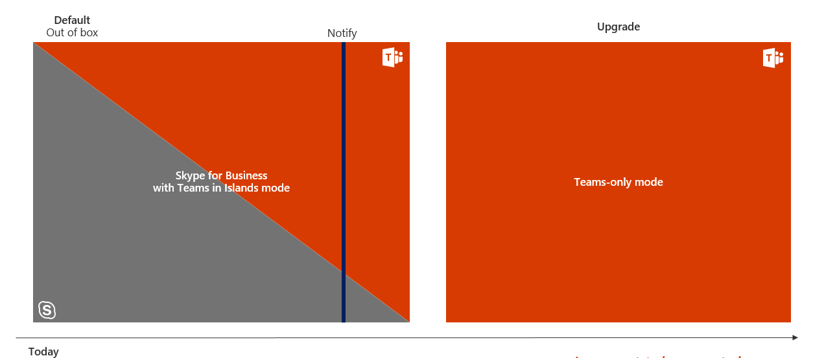

![여행 다이어그램 업그레이드, 배포 및 구현 강조] (media/upgrade-banner-deployment.png "배포 및 구현 단계에 주안점을 두어 업그레이드 여행 단계")

이 문서는 업그레이드 여행 배포 및 구현 단계의 일부입니다.This article is part of Deployment and Implementation stage of your upgrade journey. 계속 하기 전에 다음 활동을 완료 했는지 확인 합니다.Before proceeding, confirm that you’ve completed the following activities:

- [프로젝트 이해 관계자 참여Enlisted your project stakeholders](upgrade-enlist-stakeholders.md)
- [프로젝트 범위 정의Defined your project scope](https://aka.ms/SkypetoTeams-Scope)
- [비즈니스용 Skype 및 팀의 공존 성과 상호 운영성 이해Understood coexistence and interoperability of Skype for Business and Teams](https://aka.ms/SkypeToTeams-Coexist)

# 비즈니스용 Skype에서 팀으로 업그레이드 여행 선택Choose your upgrade journey from Skype for Business to Teams

기존 비즈니스용 Skype 고객의 경우 팀으로의 완벽 한 전환에는 약간의 시간이 걸릴 수 있습니다.As an existing Skype for Business customer, your complete transition to Teams might take some time. 그러나 사용자가 비즈니스용 Skype와 함께 팀을 사용할 수 있도록 하 여 지금 팀의 가치를 현실화 하는 것이 시작 됩니다.However, you can begin realizing the value of Teams today, by enabling your users to use Teams alongside Skype for Business. 두 앱 사이에 일부 겹치는 기능이 있는 경우 조직에 적합 한 경로를 결정 하는 데 도움이 되도록 사용 가능한 공존 및 업그레이드 모드를 검토 하는 것이 좋습니다.Given that there’s some overlapping functionality between the two apps, we recommend that you review the available coexistence and upgrade modes to help determine which path is right for your organization. 예를 들어 상호 운용성 없이 두 솔루션 모두에 대해 모든 작업을 사용 하도록 선택할 수 있습니다.For example, you might opt to enable all workloads on both solutions without interoperability. 또는 조직에서 모든 사용자를 팀으로 업그레이드할 준비가 될 때까지 팀 역량을 점진적으로 소개 하거나 선택 기능에 대 한 사용자 그룹을 대상으로 하 여 사용자 환경을 관리 하도록 결정할 수 있습니다.Or, you might decide to manage the user experience, either by gradually introducing Teams capabilities or by targeting groups of users for select capabilities, until your organization is ready to upgrade everyone to Teams. 파일럿의 결과를 사용 하 여 조직의 올바른 업그레이드 여행에 대 한 평가를 도울 수 있습니다.Use the outcome of your pilot to help assess the right upgrade journey for your organization.

> [!IMPORTANT]
> 비즈니스용 Skype Online은 2021 년 7 월 31 일에 만료 되며, 그 이후에는 더 이상 접근성 또는 지원 되지 않습니다.Skype for Business Online will be retired on July 31, 2021, after which it will no longer be accessible or supported. 조직의 혜택 실현을 최대화 하 고 업그레이드를 구현 하는 데 적절 한 시간을 확보 하려면 지금 Microsoft 팀으로 여행을 시작 하는 것이 좋습니다.To maximize benefit realization and ensure your organization has proper time to implement your upgrade, we encourage you to begin your journey to Microsoft Teams today.

이 문서에서는 비즈니스용 Skype 및 팀이 사용자에 게 사용할 수 있는 형식을를 관리할 수 있는 다양 한 모드에 대해 간략하게 설명 합니다.This article outlines the various modes that enable you to manage which modalities in Skype for Business and Teams are available to your users. 모든 구축과 마찬가지로 조직을 팀으로 업그레이드 하기 전에 선택한 사용자 그룹을 사용 하 여 [계획을 시험](pilot-essentials.md) 하는 것이 좋습니다.As with any deployment, we strongly encourage you to [pilot your intended plan](pilot-essentials.md) with a selected group of users before upgrading your organization to Teams. 새로운 기술이 도입 되어 사용자에 게 방해가 될 수 있다는 점에 유의 하세요.Remember, introducing new technology can be disruptive for users. 사용자 준비를 평가 하 고 여기에 설명 된 모드를 구현 하기 전에 통신 및 교육 계획을 구현 하는 데 시간을 찍습니다.Take time to assess user readiness and implement a communication and training plan prior to implementing any of the modes outlined herein.

> [!TIP]
> 업그레이드 계획 및 구현을 시작 하기 위해 디자인 된 지침, 모범 사례 및 리소스를 공유 하는 실시간 대화형 워크샵에 참여해 주시기 바랍니다.Join us for live, interactive workshops in which we’ll share guidance, best practices, and resources designed to kick start upgrade planning and implementation.
>
>먼저 [업그레이드 세션 계획](https://aka.ms/SkypeToTeamsPlanning) 에 참가 하 여 시작 하세요.Join the [Plan your upgrade](https://aka.ms/SkypeToTeamsPlanning) session first to get started.

## 여행 문서 블록 업그레이드Upgrade journey building blocks

팀에 게 여행을 위해 조직을 공식적으로 준비 하려면 조직에서 팀을 유일한 통신 및 공동 작업 솔루션으로 완벽 하 게 사용할 수 있도록 업그레이드 시나리오에 대 한 계획을 시작 해야 합니다.To formally prepare your organization for its journey to Teams, you need to start planning for the upgrade scenarios that will eventually let your organization fully embrace Teams as your sole communications and collaboration solution.

결정을 진행 하는 데 도움이 되도록 비즈니스용 Skype에서 팀으로 업그레이드 하는 데 관련 된 다양 한 모드, 개념 및 용어에 대해 익힙니다.To help guide your decision-making process, familiarize yourself with the various modes, concepts, and terminology relevant to upgrading from Skype for Business to Teams. 자세한 내용은 [Microsoft 팀 및 비즈니스용 Skype 공존 및 상호 운용성](https://aka.ms/SkypeToTeams-Coexist) 을 참조 하세요.For more information, see [Microsoft Teams and Skype for Business coexistence and interoperability](https://aka.ms/SkypeToTeams-Coexist)

일부 사용자가 일일 통신 및 공동 작업 요구 사항에 대 한 팀만 사용할 준비가 되 면 해당 사용자에 대해 **팀 전용** 모드를 사용 하도록 설정 하 여 팀으로의 업그레이드를 시작할 수 있습니다.When some of your users are ready to use only Teams for their day-to-day communications and collaboration needs, you can start upgrading these users to Teams by enabling **Teams Only** mode for them.

조직 전체를 팀으로 이동 하는 것이 적절 하지 않은 경우에는 **아일랜드** 공존 모드의 비즈니스용 Skype와 함께 파일럿 팀을 시작할 수 있습니다.If it’s not feasible for your whole organization to move to Teams, you can start by piloting Teams alongside Skype for Business in **Islands** coexistence mode. 추가 공존 모드 (예: **팀 공동 작업** 및 팀 **공동 작업 및 모임을**사용 하는 비즈니스용 skype)는 다음 몇 개월 내에 점진적으로 제공 될 수 있으며,이를 통해 전체적으로 시작할 수도 있습니다. 비즈니스용 Skype를 조직의 통합 커뮤니케이션 솔루션으로 유지 하면서 먼저 그룹 공동 작업 솔루션으로 팀을 채택 합니다.As the additional coexistence modes, (i.e. **Skype for Business with Teams collaboration** and **Skype for Business with Teams collaboration and meetings**), are become progressively fully available in the next few months, you can also start by fully adopting Teams as a group collaboration solution first while keeping Skype for Business as your organization’s unified communications solution. 이는 비즈니스용 Skype Server (온-프레미스 또는 하이브리드)를 사용 하는 고객에 게는 Microsoft에서 권장 하는 경로 이며, 팀에 대 한 궤적에 장기간의 공존 기간이 포함 되도록 하는 것은 매우 복잡 합니다.That is Microsoft’s recommended path for customers using Skype for Business Server (on-premises or hybrid) and customers with significant complexity whose trajectory to Teams will include a long coexistence period.

비즈니스용 ![Skype에서 팀으로 업그레이드 하는 문서 블록의 스크린샷] 비즈니스용 skype (media/upgrade_journeys_building_block.png "에서 팀으로의 업그레이드 구성 블록, 팀 공동 작업&ndash;전용 모드, 팀 공동 작업 및 모임 모드를 사용 하는 비즈니스용 skype, 제도 모드, 팀 전용 모드 및 Skype for business의 스크린샷 비즈니스&ndash;전용 모드.")

다음 표에서는 공존 및 업그레이드 모드를 비교 합니다.The following table compares coexistence and upgrade modes.

|모드Mode |상황과Situation |권장 사용Recommended Use |된다는Advantages |특이Caveats |
|---|---|---|---|---|
|분리Islands |더 작거나 간단한 비즈니스용 Skype 배포Smaller or simpler Skype for Business deployment  일부 단기 복잡성을 관리 하 여 팀으로 더 빠르게 이동 하는 기능 및 willingnessAbility and willingness to manage some short-term complexity to move to Teams more quickly |최대한 빠르게 전체 팀 환경으로 이동Go to the full Teams experience as quickly as possible  팀의 개념 입증 시스템 (PoC) 수행Conduct a proof of concept (PoC) of Teams  비즈니스용 Skype Online을 채택한 조직의 경우 권장 되는 업그레이드 경로Recommended upgrade path for organizations who adopted Skype for Business Online |간단한 작동Simple to operate  모든 기능에 대 한 다양 팀의 경험을 제공 합니다.Richest Teams experience up-front for all capabilities |혼란을 피하고 팀에 대 한 사용량을 줄이려면 적절 한 사용자 통신이 필요 합니다.Requires good user communication to avoid confusion and to drive usage toward Teams  종료 전략을 사용 하려면 팀 전용 단계로 업그레이드를 시작 하기 전에 사용자에 게 팀이 완전히 채택 된 것이 필요 합니다.Exit strategy requires users to have fully adopted Teams prior to starting upgrade to Teams Only phase  사용자에 대 한 interop는 아일랜드 모드에서 사용할 수 없습니다. 또한 사용자의 비즈니스용 Skype 계정이 온-프레미스 인 경우 팀의 페더레이션 없음No interop for users in Islands mode; also no federation from Teams when the user’s Skype for Business account is homed on-premises|
|팀 공동 작업을 통한 비즈니스용 SkypeSkype for Business with Teams collaboration |팀에서 아직 충족 하지 않는 요구 사항이 포함 된 비즈니스용 Skype 배포 (예: 고급 규정 준수)Skype for Business deployment with requirements that aren’t yet met by Teams (for example, advanced compliance)  비즈니스용 Skype에 대 한 장기간의 필요 및/또는 약정Long-term need for and/or commitment to Skype for Business|그룹 공동 작업에 집중, 팀 채택을 빠르게 시작Start Teams adoption quickly, focusing on group collaboration first  현재 비즈니스용 Skype에 모든 통합 커뮤니케이션 작업량을 유지 하려는 경우Want to keep all unified communications workloads on Skype for Business for now  온-프레미스 (또는 하이브리드) 비즈니스용 Skype를 시작 하는 조직의 시작 점으로 권장 되는 사용Recommended use as the starting point for organization starting their journey from on premises (or hybrid) Skype for Business|팀과 비즈니스용 Skype 간의 겹치는 접근 권한 없음No overlapping capabilities between Teams and Skype for Business  인스턴트 메시지 채팅 및 모임 예약은 비즈니스용 Skype (통화에 연결)에 저장 됩니다.Instant messaging chat and meeting scheduling will reside in Skype for Business (tied to calling)  팀의 사용자와의 상호 운용성Interoperability with users in Teams Only|
|팀 공동 작업 및 모임이 있는 비즈니스용 SkypeSkype for Business with Teams collaboration and meetings |팀에서 전화를 걸고 있지 않은 엔터프라이즈 음성 및 요구 사항이 많이 사용 된 비즈니스용 Skype 배포Skype for Business deployment with significant use of enterprise voice and requirements that aren’t yet met by Teams calling  비즈니스용 Skype에 대 한 장기간의 필요 및/또는 약정Long-term need for and/or commitment to Skype for Business  타사 모임 서비스를 사용 중일 수 있습니다.Might be using a third-party meeting service|그룹 공동 작업을 거치면 팀 채택을 빠르게 시작Start Teams adoption quickly, going beyond group collaboration  사용자의 모임 환경 개선Improve your users’ meetings experience  완전 업그레이드를 준비 하기 전에 팀 회의를 활용 하려는 구내 조직에 사용 하는 것이 좋습니다 (일반적으로 엔터프라이즈 보이스 온-프레미스로 인해 수행).Recommended use for on premises organizations wanting to take advantage of Teams meetings prior to being ready to fully upgrade (generally due to Enterprise Voice on-premises). |겹치는 접근 권한 없음No overlapping capabilities  팀에 대 한 상사 용 모임.Superior meetings on Teams. 기능 로드맵, UX, 플랫폼, 품질 및 안정성Features roadmap, UX and cross platform, quality and reliability  비즈니스용 Skype와 팀 간의 "서로 다른" 환경 개선"Better Together" experiences between Skype for Business and Teams  팀의 사용자 상호 운용성만 가능 합니다.Interoperability users in Teams Only.|인스턴트 메시지 및 채팅은 비즈니스용 Skype (통화에 연결)에 저장 됩니다.Instant messaging and chat will reside in Skype for Business (tied to calling)|
|팀만Teams Only |팀은 모든 사용자에 게 최종적으로 최종 대상이 됩니다.Teams Only is the final destination for all users, eventually.  일부 사용자는 비즈니스용 Skype를 유지 해야 합니다.Some users need to stay on Skype for Business  비즈니스용 skype for 프레미스 사용자를 비즈니스용 skype로 유지 하면서 비즈니스용 Skype Online 사용자를 팀으로 업그레이드 하는 경우You’re upgrading your Skype for Business Online users to Teams while keeping Skype for Business on-premises users on Skype for Business Server  이미 아일랜드 모드에서 사용자를 배포 했 고 사용자 그룹에 대해 비즈니스용 Skype를 사용 중지할 준비가 되었을 수 있습니다.You might have already deployed users in islands mode and are ready to retire Skype for Business for groups of users |비즈니스용 Skype에서 가변 비용 줄이기 (온-프레미스 서버 작업, 아웃소싱 약정 등)Reduce variable costs on Skype for Business (on-premises server operations, outsourcing contract, and so on)  적어도 일부 사용자는 최대한 빠르게 전체 팀 환경으로 이동 하세요.Go to the full Teams experience as quickly as possible, for at least some users|비즈니스용 skype에 대 한 사용자와의 상호 운용성, 팀 공동 작업이 있는 비즈니스용 Skype, 팀 공동 작업 및 모임이 있는 비즈니스용 skype를 사용 하 여 사용자의 혼란을 제한 하세요.Limits user confusion by providing only one client to work with Interoperability with users in Skype for Business Only, Skype for Business with Teams Collaboration, Skype for Business with Teams Collaboration and Meetings|상호 운용성은 비즈니스용 Skype와 팀 간 기본 채팅 및 통화와 데스크톱 공유 및 파티 채팅 및 통화에 대 한 interop 에스컬레이션 시나리오만 지원 합니다.Interoperability only supports basic chat and calling between Skype for Business and Teams, and interop escalation scenarios for desktop sharing and multi-party chat and calling|
|비즈니스용 Skype 전용Skype for Business only |일부 사용자는 비즈니스용 Skype를 유지 해야 합니다.Some users need to stay on Skype for Business  |사용할 하나의 클라이언트만 제공 하 여 사용자 혼동을 제한 합니다.Limits user confusion by providing only one client to work with  사용자가 초대 된 팀 모임에 계속 참가할 수 있습니다.User can still participate in Teams meetings they are invited to|현재 비즈니스용 Skype만 사용할 수 있는 비즈니스 요구 사항에 대 한 지속적인 달성Continue to meet business requirements that currently can only be met by Skype for Business  팀의 사용자와의 상호 운용성Interoperability with users in Teams Only|상호 운용성은 비즈니스용 Skype와 팀 간 기본 채팅 및 통화와 데스크톱 공유 및 파티 채팅 및 통화에 대 한 interop 에스컬레이션 시나리오만 지원 합니다.Interoperability only supports basic chat and calling between Skype for Business and Teams, and interop escalation scenarios for desktop sharing and multi-party chat and calling|

> [!TIP]
> 비즈니스용 Skype를 사용 하는 동안 팀에서 사용 하려는 기능을 기반으로 권장 되는 업그레이드 모드를 식별 하는 데 도움이 되도록 [skype To 팀 업그레이드 마법사](https://aka.ms/SkypeToTeamsWizard)를 이용해 보세요.To help identify the recommended upgrade mode based on the capabilities you want to enable in Teams while Skype for Business is still in use, leverage the [Skype to Teams Upgrade Wizard](https://aka.ms/SkypeToTeamsWizard).

## 여행 업그레이드Upgrade journeys

비즈니스용 Skype (온라인 또는 온-프레미스)에서 팀으로 업그레이드 하는 데 여러 가지 접근 방법을 사용할 수 있습니다.You can take multiple approaches to upgrading from Skype for Business, either online or on-premises, to Teams:

- 직접 업그레이드를 사용 하는 경우 먼저 평가판 및 조기 채택의 일부로 팀 \*\*\*\* 을 비즈니스용 skype와 함께 배포 하 고, 사용자를 **팀 전용** 모드로 업그레이드 하 여 비즈니스용 skype를 신속 하 게 폐기 하는 목표로 조직의 모든 사용자에 대 한 환경In a direct upgrade journey, you first deploy Teams alongside Skype for Business in **Islands** mode as part of evaluation and early adoption, and then upgrade your users to **Teams Only** mode with the goal of quickly retiring Skype for Business from the environment for all users in the organization. 이는 사용자가 동일한 작업을 수행 하는 두 가지 도구 (채팅, 통화, 모임 예약)를 사용 하는 것이 염려 되지 않는 한 Skype Business online 고객에 게 권장 되는 여행입니다.This is the recommended journey for Skype Business online customers, unless they are concerned their users will be confused with having two tools to conduct the same action (chat, calling, meeting scheduling).
- 점진적 업그레이드 여행에서는 통신 및 공동 작업 요구 사항에 따라 특정 사용자 그룹 ( *cohort*이 라고도 함)에 대 한 다양 한 공존 및 업그레이드 모드를 제공 합니다.A gradual upgrade journey delivers a specific coexistence and upgrade mode to a specific group of users (also called a *cohort*), depending on their communications and collaboration requirements. 시간이 지남에 따라 전체 조직이 팀을 사용 하 여 수렴 하 고 최종적으로 비즈니스용 Skype를 교체할 수 있습니다.Over time, the entire organization can converge into using Teams Only and eventually replace Skype for Business. 그러나 조직에 비즈니스용 Skype를 유지 해야 하는 비즈니스 이유가 있는 경우 (예: lob (기간 업무) 응용 프로그램과 통합 된 통합 커뮤니케이션 관리 API () 기반 솔루션에 대 한 종속성 등) 윤리적인 wall 솔루션 현재 비즈니스용 Skype 전용 또는 **팀**으로 업그레이드 하는 데 시간이 걸리는 복잡 한 엔터프라이즈 음성 배포만 가능 하며, 사용자는 비즈니스용 skype 사용자를 **팀 전용** 모드로 업그레이드할 수 있습니다. 사용자 채우기의 일부에 대 한 공존 모드입니다.However, if your organization has compelling business reasons to keep Skype for Business—such as a dependency on a Unified Communications Managed API (UCMA)–based solution that integrates with line-of-business applications, or an ethical wall solution currently available for Skype for Business only, or a complex Enterprise Voice deployment that will take time to upgrade to **Teams Only**—you can upgrade a portion of users to **Teams Only** mode while retaining Skype for Business users in one of the coexistence modes for a portion of your user population. 팀 공동 작업 공존 모드를 사용 하 여 비즈니스용 Skype로 시작 하 고 사용자에 대 한 요구 사항이 충족 되는 경우 팀 전용 모드로 전환 하는 경우에는 온-프레미스 (및 하이브리드) 고객에 게 점진적으로 업그레이드를 사용 하는 것이 좋습니다 ( 팀 공동 작업 및 모임 공존 모드를 사용 하는 비즈니스용 SkypeGradual upgrade journey is the recommended approach for on-premises (and hybrid) customers starting with Skype for Business with Teams Collaboration coexistence mode and moving from there to Teams Only mode when requirement for the users met (possibly through the Skype for Business with Teams Collaboration and Meetings coexistence mode).

> [!IMPORTANT]
> 두 유형의 업그레이드 여행에 대해 조직이 현재 비즈니스용 Skype 온-프레미스 배포 인 경우, 사용자를 **팀 전용** 모드로 업그레이드 하기 전에 비즈니스용 skype 하이브리드을 구현 하기 위해 계획을 시작 해야 합니다.For both types of upgrade journey, if your organization is currently a Skype for Business on-premises deployment only, you need to start planning to implement Skype for Business hybrid before upgrading your users to **Teams Only** mode. 이렇게 하면 팀과 더욱 효율적으로 상호 운용 될 수 있습니다.This will also help facilitate interoperability with Teams.

> [!NOTE]
> **팀 전용** 모드를 사용 하려면 비즈니스용 skype online에서 cohorts에 속한 사용자를 설정 하 고 비즈니스용 skype 온-프레미스 배포와 비즈니스용 skype Online 테 넌 트 간 하이브리드 관계를 설정 하는 일이 필요 합니다. 비즈니스용 Skype와 팀 간의 상호 운용성.**Teams Only** mode requires that the users who are part of cohorts be homed in Skype for Business Online, and a hybrid relationship between your Skype for Business on-premises deployment and your Skype for Business Online tenant is required to facilitate the interoperability between Skype for Business and Teams. Cohorts에 속하는 사용자는 **팀 전용** 모드로 업그레이드 하기 전에 비즈니스용 Skype Online으로 이동을 완료 해야 합니다.The move to Skype for Business Online must be completed for users who are part of the cohorts before they’re upgraded to **Teams Only** mode. 비즈니스용 skype 서버 2019 및 CU8 업데이트의 비즈니스용 Skype Server 2015는 비즈니스용 Skype Online으로 마이그레이션을 관리 하 고 사용자를 **팀 전용** 모드로 업그레이드 하 여 온-프레미스 사용자를 팀으로 업그레이드 하는 기술을 단순화할 수 있습니다. .Skype for Business Server 2019, and Skype for Business Server 2015 with CU8 update can simplify the mechanics of upgrading on-premises users to Teams by managing the migration to Skype for Business Online and upgrading the users to **Teams Only** mode in one step.

### 직접 업그레이드 여행Direct upgrade journey

다음 다이어그램에는 직접 업그레이드에 대 한 여행이 나와 있습니다.The direct upgrade journey is illustrated in the following diagram.

![직접 업그레이드 여행 스크린샷] (media/upgrade_journey_direct_upgrade.png "직접 업그레이드 여행에 대 한 스크린샷. 모든 사용자는 먼저 아일랜드 모드에서 팀을 사용 하 고 팀 전용 모드로 전환 하 여 전체 조직의 최종 상태를 팀으로 업그레이드 합니다.")

팀은 조직의 모든 사용자에 게 배포 되 고 **아일랜드** 모드에서 구성 됩니다.Teams is deployed to all users in the organization and configured in **Islands** mode. 조직에서 팀이 모든 통신 및 공동 작업 요구를 충족 시킬 준비가 된 것으로 판단 되는 경우 사용자에 게 알리고 **팀 전용** 모드로 업그레이드 합니다.When your organization determines that Teams is ready to fulfill all of your communications and collaboration needs, notify the users and upgrade them to **Teams Only** mode. 이 시점에서 비즈니스용 Skype는 환경에서 사용을 중지 시킬 수 있습니다.At that point, Skype for Business can be retired from the environment.

### 점진적 업그레이드 여행Gradual upgrade journey

다음 다이어그램에서는 점진적 업그레이드 여행의 예를 보여 줍니다.An example of a gradual upgrade journey is illustrated in the following diagram.

![점진적 업그레이드 여행의 예를 보여 줍니다] . (media/upgrade_journey_gradual_upgrade.png "점진적 업그레이드 출장 중에는 cohorts 사용자가 먼저 아일랜드 모드에서 팀을 사용 하 여 평가를 수행한 다음 초기 채택을 위해 다양 한 업그레이드 모드를 비즈니스용 Skype와 나란히 정렬 합니다. 일부 cohorts 팀 전용 모드로 전환 되는 반면, 한 사용자 그룹은 팀 공동 작업 및 모임 모드를 사용 하는 비즈니스용 Skype에 남아 있습니다.")

팀은 평가를 위해 조직에 **아일랜드** 모드로 배포 된 다음 다양 한 사용자 그룹에 대해 다양 한 공존 및 업그레이드 모드로 이동 합니다.Teams is deployed in the organization in **Islands** mode for evaluation and then move to different coexistence and upgrade modes for different groups of users. 예를 들어 사용자 그룹은 **팀 공동 작업 및 모임** 모드를 사용 하는 비즈니스용 skype에서 사용할 수 있고, 세 번째 사용자 그룹은 팀의 \*\*\*\* **비즈니스용 skype에서 처음 사용할 수 있습니다. 공동 작업 전용** 모드입니다.For example, a group of users can be enabled for **Islands** mode, another enabled for **Skype for Business with Teams collaboration and meetings** mode, while a third group of users might initially be enabled for **Skype for Business with Teams collaboration only** mode.

시간이 지남에 따라, 사용자 그룹은 **팀 전용** 모드로 업그레이드 될 수 있으며, 나머지 조직은 그 다음에 나옵니다.Over time, groups of users can be upgraded to **Teams Only** mode, followed by the rest of the organization. 결국에는 전체 조직이 비즈니스용 Skype를 사용 하지 않도록 하 고 통신 및 공동 작업을 위해 팀만 사용할 준비가 되어 있거나, 비즈니스 요구 사항에 따라 특정 그룹에 대해 비즈니스용 Skype가 보존 됨을 규정 하는 경우 조직에서 팀만 사용할 수 있습니다.Eventually, the entire organization will be ready to retire Skype for Business and use only Teams for communications and collaboration, or—if business requirements dictate that Skype for Business be retained for a specific group—the majority of users in the organization can use Teams Only.   
<table>
<tr><td>  판단 요점Decision point</td><td><ul> 조직의 비즈니스 요구 사항에 적합 한 업그레이드 여행Which upgrade journey is suitable to your organization's business requirements?  </ul></td></tr>
<tr><td> 다음 단계Next step</td><td><ul> 현재 배포 모델, 사용 사례 시나리오, 조직에 대 한 주요 고려 사항에 따라 조직에 가장 적합 한 팀에 게 여행에 대 한 정보를 알려 줍니다.Identifying your current deployment model, use case scenarios, and key considerations for your organization will inform the journey to Teams that’s best suited to your organization.  </ul></td></tr>
</table>

<table>
<tr><td>  판단 요점Decision point</td><td><ul> 조직에 적용 되는 업그레이드 시나리오는 무엇 인가요?Which upgrade scenario is applicable to your organization?  </ul></td></tr>
<tr><td> 다음 단계Next steps</td><td><ul> 메시징, 모임, 통화 비즈니스 요구 사항에 따라 조직의 업그레이드 여행에 대 한 시간 표시 막대를 결정 합니다.Decide the timeline of your organization's upgrade journey based on messaging, meetings, and calling business requirements.   업그레이드 여행을 완료 하는 데 필요한 추가 작업을 결정 합니다.Decide the required additional work to complete your upgrade journey.  </ul></td></tr>
</table>

조직에 가장 적합 한 업그레이드 여행을 선택한 후 [팀으로 업그레이드를 수행](https://aka.ms/SkypeToTeams-Upgrade)합니다.After you’ve chosen the best upgrade journey for your organization, [perform your upgrade to Teams](https://aka.ms/SkypeToTeams-Upgrade).
