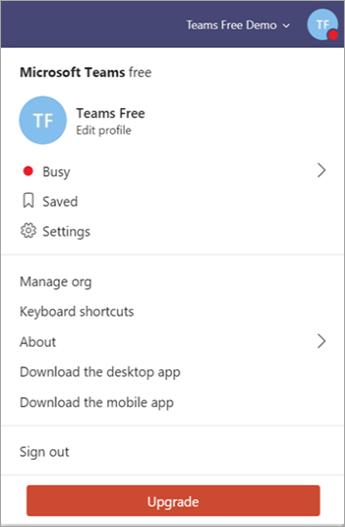

# 무료 Microsoft Teams를 구독 버전으로 업그레이드

조직에서 무료 버전의 Microsoft Teams를 사용하는 경우 사용자를 위해 Microsoft 365 또는 Office 365 구독 계획을 구입하여 정식 버전으로 쉽게 업그레이드할 수 있습니다. 정식 버전은 무료 버전에서 제공하지 않는 추가 Teams 기능(예정, 오디오 회의, 향상된 관리 및 보안 기능)을 제공합니다. Microsoft 365 및 Office 365는 익숙한 Microsoft Office 데스크톱 제품군과 Exchange Online, SharePoint Online 및 Office를 비롯한 Microsoft의 차세대 통신 및 공동 작업 서비스의 클라우드 기반 버전과 결합하여 사용자가 인터넷을 통해 거의 모든 곳에서 생산성을 향상할 수 있도록 합니다. Teams를 업그레이드하면 기존 Teams 데이터가 손실되지 않습니다. 모든 팀, 채널, 채팅, 파일 및 사용 권한을 제공합니다. 

> [!NOTE]
> Microsoft 365 또는 Office 365 구독이 이미 있는 경우 무료 버전이 아닌 Teams 평가판 버전(회사 ID 사용)을 사용할 수 있습니다. Teams 평가판은 제한된 시간 동안 Teams의 정식 버전을 제공 합니다. 자세한 내용은 Microsoft Teams 상용 클라우드 평가판 [제품 관리를 참조하세요.](iw-trial-teams.md)

## Teams 무료는 전체 버전의 Teams와 어떻게 비교하나요?

무료 Teams는 중소기업용이며 다음과 같은 기능을 제공합니다.

- 최대 사용자 500,000명
- 무제한 채팅 메시지 및 검색
- 게스트 액세스
- Word, Excel, PowerPoint, OneNote의 온라인 버전을 비롯한 앱 및 서비스와 통합
- 사용자당 2GB 저장소 및 10GB의 공유 저장소
- 1:1 및 그룹 온라인 오디오 및 비디오 통화
- 채널 모임
- 화면 공유

Microsoft 365 또는 Office 365 구독에 포함된 전체 Teams 버전은 Teams에서 무료로 제공하는 기능 외에도 다음과 같은 기능을 제공합니다.

- 사용자 제한 없음(엔터프라이즈 라이선스 사용)
- Exchange 전자 메일 호스팅 및 사용자 지정 전자 메일 도메인
- OneDrive, SharePoint, Planner, Yammer 및 더 많은 Microsoft 365 및 Office 365 서비스
- 사용자당 1 TB의 저장소
- 예약된 모임
- 오디오 회의
- 다단계 인증, Single Sign-On 및 고급 감사 및 보고를 비롯한 향상된 보안 및 규정 준수 기능
- 24 x 7 전화 및 웹 지원, 사용자 및 앱 관리용 관리 도구, Microsoft 365 또는 Office 365 서비스 사용 현황 보고, 서비스 수준 계약 및 구성 가능한 사용자 설정 및 정책을 비롯한 관리 제어 및 지원 기능

무료 Teams와 Teams 기능의 자세한 비교는 Teams 계획 [비교를 참조합니다.](https://products.office.com/microsoft-teams/free)

## 업그레이드 요구 사항

다음 요구 사항을 충족하는 경우 정식 버전의 Teams로 업그레이드할 수 있습니다.

- 기존 Teams 무료 구독에 등록한 사용자입니다.
- 자체 도메인을 가져오는 경우 아직 Azure Active Directory와 연결되어 있지 않습니다(평가판 또는 구입한 Microsoft 365 또는 Office 365 구독).

> [!NOTE]
> 데이터를 업그레이드하고 전송하려면 Teams 애플리케이션의 업그레이드 프로세스를 통해 구독을 구입해야 합니다. 업그레이드 프로세스를 거치지 않고 Teams에서 Microsoft 365 또는 Office 365를 구입한 경우 별도의 테넌트가 이미 있기 때문에 데이터를 전송할 수 없습니다.

## 제한 사항

다음 제한 사항을 염두에 두어야 합니다.

- 업그레이드한 후 무료 Teams로 다시 전환할 수 없습니다.
- 여러 Teams 무료 테넌트는 단일 유료 테넌트에 병합할 수 없습니다.
- 모든 사용자는 동일한 도메인에 있어야 합니다. (모든 사용자는 사용자 이름 형식으로 *로그인합니다.* @ *domain.com*.)
- 모든 사용자를 업그레이드해야 합니다. 동일한 테넌트의 Teams 무료 및 유료 구독 사용자는 혼합되지 않습니다.

## 조직을 업그레이드하려면 어떻게 해야 하나요?

Teams 정식 버전으로 업그레이드하려면 Teams에서 **업그레이드를** 선택합니다.

Teams에 로그인하는 데 사용하는 전자 메일 주소를 입력한 다음 Microsoft 365 Business Standard 계획을 구입합니다. Microsoft 365 Business Basic 또는 Enterprise Edition of Office 365를 구입하고자 하는 경우 고객 [지원에 문의합니다.](https://portal.office.com/support/altusupport.aspx?app=teamsfreeupgrade)

## 다음 단계

업그레이드가 완료되면 첫 번째 단계에 대한 [Microsoft Teams](get-started-with-teams-quick-start.md) 시작 및 조직 전체의 Teams 채택에 대한 단계적 접근 방식을 Microsoft [Teams](adopt-microsoft-teams-landing-page.md) 채택을 참조하세요.

## 추가 정보

- Teams 버전 및 기능에 대한 자세한 내용은 Teams 계획 [비교를 참조합니다.](https://products.office.com/microsoft-teams/free)
- 정식 버전의 Teams로 업그레이드하는 자세한 내용은 [무료 Teams에서 Teams로](https://support.office.com/article/Upgrade-from-Teams-free-to-Teams-29475bbd-a34f-4175-9b33-d44430f8ad39)업그레이드를 참조하세요.
- 사용자 라이선스 추가, 사용자 이름 변경, 임시 암호 할당 등 사용자 업그레이드와 관련된 추가 관리 작업은 무료 Teams에서 유료 구독으로 업그레이드하는 관리자를 [참조하세요.](https://support.office.com/article/for-admins-upgrading-from-teams-free-to-a-paid-subscription-75a95e7f-001e-42d0-a787-ae8b992d5a52)
- 조직에서 무료 Teams 관리에 대한 자세한 내용은 Microsoft Teams의 무료 [버전 관리를 참조하세요.](manage-freemium.md)

