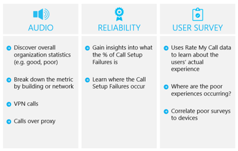

# QoE(체감 품질) 검토 가이드Quality of Experience Review Guide

이 문서는 비즈니스용 Skype에서 Teams로의 업그레이드를 완료하는 즉시 시작하는 업그레이드 여정의 운영 효율성 단계의 일부입니다.This article is part of the Operational Excellence stage of your upgrade journey, which begins as soon as you've completed your upgrade from Skype for Business to Teams.

## 통화 품질 개선 및 모니터링Improve and monitor call quality

[Teams의](monitor-call-quality-qos.md) 통화 품질 개선 및 모니터링에는 아래와 같은 사용자 환경 개선에 가장 큰 영향을 주는 주요 영역에서 수정 지침을 평가하고 제공하는 활동 집합이 포함되어 있습니다.[Improve and monitor call quality for Teams](monitor-call-quality-qos.md) includes a set of activities that assess and provide remediation guidance in key areas that have the greatest impact on improving the user experience, as illustrated below.

가이드에 설명된 영역을 지속적으로 평가하고 수정하여 사용자 경험에 부정적인 영향을 줄 수 있습니다.By continually assessing and remediating the areas described in the guide, you can reduce their potential to negatively affect user experience. 배포에서 발생하는 대부분의 사용자 환경 문제는 다음 범주로 그룹화할 수 있습니다.Most user-experience problems encountered in a deployment can be grouped into the following categories:

- 불완전한 방화벽 또는 프록시 구성Incomplete firewall or proxy configuration

- 불량 Wi-Fi 검사Poor Wi-Fi coverage

- 대역폭 부족Insufficient bandwidth

- VPNVPN

- 사용할 수 없는 오디오 장치 또는 기본 제공 오디오 장치 사용Use of unoptimized or built-in audio devices

- 문제가 있는 서브넷 또는 네트워크 디바이스Problematic subnets or network devices

[Teams의](monitor-call-quality-qos.md) 통화 품질 개선 및 모니터링에 제공된 지침은 채택과 영향을 최대화하기 위해 오디오에 초점을 맞추고 설명된 각 영역을 보고하고 조사하는 기본 도구로 CQD(통화 품질 대시보드) Online을 사용하는 데 중점을 습니다.The guidance provided in [Improve and monitor call quality for Teams](monitor-call-quality-qos.md) focuses on using Call Quality Dashboard (CQD) Online as the primary tool to report and investigate each area described, with a focus on audio to maximize adoption and impact. 또한 오디오 환경을 개선하기 위해 네트워크를 최적화하면 비디오 및 데스크톱 공유가 개선됩니다.Any optimizations made to the network to improve the audio experience will also directly translate to improvements in video and desktop sharing.

품질 챔피언을 초기에 추천하는 것이 좋습니다.We highly recommend that you nominate the quality champion early on. 지명된 후 Teams의 통화 품질 개선 및 모니터링 콘텐츠에 [익숙해지기 시작해야 합니다.](monitor-call-quality-qos.md)After being nominated, they should start to familiarize themselves with the content in [Improve and monitor call quality for Teams](monitor-call-quality-qos.md).

<!--ENDOFSECTION-->
