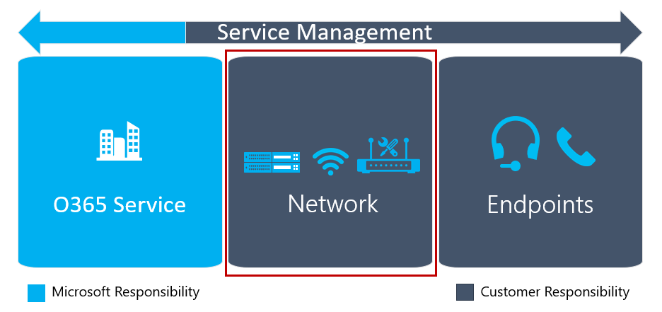

![여행 다이어그램 업그레이드, 기술 준비 단계 강조] (media/upgrade-banner-tech-readiness.png "기술 준비 단계에 중점을 두어 업그레이드 여행 단계")

이 문서는 사용자 준비 단계와 병행 하 여 완료 한 활동 인 업그레이드 여행에 대 한 기술 준비 단계의 일부입니다.This article is part of the Technical Readiness stage of your upgrade journey, an activity you complete in parallel with the User Readiness stage. 계속 하기 전에 이전 단계에서 다음 활동을 완료 했는지 확인 합니다.Before proceeding, confirm that you’ve completed these activities from previous stages:

- [프로젝트 이해 관계자 참여Enlisted your project stakeholders](upgrade-enlist-stakeholders.md)
- [프로젝트 범위 정의Defined your project scope](https://aka.ms/SkypetoTeams-Scope)
- [비즈니스용 Skype 및 팀의 공존 성과 상호 운영성 이해Understood coexistence and interoperability of Skype for Business and Teams](https://aka.ms/SkypeToTeams-Coexist)
- [업그레이드 여행 선택Chosen your upgrade journey](upgrade-and-coexistence-of-skypeforbusiness-and-teams.md)

<!-- [!INCLUDE [envision-planning-for-service-management-and-quality-complete-guide](envision-planning-for-service-management-and-quality-complete-guide.md)]-->

# 품질 계획Plan for quality

오디오, 비디오 또는 모임을 배포 하는 경우 몇 가지 추가 단계를 수행 하 여 해당 기능에 대 한 환경을 최적화할 수 있습니다.If you’re deploying audio, video, or meetings, you can take some additional steps to optimize your environment for that functionality. 이 콘텐츠는 고품질 Microsoft 팀 배포를 제공 하 고 유지 관리 하는 데 필요한 요구 사항에 대 한 개요를 제공 합니다.This content will provide an overview of the requirements that are necessary to deliver and maintain a high-quality Microsoft Teams deployment. 첫 번째 파일럿 또는 프로덕션 배포 이전에 서비스 관리 및 품질 계획을 성공적으로 배포 하는 데 도움이 될 수 있습니다.You can help ensure a successful deployment by planning for service management and quality, before your first pilot or production deployment.

지침은 다음 섹션으로 구성 되어 있습니다.The guidance is organized into the following sections:

- 첫 번째는 사용자 환경 및 품질을 underpin 하는 주요 구성 요소에 대 한 개요입니다.First is an overview of user experience and the key components that underpin quality. Microsoft 팀에 게 온 보 딩 전에 초점을 맞춘 영역을 강조 표시 합니다.This highlights the areas to focus on prior to onboarding to Microsoft Teams.

- 둘째로, 첫 번째 사용자 파일럿 또는 프로덕션 배포 이전에 Microsoft 팀을 관리 하기 위한 지원 모델 계획에 대 한 지침이 제공 됩니다.Second, guidance is given for planning a support model to manage Microsoft Teams prior to the first user pilot or production deployment. 이 섹션에서는 고품질 팀 배포를 유지 관리 하기 위해 정기적으로 수행 해야 하는 작업에 대해 설명 합니다.This section describes the tasks that need to be performed on a regular basis to maintain a high-quality Teams deployment. 또한이 섹션에서는 이러한 작업을 이해 하 고 operationalizing 하는 데 사용할 수 있는 추가 지침을 소개 합니다.In addition, this section introduces you to further guidance which you can use to start understanding and operationalizing these tasks.

- 셋째, 특정 지침은 Microsoft 팀을 지원 하기 위해 조직의 네트워크 및 끝점을 계획 하는 데 도움이 됩니다.Third, specific guidance helps with planning your network and endpoints in your organization to support Microsoft Teams.

- 마지막으로 다음 단계는 관련 내용에 대 한 참조를 사용 하 여 요약 됩니다.Lastly, next steps are summarized with references to related content.

## 사용자 환경에 영향을 주는 주요 기술 구성 요소Key technical components that affect user experience

이 섹션에서는 사용자 환경에 영향을 주는 주요 기술 구성 요소를 검토 합니다.The key technical components that affect user experience will be reviewed in this section. 주요 구성 요소를 검토 하기 전에 사용자 환경과 조직의 비즈니스 목표 실현에 대 한 중요성을 이해 하는 것이 중요 합니다.Before reviewing the key components, it’s critical that you understand user experience and its importance in realizing your organization’s business goals. 먼저 사용자 환경을 정의 하는 방법을 검토해 보겠습니다.Let’s review how we define the user experience first.

### 사용자 환경 정의User experience defined

비즈니스 목표는 Microsoft 팀을 배포할 때와 사용자가 팀을 핵심 공동 작업 및 통신 솔루션으로 채택할 때 실현 될 수 있습니다.Business goals can be realized when you deploy Microsoft Teams and when users adopt Teams as their core collaboration and communication solution. 품질은 사용자 경험을 보장 하는 데 도움이 되며 사용 및 채택을 위한 주요 특성입니다.Quality can help ensure a positive user experience, a key attribute in driving usage and adoption. Delights 사용자, 개인 및 팀이 확신을 얻고 비즈니스 이익을 구동 하는 서비스를 사용 하는 새롭고 혁신적인 방법을 찾을 수 있는 고품질 서비스를 제공 합니다.By delivering a high-quality service that delights people, individuals and teams can gain confidence and find new and innovative ways of using the service that drive business benefits.

이의 핵심은 서비스에 대 한 감정 및 attitudes 팀의 사용자 환경입니다.At the heart of this is the user’s experience with Teams—the person’s emotions and attitudes toward the service. 사용자 환경에 어떤 도움이 되나요?So what contributes to the user experience? 이는 사용자가 팀을 사용 하는 방법과 이유를 파악 하 고, 탁월한 통화 품질을 발생 하 여 그 위치에 관계 없이 안정적인 연결을 가능 하 게 하는 것을 일일 워크플로로 통합 합니다.It ranges from users’ knowing how and why to use Teams and incorporating it into their daily workflow to experiencing exceptional call quality and being able to connect reliably, regardless of where they are. 사용자 환경은 본질적으로 광범위 하 게 사용 됩니다. 이 문서에서는 조직에서 제어할 수 있는 기술 요소만 중점적으로 설명 합니다.User experience is very broad in nature; this article focuses only on those technical elements that can be controlled by your organization. 사용자 준비에 대 한 추가 정보는 [팀을 위한 조직 준비](https://aka.ms/SkypeToTeams-UserReadiness)를 참조 하세요.Additional information about user readiness can be found in [Prepare your organization for Teams](https://aka.ms/SkypeToTeams-UserReadiness).

특히 팀에서 클라우드 음성 기능을 사용 하는 경우에는 훌륭한 사용자 환경을 제공 하는 것이 매우 중요 한 배포에 대 한 특정 요구 사항이 있습니다.There are specific requirements to the deployment that are critically important to deliver a fantastic user experience—especially when using the Cloud Voice features in Teams. Microsoft 팀을 다른 통신 및 공동 작업 투자와 함께 최초의 수업으로 취급 하 고 그에 따라 실시간 트래픽 우선 순위를 정하는 것이 중요 합니다.It is critical to treat Microsoft Teams as a first-class citizen with other communication and collaboration investments, prioritizing real-time traffic accordingly. 다음 섹션에서는 사용자 환경에 영향을 주는 주요 구성 요소에 대해 간략하게 설명 합니다.The following section gives an overview of the key components that affect user experience. 그 밖의 섹션에서는 품질을 구성 하는 주요 구성 요소를 배포 하 고 유지 관리 하는 계획을 시작 하는 방법에 대 한 지침을 제공 합니다.In further sections, we will provide you guidance on how to start planning to deploy and maintain the key components that comprise quality.

### 품질의 주요 구성 요소Key components of quality

조직 또는 지원 파트너는 팀 배포의 기술 준비 단계 (서비스 관리, 네트워크, 끝점) 중에 세 가지 주요 구성 요소에 대 한 계획을 시작 해야 합니다.An organization or supporting partner should start planning for three key components during the Technical Readiness stage of a Teams deployment: service management, network, and endpoints. 세 가지 영역의 조합은 모두 사용자 환경의 품질에 대 한 기본입니다.The combination of all three areas is fundamental to the quality of the user experience.

![품질의 세 가지 구성 요소를 보여 주는 다이어그램] (media/envision-planning-for-service-management-and-quality-complete-guide-image1.png "품질의 세 가지 구성 요소와 서비스 관리가 세 구성 요소를 모두 겹치는 방법을 보여 주는 다이어그램")

#### 서비스 관리Service management

서비스 관리는 두 가지 개별 책임 범주로 나눌 수 있습니다.Service management can be divided into two distinct categories of responsibility:

- **Microsoft 책임**.**Microsoft responsibility**. Microsoft는 Office 365 서비스의 인프라 구성 요소에 대해 책임을 집니다.Microsoft is responsible for the infrastructure components that the Office 365 service comprises. Microsoft는 팀에 연결 하는 모든 사용자에 게 안정적인 고품질 환경을 제공 하도록 고객에 게 책임을 지 고 있습니다.Microsoft is accountable to customers to ensure that any of their users connecting to Teams is provided with a reliable and high-quality experience.

- **고객 책임**.**Customer responsibility**. 사용자와 조직은 Office 365 서비스, 온-프레미스 네트워크 및 사용자 끝점의 다양 한 측면을 관리 하는 데 책임이 있습니다.You and your organization are responsible for managing various aspects of the Office 365 service, on-premises network, and user endpoints. 예를 들어 새 IP 주소가 Office 365에 추가 되 면 사용자 중단을 방지 하기 위해 새 끝점에 대 한 통신을 허용 하도록 적절 한 방화벽을 업데이트 해야 합니다.For example, as new IP addresses are added to Office 365, you must update the appropriate firewalls to allow communication to the new endpoints to avoid user disruption.

서비스 관리 계획에 대 한 자세한 지침은 [서비스 관리 계획](#plan-for-service-management)을 참조 하세요.For detailed guidance for service management planning, see [Plan for service management](#plan-for-service-management).

#### 사설망Network

대부분의 조직에서는 기본적으로 네트워크 센터에 있는 데이터 및 응용 프로그램에 대 한 액세스를 제공 하도록 디자인 되었습니다.In most organizations, networks were initially designed to provide access to data and applications that resided in their datacenters. Office 365와 같은 클라우드 기반 응용 프로그램은 팀이 필요로 하는 새 액세스 및 데이터 흐름을 지원 하기 위해 이러한 네트워크를 변경 해야 합니다.Cloud-based applications like Office 365 require changes to these networks to support the new access and data flows that Teams requires. 조직의 팀에 대해 사용자를 사용 하도록 설정 하기 전에 현재 네트워크를 평가 하 고 최적화 해야 합니다.Before you can enable users for Teams in your organization, you must evaluate and optimize your current network. 이는 클라우드 음성 기능을 활용할 때 매우 중요 합니다.This is critically important when leveraging cloud voice capabilities.

기존 네트워크에서 사용자는 조직의 경계 네트워크를 통과 하 여 팀에 액세스 해야 합니다.In traditional networks, users will need to traverse the perimeter networks of an organization to access Teams. 많은 조직에는 프록시 서버, 방화벽, Vpn 등의 보안 기반 장치가 있어 네트워크 트래픽에 최적화 되지 않은 경로를 차단, 방해 또는 제공할 수 있습니다.Many organizations will have security-based devices such as proxy servers, firewalls, and VPNs that can block, impede, or provide an unoptimized path for network traffic.

또한 코어 내부 네트워크는 실시간 미디어를 포함 하 여 팀의 작업량을 지원 하기에 충분 한 용량 및 품질을 제공 하기 위해 최적화 되 고 오른쪽으로 조정 되어야 합니다.Furthermore, the core internal networks need to be optimized and right-sized to provide sufficient capacity and quality for supporting the Teams workloads, including real-time media. 대역폭 계획, 재구성 및 최적화를 사용 하 여 네트워크에서 Office 365에 대 한 고품질의 효율적인 경로를 제공 하도록 할 수 있습니다.You can use bandwidth planning, remediation, and optimization to help ensure your network provides a high-quality and efficient path to Office 365.

네트워크 계획에 대 한 자세한 지침은 [네트워크 품질 계획](#plan-for-network-quality)을 참조 하세요.For detailed guidance about network planning, see [Plan for network quality](#plan-for-network-quality).

#### 끝점Endpoints

Microsoft 팀은 다양 한 끝점을 지원 합니다.Microsoft Teams supports a variety of endpoints. Pc에서 휴대폰으로 태블릿에 이르기까지 거의 모든 장치에서 어디서 나 팀에 액세스할 수 있습니다.From PCs to tablets to phones, you can access Teams anywhere from virtually any device.

사용자에 게 최상의 환경을 제공 하기 위해서는 다음과 같은 중요 한 사항을 고려해 야 합니다. 종점이 팀 하드웨어 및 소프트웨어 요구 사항을 충족 하나요?To give your users the best experience possible, you need to consider these important aspects: Do your endpoints meet the Teams hardware and software requirements? Wi-fi 네트워크를 지원 하도록 끝점을 구성 하 고 최적화 했습니까?Have you configured and optimized endpoints to support Wi-Fi networks? 음성 통화를 설정 하 고 수신 하는 데 어떤 장치를 사용할 수 있나요?Which devices will you use to make and receive voice calls? 팀에 최적화 된 장치 입니까?Are those devices optimized for Teams?

끝점 계획에 대 한 자세한 지침은 [끝점 품질 계획](#plan-for-endpoint-quality)을 참조 하세요.For detailed guidance about endpoint planning, see [Plan for endpoint quality](#plan-for-endpoint-quality).

## 서비스 관리 계획Plan for service management

서비스 관리는 사용자에 게 배포 되 고 사용 하도록 설정 된 후 Microsoft 팀 서비스의 일상 작업을 다루는 광범위 한 항목입니다.Service management is a broad topic that covers day-to-day operations of the Microsoft Teams service after it has been deployed and enabled for users. 팀 서비스에는 Microsoft Office 365 및 온-프레미스에 배포 되는 인프라 구성 요소 (예: 네트워킹)가 포함 됩니다.The Teams service encompasses Microsoft Office 365 and the infrastructure components that are deployed on-premises (for example, networking).

대부분의 조직에 대 한 새로운 개념은 서비스 관리 라는 개념에 해당 하지 않을 수 있습니다.The notion of service management is most likely not a new concept for most organizations. 기존 서비스와 연결 된 프로세스 및 작업을 이미 구현한 것일 수 있습니다.You probably have already implemented processes and tasks that are associated with existing services. 이는 향후 Microsoft 팀을 지원 하기 위해 지금 서비스 관리 계획을 수립할 때의 현재 위치를 확장할 수 있다는 사실입니다.That said, you can probably augment what you have in place when you plan for service management today to support Microsoft Teams in the future.

서비스 관리에는 Microsoft 팀의 종단 간 관리에 관련 된 모든 활동과 프로세스가 포함 됩니다.Service management encompasses all the activities and processes involved in managing Microsoft Teams end to end. 앞에서 설명한 대로, Office 365 서비스 자체에 속하는 인프라 구성 요소인 서비스 관리의 일부 구성 요소는 Microsoft의 역할을 하지만, 고객은 팀의 다양 한 측면을 관리 하기 위해 사용자에 게 책임을 집니다. 네트워크 및 해당 사용자가 제공 하는 끝점.As described earlier, some components of service management—the infrastructure components that the Office 365 service itself comprises—are Microsoft’s responsibility, whereas the customer is accountable to its users to manage the various aspects of Teams, the network, and endpoints they provide. 이 문서의 섹션에서는 서비스 관리 관점에서 고객의 책임에 초점을 집중 합니다.This section of the document will focus on the customer’s responsibility from a service management perspective.

![품질의 세 가지 구성 요소를 보여 주는 다이어그램] (media/envision-planning-for-service-management-and-quality-complete-guide-image2.png "품질의 세 가지 구성 요소와 서비스 관리가 세 구성 요소를 모두 겹치는 방법을 보여 주는 다이어그램 서비스 관리에 집중")

### 운영 가이드 소개Introduction to the Operations Guide

서비스 관리 \*\*\*\* 에 필요한 세 \*\*\*\* 가지 중요 한 질문에 대 한 답변을 제공 합니다. \*\*\*\***What**, **Who**, and **How** are three important questions that need to be answered when it comes to service management.

[운영 가이드](1-drive-value-operate-my-service.md) 를 사용 하 여 세 가지 질문에 대 한 해결을 도울 수 있습니다.You can use the [Operations Guide](1-drive-value-operate-my-service.md) to help you address all three of these questions. 이 가이드에서는 매일, 매주, 매월, 필요한 기준에 따라 수행할 작업 목록을 제공 합니다.The guide provides a list of activities to be performed on a daily, weekly, monthly, and as-needed basis. 이러한 활동 및 작업은 고품질 팀 배포를 유지 관리 하는 데 중요 합니다.These activities and tasks are critical for maintaining a high-quality Teams deployment. 서비스 관리에서 특정 작업을 수행 하는 담당자를 결정 하는 것은 배포를 성공적으로 완료 하기 위해 [계획 단계의](upgrade-enlist-stakeholders.md) 초기 단계에서 수행 해야 하는 계획의 중요 한 측면입니다.Determining who will be responsible for performing specific activities in service management is a critical aspect of your planning that you need to do early in the [planning stage](upgrade-enlist-stakeholders.md) to ensure a successful deployment. 작업 및 활동을 파악 한 후에는 이해 하 고 그 다음에 자신에 게 할당 하는 그룹 또는 개인이 그 다음에 자신을 확인 해야 합니다.After you’ve figured out the tasks and activities, they need to be understood and followed by the groups or individuals that you assign to them. 운영 가이드에서는 각 작업을 수행 하는 방법에 대 한 정보 및 지침과 외부 콘텐츠를 참조 하는 방법에 대해 설명 합니다.The Operations Guide provides knowledge and guidance for how to perform each of the tasks, and/or references to outside content.

### 운영 역할 매핑Operational role mapping

첫 번째 파일럿 사용자를 사용 하는 경우 운영 단계가 시작 되므로 초기에 서비스 관리 계획은 중요 시점입니다.Planning for service management early is a critical milestone, because the operations phase begins when the first pilot users are enabled. 프로젝트 팀은 필요한 작업 및 활동을 검토 하 고 동의 하며, 각 운영 작업을 담당 하는 팀을 식별 하 고, 약정을 받고 각각의 각 팀에 게 승인 해야 합니다.The project team must review and agree on the tasks and activities required, identify the team that’s responsible for each operational task, and then get a commitment and sign-off from each respective team.

로그 오프가 완료 된 후에는 책임 팀이 이러한 역할 및 책임을 operationalizing 시작 해야 합니다.After sign-off is complete, the responsible team must then start operationalizing these roles and responsibilities. 여기에는 교육 및 준비, 인력 배치 모델 업데이트 또는 외부 파트너가 배달할 준비가 되었는지 확인이 포함 될 수 있습니다.This might include training and readiness, updating the staffing model, or ensuring that external partners are ready to deliver.

[프로젝트 팀](upgrade-enlist-stakeholders.md) 을 수집 하는 동안 작동 역할을 매핑하면 모든 팀이 파일럿 동안 작동 작업을 시작 하 고 작업을 진행 하 고 배포 시작 후 모든 항목이 준비 되었는지 확인할 수 있습니다.Mapping operational roles as you gather your [project team](upgrade-enlist-stakeholders.md) enables all teams to start their operational tasks during the pilot, and ramp up operations and make sure that everything is ready after the deployment starts.

운영 가이드는 대부분의 시나리오에서 유효 해야 하는 일반적인 역할에 매핑되는 일반적인 작업 목록을 제공 합니다.The Operations Guide provides a list of common tasks mapped to typical roles that should be valid in most scenarios. 조직에서 작동 하도록 이러한 책임을 사용자 지정 해야 합니다.You need to customize these responsibilities to work for your organization.

### 품질 챔피언 역할The Quality Champion role

그룹 또는 개인이 모든 조직의 품질을 책임 야 합니다.A group or individual needs to be accountable for quality in all organizations. 이는 서비스 관리에서 가장 중요 한 역할을 합니다.This is the most important role in service management. 품질 챔피언은 사용자의 경험을 열정 하는 사람이 나 그룹에 할당 되는 고객 역할입니다.The Quality Champion is a customer role that's assigned to a person or group who is passionate about their users' experience. 이 역할에는 환경에서 추세를 식별 하는 기술 및 다른 팀과 협력 하 여 업데이트 관리를 위한 지원이 필요 합니다.This role requires the skills to identify trends in the environment and the sponsorship to work with other teams to drive remediation. 품질 챔피언에서 가장 좋은 후보는 일반적으로 조직의 크기 및 복잡도에 따라 사용자 환경에 대해 열정 하는 사람 또는 그룹이 될 수 있는 고객 서비스 소유자입니다.The best candidate for the Quality Champion is typically the customer service owner, who—depending on the organization’s size and complexity—could be any person or group who is passionate about user experience.

품질 챔피언은 통화 품질 대시보드 (CQD) 및 품질 경험 검토 가이드 등의 기존 도구 및 문서화 된 프로세스를 사용 하 여 사용자 환경을 모니터링 하 고, 품질 추세를 식별 하 고, 필요한 경우 업데이트를 제공 합니다.The Quality Champion leverages existing tools and documented processes, such as the Call Quality Dashboard (CQD) and the Quality Experience Review Guide, to monitor user experience, identify quality trends, and drive remediation where needed. 품질 챔피언은 각 팀과 함께 작업 진행 상황 및 미해결 문제에 대 한 조종 위원회에 보고 하는 재구성 작업을 수행 합니다.The Quality Champion works with the respective teams to drive remediation actions, reporting to a steering committee on their progress and open issues.

역할에 연결 된 작업 및 활동은 운영 가이드에 설명 되어 있습니다.The tasks and activities associated with the role have been documented in the Operations Guide. [계획 단계](https://aka.ms/SkypeToTeams-Plan)중에이 역할을 배정 해야 합니다.This role should be assigned during the [planning stage](https://aka.ms/SkypeToTeams-Plan). Operationalizing의 주요 단계는 품질 챔피언의 역할이 역할에 필요한 지식을 확보 하 고 작업에 대 한 필수 조건이 충족 되는지 확인 하는 것입니다.A key step in operationalizing the role of Quality Champion is gaining the knowledge required for the role and ensuring the prerequisites are in place to deliver on the tasks. 이 역할의 주요 작업은 일반 품질 경험 검토를 실행 하는 것입니다.A key task for this role is running a regular Quality Experience Review.

### 품질 환경 검토 가이드 소개Introduction to the Quality Experience Review Guide

품질 경험 검토 가이드에는 아래 그림에 표시 된 대로 사용자 환경을 개선 하는 데 가장 큰 영향을 주는 주요 영역에서 개선 지침을 평가 하 고 제공 하는 일련의 활동이 있습니다.The Quality Experience Review Guide has a set of activities that assess and provide remediation guidance in key areas that have the greatest impact for improving user experience as shown in the figure below.

![품질 환경 검토 중 검사 되는 영역을 보여 주는 다이어그램] (media/envision-planning-for-service-management-and-quality-complete-guide-image3.png "품질 환경 검토 중에 검사 되는 주요 영역을 보여 주는 다이어그램")

이 문서에서 설명 하는 영역을 지속적으로 평가 하 고 수정 사용자 환경에 부정적인 영향을 줄 수 있습니다.By continually assessing and remediating the areas described in this document, you can reduce their potential to negatively affect user experience. 배포에서 발생 하는 대부분의 사용자 경험 문제는 다음 범주로 그룹화 할 수 있습니다.Most user-experience problems encountered in a deployment can be grouped into the following categories:

- 방화벽 또는 프록시 구성이 완료 되지 않음Incomplete firewall or proxy configuration

- 불량 Wi-fi 서비스Poor Wi-Fi coverage

- 대역폭 부족Insufficient bandwidth

- VPNVPN

- 최적화 되지 않음 또는 내장 오디오 장치 사용Use of unoptimized or built-in audio devices

- 문제가 있는 서브넷 또는 네트워크 장치Problematic subnets or network devices

품질 경험 검토 가이드에서 제공 하는 지침에 따라, 제공 되는 각 영역을 보고 하 고 조사 하 고, 오디오에 초점을 따라 채택 및 영향을 최대화 하는 기본 도구로 서 온라인으로 CQD (통화 품질 대시보드)를 사용할 수 있습니다.The guidance provided in the Quality Experience Review Guide focuses on using Call Quality Dashboard (CQD) Online as the primary tool to report and investigate each area described, with a focus on audio to maximize adoption and impact. 오디오 환경을 개선 하기 위해 네트워크에 대 한 최적화는 비디오 및 데스크톱 공유의 향상 된 기능으로 직접 번역 될 수 있습니다.Any optimizations made to the network to improve the audio experience will also directly translate to improvements in video and desktop sharing.

품질 챔피언을 일찍 지명할 것을 적극 권장 합니다.We highly recommend that you nominate the Quality Champion early on. 지정 된 후에는 품질 환경 검토 가이드의 콘텐츠를 숙지 하기 시작 해야 합니다.After being nominated, they should start to familiarize themselves with the content in the Quality Experience Review Guide.

품질 경험 검토 가이드는 [여기](https://aka.ms/qerguide)에서 찾을 수 있습니다.The Quality Experience Review Guide can be found [here](https://aka.ms/qerguide).

## 네트워크 품질 계획Plan for network quality

네트워크 품질에 대 한 계획은 다음 섹션에 중점을 둔 것입니다.Planning for network quality will be the focus for the following section.

![품질의 세 가지 구성 요소를 보여 주는 다이어그램] (media/envision-planning-for-service-management-and-quality-complete-guide-image4.png "품질의 세 가지 구성 요소와 서비스 관리가 세 구성 요소를 모두 겹치는 방법을 보여 주는 다이어그램 네트워크에 포커스를 둔 상태")

앞에서 언급 한 것 처럼 Microsoft 팀에 온 보 딩 전에 네트워크 품질을 계획 하 고 있는 것이 중요 합니다.As previously mentioned, planning for network quality prior to onboarding to Microsoft Teams is critical. 네트워크 준비에 대 한 자세한 내용은 [Microsoft 팀 용 조직의 네트워크 준비](prepare-network.md)를 참조 하세요.For further guidance for network readiness, see [Prepare your organization's network for Microsoft Teams](prepare-network.md).

대부분의 조직에서 네트워크는 관리 및 관리 되지 않는 네트워크를 모두 구성할 수 있습니다.In most organizations, networks can comprise both managed and unmanaged networks.

관리 네트워크는 조직이 직접 제어 하는 네트워크 인프라의 구성 요소입니다.Managed networks are components of the network infrastructure that an organization has direct control over. 결과적으로, 관리 네트워크는 실시간 트래픽 작업 부하에 제공 될 수 있는 품질에 직접적인 영향을 미칩니다.As a result, managed networks have a direct influence on the quality that can be provided to real-time traffic workloads.

반대로, 관리 되지 않는 네트워크는 고객이 제어를 제한 하거나 제어 하지 않는 네트워크 세그먼트입니다.Conversely, unmanaged networks are segments of the network that a customer has limited control, or no control, over.

조직과 Office 365 간의 인터넷 연결은 고객이 제어를 제한 하는 네트워크입니다.Internet connections between the organization and Office 365 are networks where a customer has limited control. 네트워크는 ISP에 의해 관리 되지만, 조직은 대역폭을 업그레이드 하거나 경로 최적화를 위해 advocating 네트워크 품질에 영향을 줄 수 있으며, 그렇지 않은 경우에는 Isp를 전환 하는 것입니다.The networks are managed by an ISP, but organizations should be able to influence the quality of the network by upgrading their bandwidth, advocating for route optimizations, or—if all else fails—switching ISPs.

호텔 또는 커피숍의 홈 네트워크나 네트워크에는 고객이 제어할 수 없는 네트워크의 예가 있습니다.Home networks or networks in hotels or coffee shops are examples of networks where a customer has no control.

다음 섹션에서는 관리 되는 네트워크의 품질 요구 사항에 대해 중점적으로 설명 합니다.In the following sections, we will focus on the quality requirements of managed networks.

### 주요 네트워크 계획 영역Key network planning areas

다음 섹션에서는 고품질 네트워크를 제공 하기 위한 중요 한 영역에 대해 중점적으로 설명 합니다.The following sections focus on the important areas for delivering a high-quality network.

> [!NOTE]
> 많은 네트워크는 업그레이드, 확장 또는 기타 비즈니스 요구 사항으로 인해 시간에 따라 발전 했습니다.Many networks evolve over time due to upgrades, expansion, or other business requirements. 이러한 영역을 서비스 관리 계획의 일부로 유지할 수 있도록 운영 프로세스가 준비 되어 있는지 확인 합니다.Ensure that you have operational processes in place to maintain these areas as part of your service management planning.

#### 고대역폭Bandwidth

대역폭 계획은 네트워크 준비 활동의 중요 한 측면입니다.Bandwidth planning is a critical aspect of the network readiness activity. Microsoft 팀 작업 부하에 충분 한 대역폭이 있는지 확인 하는 것이 필수적입니다.Ensuring that there's enough bandwidth for the Microsoft Teams workloads is imperative. 기존 네트워크를 오른쪽으로 크기를 조정 하려면 현재 사용 중인 현재 활용도, 그리고 결과적으로 남아 있는 대역폭을 이해 해야 합니다.To be able to right-size an existing network, you must understand what’s currently provisioned, the current utilization, and—ultimately—the remaining available bandwidth.

현재 사용률을 측정 하려면 네트워크를 모니터링 해야 합니다.To measure current utilization, you need to monitor the network. 그런 다음이 측정을 대역폭 계획의 시작 점으로 사용할 수 있습니다.This measurement can then be used as the starting point for bandwidth planning. 또한 네트워크를 배포 하는 동안 지속적으로 모니터링 하 고 네트워크를 충분히 구축할 수 있도록 배포를 완료 해야 합니다.In addition, the network should be continually monitored during the deployment and after the deployment to ensure that the network is sufficiently provisioned.

> [!NOTE]
> 네트워크 활용도를 모니터링할 때는 하루에 평균을 사용 하지 않는 것이 중요 합니다.When monitoring network utilization, it’s important to avoid using averages over the day. 이러한 평균값에는 결과를 기울이는 비 코어 시간을 포함할 수 있습니다.These averages can include non-core hours that skew the result. 평균값은 최대 기간을 숨기고 기본 문제를 마스킹할 수 있습니다.Averages can hide peak periods and mask an underlying problem.

#### QoS (서비스 품질)Quality of service (QoS)

QoS는 대역폭에 적절 하 게 프로 비전 된 네트워크를 포함 하 여 관리 되는 네트워크의 모든 세그먼트에 대해 구현 되어야 합니다.QoS should be implemented on all segments of the managed network, even networks that have been adequately provisioned for bandwidth. 후자의 경우 QoS는 예기치 않은 네트워크 로드가 발생할 경우 위험 경감의 역할을 합니다.In the latter case, QoS acts as a risk mitigation in the event of unanticipated network load. QoS가 구현 된 경우 이러한 예기치 않은 이벤트가 품질에 영향을 주지 않도록 음성 트래픽이 우선 순위를 지정 합니다.When QoS is implemented, voice traffic will be prioritized so that these unanticipated events don’t affect quality.

QoS 구현에는 끝점에서 송신 지점 까지의 모든 방법 및 송신 지점에서 끝점으로 다시 이동 하는 네트워크 영역이 포함 되어야 합니다.A QoS implementation should include areas of the network, from the endpoint all the way up to the egress points and from the egress points back to the endpoint. 이렇게 하면 양방향으로 음성 트래픽이 우선 순위를 유지 하 게 됩니다.This will ensure that voice traffic is being prioritized in both directions. QoS는 유선 및 Wi-fi 네트워크 모두에서 구현 해야 합니다.QoS should be implemented on both wired and Wi-Fi networks.

네트워크에서 QoS를 구현 하는 경우 다음 지침이 [Microsoft 팀에서 서비스 품질](qos-in-teams.md) 을 도울 수 있습니다.For implementing QoS on your network, the following guidance can help [Quality of Service in Microsoft Teams](qos-in-teams.md)

#### 프록시 서버Proxy servers

대부분의 조직에서는 보안 위험으로 인터넷에 연결 된 트래픽을 보고 네트워크의 송신 지점에서 트래픽을 모니터링 하 고 평가 하 여 이러한 위험을 줄입니다.Many organizations view traffic destined for the internet as a security risk, and they mitigate this risk by monitoring and evaluating traffic at the egress points in the network. 프록시 서버는이 요구 사항을 충족 하기 위해 배포할 수 있는 디바이스의 클래스입니다.Proxy servers are a class of devices that can be deployed to meet this requirement.

프록시 서버는 패킷 검사 또는 페이로드 수정을 수행할 때 문제가 발생할 수 있습니다.A proxy server can introduce problems when performing packet inspection or modification to the payload. 이로 인해 설정 오류, 통화 끊김, 통화 품질이 저하 될 수 있습니다.This can lead to call setup failures, dropped calls, and poor call quality. 실시간 미디어가 프록시 서버를 강제로 통과 하는 경우 팀의 미디어 스택은 강제로 TCP로 장애 복구 되므로 품질을 더욱 줄일 수 있습니다.If real-time media is forced to traverse a proxy server, the media stack in Teams will be forced to fail back to TCP, which can further reduce quality. UDP는 항상 TCP 보다 우선 합니다.UDP is always preferred over TCP.

또한 프록시 서버는 Office 365의 추가 로드를 처리 하도록 설계 되지 않았거나, 특히 Microsoft 팀 작업 부하 (실시간 미디어 포함)를 지원 합니다.In addition, a proxy server might not be designed to handle the additional load of Office 365, and specifically Microsoft Teams workloads—including real-time media.

프록시 서버에 발생할 수 있는 잠재적인 문제와 추가 용량 문제 때문에 Microsoft는 프록시 서버를 우회 하 여 Office 365에 직접 연결 하는 것이 좋습니다.Due to the potential problems a proxy server can introduce, and these additional capacity concerns, Microsoft recommends bypassing the proxy server and making a direct connection to Office 365.

프록시 서버를 우회 하는 데 필요한 구성은 공급 업체 마다 다르지만 일반적으로 프록시 자동 구성 (PAC) 파일을 업데이트 하는 것과 관련이 있습니다.The configuration required to bypass the proxy server varies among vendors, but the common approach typically involves updating the proxy auto-config (PAC) file. PAC 파일은 프록시를 통과 하는 트래픽과이를 우회 하는 트래픽을 설명 하는 구성 파일입니다.The PAC file is a configuration file that describes which traffic goes through the proxy and what traffic bypasses it.

일부 프록시 서버 공급 업체는 구성을 최신 상태로 유지할 수 있도록 자동화 된 프로세스를 제공 합니다.Some proxy server vendors provide an automated process for ensuring the configuration is up to date. 공급 업체가이 자동 프로세스를 제공 하지 않는 경우에서 <https://aka.ms/o365proxies>업데이트 된 PAC 파일을 다운로드할 수 있습니다.If your vendor doesn’t provide this automatic process, you can download an updated PAC file from <https://aka.ms/o365proxies>.

[팀 또는 비즈니스용 Skype Online 및 팀을 위한 프록시 서버Proxy Servers for Teams or Skype for Business Online and Teams](proxy-servers-for-skype-for-business-online.md)

#### 들Firewalls

적절 한 포트와 프로토콜이 모든 Office 365 Ip에 열려 있는지 확인 하 고 Microsoft 팀에 액세스 하려면 Url이 필요 합니다.Ensuring that the right ports and protocols are open to all Office 365 IPs and URLs is required to gain access to Microsoft Teams. 또한 고품질 배포에도 중요 합니다.It’s also critical for a high-quality deployment. 전화를 걸거나 전화 회의에 참가 하는 것 만으로는 방화벽이 제대로 구성 되지 않은 것을 확인할 수 있습니다.Simply making a call or joining a conference call is not enough to be sure your firewall is properly configured.

방화벽에서 TCP만 열면 세션이 설정 되지만 기본 전송 (UDP)은 협상 되지 않습니다.If only TCP is opened on the firewall, the session will be established, but the preferred transport (UDP) is not negotiated. 최상의 사용자 환경을 제공 하려면 TCP 및 UDP가 방화벽에서 열려 있어야 합니다.Both TCP and UDP are required to be open on the firewall to provide the best user experience.

상태 저장 특성상 TCP는 실시간 미디어에는 적합 하지 않으며, Microsoft 팀을 위한 장애 복구 네트워크 전송 으로만 제공 됩니다.Due to its stateful nature, TCP isn’t preferred for real-time media and is only provided as a failback network transport for Microsoft Teams. TCP를 사용 하는 경우 패킷 지연 또는 손실이 발생 하는 경우 해당 패킷은 승인 될 때까지 다시 전송 되어야 합니다.With TCP, if there’s packet delay or loss, those packets must be retransmitted until they’re acknowledged. 이로 인해 더 이상 현재 미디어 패킷을 적시에 전달 하는 것과 상충 되는 미디어 패킷이 발생할 수 있습니다.This can result in media packets that are no longer relevant competing with timely delivery of current media packets. 사용자의 팀 클라이언트는 오디오를 늘이지 않으며 네트워크 상태에 따라 가청 아티팩트를 생성할 수 있습니다.The user’s Teams client attempts to stretch audio and can produce audible artifacts depending on network conditions. TCP의 추가 오버 헤드를 통해 일반적으로 허용 되는 환경이 낮은 사용자 환경으로 전환할 수 있습니다.With the additional overhead of TCP, a generally acceptable experience can shift to a poor user experience. 이 때문에 상태 비저장 네트워크 전송 UDP가 필요 합니다.For this reason, the stateless network transport UDP is required.

Microsoft 팀 용 방화벽을 여는 데 대 한 전체 지침은 [Office 365 url 및 IP 주소 범위](https://aka.ms/o365ips) 문서에 나와 있습니다.Full guidance for opening the firewall for Microsoft Teams is provided in the [Office 365 URLs and IP address ranges](https://aka.ms/o365ips) article.

방화벽을 연 후 [Microsoft 네트워크 평가 도구](https://www.microsoft.com/download/details.aspx?id=53885) 를 사용 하 여 클라우드 음성 기능에 대 한 연결을 확인할 수 있습니다.After the firewall is opened, you can use the [Microsoft Network Assessment Tool](https://www.microsoft.com/download/details.aspx?id=53885) to validate connectivity for cloud voice capabilities.

> [!IMPORTANT]
> Microsoft Office 365 Ip 및 Url은 시간이 지남에 따라 변경 됩니다.The Microsoft Office 365 IPs and URLs will change over time. 서비스 관리 계획의 일부로, 운영 프로세스가 적절 하 게 설정 되어 있는지 확인 하 고, 그룹에서 [Office 365 url 및 IP 주소 범위](https://aka.ms/o365ips) 를 모니터링 하 고 적절 하 게 업데이트 하는 것이 중요 합니다.As part of service management planning, it’s important to ensure an operational process is in place and a group is accountable to monitor the [Office 365 URLs and IP address ranges](https://aka.ms/o365ips) and make updates accordingly.

#### 로컬 인터넷 송신Local internet egress

많은 네트워크는 허브 및 스포크 토폴로지를 사용 하도록 설계 되었습니다.Many networks were designed to use a hub and spoke topology. 이 토폴로지에서 인터넷 트래픽은 일반적으로 WAN을 인터넷에 소개 (egresses) 하기 전에 중앙 집중화 된 데이터 센터로 트래버스 합니다.In this topology, internet traffic typically traverses the WAN to a central datacenter before it emerges (egresses) to the internet. 이는 전반적인 비용 절감을 목표로 하는 네트워크 보안 장치를 중앙 집중화 하는 데 주로 사용 됩니다.Often, this is done to centralize network security devices with the goal of reducing overall cost.

WAN을 통한 후면 hauling 소통량이 지연 되 고, 품질과 사용자 환경에 부정적인 영향을 줍니다.Back-hauling traffic across the WAN increases latency and has a negative impact on quality and the user experience. Microsoft 팀은 Microsoft의 대규모 전역 네트워크에서 실행 되므로 사용자에 게 가까이 있는 네트워크 피어 링 위치를 사용 하는 경우가 많습니다.Because Microsoft Teams runs on Microsoft’s large global network, there’s often a network peering location close to the user. 사용자는 로컬 인터넷 지점이 해당 위치와 가까운 곳에서 가능한 한 빨리 음성 최적화 네트워크로 이동 하 여 더 나은 성능을 얻을 수 있습니다.A user will most likely get better performance by egressing out of a local internet point close to their location and on to our voice-optimized network as soon as possible. 일부 작업 부하의 경우 DNS 요청을 사용 하 여 가장 가까운 프런트 엔드 서버로 트래픽을 보냅니다.For some workloads, DNS requests are used to send traffic to the nearest front-end server. 이러한 경우 로컬 송신 지점을 사용 하는 경우 로컬 DNS 확인과 쌍을 이루는 것이 중요 합니다.In such cases, it’s important that when using a local egress point, it’s paired with local DNS resolution.

Microsoft 글로벌 네트워크에 대 한 네트워크 경로를 최적화 하면 성능이 개선 되 고 궁극적으로 사용자에 게 최상의 환경을 제공할 수 있습니다.Optimizing the network path to Microsoft’s global network will improve performance and ultimately provide the best experience for users. 자세한 내용은 Office 365에서 블로그 게시물을 통해 [최상의 연결성 및 성능을 얻을 것](https://techcommunity.microsoft.com/t5/Office-365-Blog/Getting-the-best-connectivity-and-performance-in-Office-365/ba-p/124694)을 참고 하세요.For more detail, see the blog post [Getting the best connectivity and performance in Office 365](https://techcommunity.microsoft.com/t5/Office-365-Blog/Getting-the-best-connectivity-and-performance-in-Office-365/ba-p/124694).

#### VPNVPN

Vpn은 여러 조직에 게 귀중 한 서비스를 제공 합니다.VPNs provide a valuable service to many organizations. 불행 하 게도 일반적으로 실시간 미디어를 지원 하도록 디자인 되지 않았거나 구성 되어 있지 않습니다.Unfortunately, they are typically not designed or configured to support real-time media. 일부 Vpn에서는 UDP가 지원 되지 않을 수도 있습니다.Some VPNs might also not support UDP. Vpn은 또한 이미 암호화 된 미디어 트래픽 위에 추가 암호화 계층을 도입 합니다.VPNs also introduce an extra layer of encryption on top of already-encrypted media traffic. 또한 VPN 장치를 통해 헤어 고정 트래픽 때문에 Microsoft 팀 서비스에 대 한 연결이 효율적이 지 않을 수 있습니다.In addition, connectivity to the Microsoft Teams service might not be efficient due to hair-pinning traffic through a VPN device. 또한 팀이 필요로 하는 예상 부하를 수용할 수 있도록 용량 측면에서 디자인 되지 않았습니다.Furthermore, they are not necessarily designed from a capacity perspective to accommodate the anticipated loads that Teams will require.

팀 트래픽용 VPN을 우회 하는 대체 경로를 제공 하는 것이 좋습니다.The recommendation is to provide an alternate path that bypasses the VPN for Teams traffic. 이는 일반적으로 분할 터널 VPN 이라고 합니다.This is commonly known as split-tunnel VPN. 분할 터널링은 Office 365에 대 한 트래픽이 VPN을 통과 하지는 않지만 Office 365로 바로 이동 한다는 것을 의미 합니다.Split tunneling means that traffic for Office 365 will not traverse the VPN but will go directly to Office 365. 이 변경은 품질에 긍정적인 영향을 주지만, VPN 장치 및 조직의 네트워크에서 로드를 줄이는 두 번째 이점을 제공 합니다.This change will have a positive impact on quality, but also provides the secondary benefit of reducing load from the VPN devices and the organization’s network.

분할 터널을 구현 하려면 VPN 공급 업체에 구성 세부 정보를 문의 하세요.To implement a split-tunnel, consult with your VPN vendor for the configuration details.

#### Wi-fiWi-Fi

VPN과 마찬가지로 Wi-fi 네트워크는 리얼 시간 매체를 지원 하도록 설계 또는 구성 되지 않아도 됩니다.Like VPN, Wi-Fi networks are not necessarily designed or configured to support real time media. 팀을 지원 하기 위해 Wi-fi 네트워크를 계획 및/또는 최적화 하는 것은 품질 배포를 위한 중요 한 고려 사항입니다.Planning for, and/or optimizing, a Wi-Fi network to support Teams is an important consideration for a quality deployment.

Wi-fi 네트워크를 최적화 하기 위해 몇 가지 요소를 재생 합니다.There are several factors that come into play for optimizing a Wi-Fi network.

- 미디어 소통량이 Wi-fi 네트워크를 통해 우선 순위를 유지 하도록 QoS 또는 Wi-fi 멀티미디어 (WMM)를 구현 합니다.Implementing QoS or Wi-Fi Multimedia (WMM) to ensure that media traffic is getting prioritized accordingly over the Wi-Fi networks.

- W-Fi 밴드 및 액세스 지점의 위치를 계획 하 고 최적화 합니다.Planning and optimizing the W-Fi bands and access point placement. 2.4 GHz 범위는 액세스 지점 배치에 따라 적절 한 환경을 제공할 수 있지만 액세스 지점은 해당 범위에서 작동 하는 다른 소비자 장치에 영향을 받는 경우가 많습니다.The 2.4 GHz range may provide an adequate experience depending on access point placement, but access points are often affected by other consumer devices that operate in that range. 5ghz 범위는 해당 집적형 범위로 인해 실시간 미디어에 더 적합 하지만, 충분 한 서비스를 얻으려면 더 많은 액세스 포인트가 필요 합니다.The 5 GHz range is better suited to real-time media due to their dense range but requires more access points to get sufficient coverage. 또한 끝점은 해당 범위를 지원 하 고 그에 따라 이러한 대역을 활용 하도록 구성 해야 합니다.Endpoints also need to support that range and be configured to leverage those bands accordingly.

- 듀얼 밴드 Wi-fi 네트워크를 배포 하는 경우 밴드 조절을 구현 하는 것이 좋습니다.If dual band Wi-Fi networks are deployed, consider implementing band steering. 대역 조종은 Ghz 범위를 사용 하는 듀얼 밴드 클라이언트에 영향을 주는 Wi-fi 공급 업체에서 구현한 기술입니다.Band steering is a technique implemented by Wi-Fi vendors to influence dual-band clients to use the 5Ghz range.

- 채널 겹침-같은 채널의 액세스 지점이 너무 가까이 있으면 신호가 겹치고 그에 따라 경합 하 여 사용자에 게 좋지 않은 환경이 발생할 수 있습니다.Channel Overlap – When access points of the same channel are too close together they can cause signal overlap and unintentionally compete, resulting in a bad experience for the user. 서로 인접 한 액세스 지점이 채널에 겹치지 않는지 확인 합니다.Ensure that access point that are next to each other are on channels than do not overlap.

각 무선 공급 업체에는 해당 무선 솔루션을 배포 하기 위한 고유한 권장 사항이 있습니다.Each wireless vendor has its own recommendations for deploying its wireless solution. 특정 지침을 보려면 공급 업체에 문의 하는 것이 좋습니다.We recommend that you consult your vendor for specific guidance.

### 네트워크 준비 상태 평가Network readiness assessment

네트워크 준비 활동의 일부는 네트워크 평가를 포함 합니다.Part of the network readiness activities includes a network assessment. 계획 및 구성을 완료 한 후에는 Microsoft 팀에 사용자를 등록 하기 전에 네트워크 품질에 대 한 초기 계획을 평가할 수 있습니다.After you’ve completed your planning and configuration, the assessment can give you a baseline understanding of the quality of your network before you onboard users to Microsoft Teams. 평가 결과는 팀에 대해 사용자를 활성화 하기 전에 업데이트 관리 노력을 확인 하 고 우선 순위를 지정 하는 데도 도움이 됩니다.The assessment results will also help you identify and prioritize remediation efforts before enabling users for Teams.

네트워크 평가는 팀에서 클라우드 음성 기능을 사용 하도록 설정 된 모든 건물에 대해 유선 및 Wi-fi 네트워크 모두에서 수행 해야 합니다.The network assessment should be performed on both wired and Wi-Fi networks for all buildings that are being enabled for cloud voice capabilities in Teams.

네트워크 평가는 Microsoft 파트너, 타사 도구 또는 [Microsoft 네트워크 평가 도구](https://www.microsoft.com/download/details.aspx?id=53885)를 사용 하 여 수행 될 수 있습니다.The network assessment can be conducted by using a Microsoft partner, third-party tools, or the [Microsoft Network Assessment tool](https://www.microsoft.com/download/details.aspx?id=53885).

## 끝점 품질 계획Plan for endpoint quality

아래 다이어그램에서 볼 수 있듯이 끝점은 사용자에 게 고품질 환경을 제공 하기 위해 중요 한 빌딩 블록입니다.As you can see from the diagram below, endpoints are an important building block in providing a high-quality experience for users.

![품질의 세 가지 구성 요소를 보여 주는 다이어그램] (media/envision-planning-for-service-management-and-quality-complete-guide-image5.png "품질의 세 가지 구성 요소와 서비스 관리가 세 구성 요소를 모두 겹치는 방법을 보여 주는 다이어그램 끝점에 포커스를 둔 상태")

Microsoft 팀 끝점은 Pc, Mac, 태블릿, 모바일 장치를 비롯 한 다양 한 장치에서 실행 될 수 있습니다.Microsoft Teams endpoints can run on many devices, including PCs, Macs, tablets, and mobile devices. 장치의 기본 제공 마이크/스피커, 이어폰 또는 최적화 된 헤드셋을 사용 하는 등 장치를 장치에 연결 하는 방법과 같은 환경의 일부Part of the experience not only encompasses the device, but how a user connects to the device—for example, by using the device’s built-in mic/speaker, earbuds, or an optimized headset. 최적화 된 헤드셋을 사용 하면 전체적인 사용자 환경이 보강 될 수 있습니다.Using an optimized headset can enrich the overall user experience.

끝점 계획에 대 한 다음 지침을 통해 조직에서 팀과 성공적으로 온 보 딩 환경을 유지할 수 있습니다.The following guidance on endpoint planning will help you ensure your organization has a successful onboarding experience with Teams.

### 끝점 기능Endpoint capability

계획의 첫 번째 단계는 조직의 모든 Pc 및 기타 장치에서 Microsoft 팀을 실행할 수 있도록 하는 것입니다.The first part of planning is to ensure all the PCs and other devices in your organization can run Microsoft Teams. 여기에는 하드웨어 요구 사항이 아닌 PC가 백그라운드에서 수행 하는 작업을 이해 하는 것이 포함 됩니다.This involves not just looking at the hardware requirements, but also understanding what else the PC is doing in the background. 많은 조직이 침입 감지 시스템 및 맬웨어 방지 소프트웨어를 포함 하 여 다른 소프트웨어를 실행 하 여 디바이스의 기본 성능에 영향을 줄 수 있습니다.Many organizations run other software, including intrusion detection systems and antimalware software, which can affect the base performance of a device.

Microsoft 팀에는 웹, 데스크톱 (Windows 및 Mac) 및 모바일 (Android, iOS, Windows Mobile)에 사용할 수 있는 클라이언트가 있습니다.Microsoft Teams has clients available for web, desktop (Windows and Mac), and mobile (Android, iOS, and Windows Mobile). 각 플랫폼의 소프트웨어 요구 사항에 대 한 자세한 내용은 [Microsoft 팀 용 클라이언트 가져오기를](get-clients.md)참조 하세요.For information about the software requirements for each platform, see [Get clients for Microsoft Teams](get-clients.md).

### 끝점 방화벽Endpoint firewalls

클라이언트쪽 방화벽은 사용자 환경에 큰 영향을 미칠 수 있습니다.Client-side firewalls can have a significant impact on the user experience. 클라이언트 쪽 방화벽은 통화 설정 방지 외에도 통화 음질에 영향을 줄 수 있습니다.Client-side firewalls can affect call quality in addition to preventing a call from being established. [Office 365 url 및 IP 주소 범위](https://aka.ms/o365ips)에 대 한 정보를 기반으로 클라이언트 방화벽에서 적절 하지 않은 예외를 구성 합니다.Configure the appropriate exclusions on the client firewall based on the information in [Office 365 URLs and IP address ranges](https://aka.ms/o365ips). 타사 공급 업체는 제외를 만드는 방법에 대 한 특정 지침을 제공 합니다.Your third-party vendor will have specific guidance on how to create the exclusions.

> [!NOTE]
> Microsoft 팀은 적절 한 방화벽 구성을 사용 하 여 Windows 방화벽을 자동으로 업데이트 합니다.Microsoft Teams will automatically update the Windows Firewall with an appropriate firewall configuration.

### 끝점에 대 한 wi-fi 권장 사항Wi-Fi recommendations for endpoints

Microsoft 팀에서 실시간 작업을 지원 하도록 최적화 된 Wi-fi 네트워크를 계획 하 고 배포 하면 상당한 계획이 필요 합니다.Planning and deploying an optimized Wi-Fi network to support real-time workloads in Microsoft Teams will require significant planning. 다음 섹션에서는 끝점을 계획할 때 몇 가지 일반적인 문제를 방지 하는 데 도움이 되는 몇 가지 일반적인 지침을 제공 합니다.The following sections provide some general guidance that can help you avoid some common pitfalls when planning for endpoints.

#### Wi-fi 드라이버Wi-Fi drivers

일부 Wi-fi 드라이버에 문제가 있을 수 있습니다.Some Wi-Fi drivers may be problematic. 예를 들어 드라이버는 액세스 지점 간에 매우 적극적인 로밍 동작을 사용 하 여 낮은 통화 품질을 유발할 수 있습니다.As an example, a driver might have very aggressive roaming behaviors between access points, causing poor call quality. 이는 일반적인 사항은 아니지만 PC의 Wi-fi 드라이버가 배포 전에 업데이트 되 고 테스트 되었는지 확인 하는 것이 중요 합니다.This is not a common thing, but it’s important to ensure that Wi-Fi drivers on the PC have been updated and tested prior to deployment.

#### Wi-fi 밴드Wi-Fi bands

현재 Wi-fi 장비에 사용 되는 밴드에는 주로 2.4 GHz 및 5.0 GHz의 두 가지 유형이 있습니다.There are primarily two types of bands used in Wi-Fi equipment today, 2.4 GHz and 5.0 GHz. 조직에서 두 밴드를 모두 제공 하는 경우 5.0 GHz 밴드를 선호 하도록 드라이버 설정을 구성 해야 합니다.If your organization provides both bands, you should configure your driver settings to prefer the 5.0 GHz band. 이 밴드는 처리량 측면에서 훨씬 denser, 2.4 GHz 밴드에 표시 되는 간섭의 영향을 덜 받습니다.This band is much denser in terms of throughput and is less affected by the interference seen in the 2.4 GHz band. 이 권장 사항은 5.0 GHz 네트워크 대역을 적절 하 게 최적화 했다고 가정 합니다.This recommendation assumes that you’ve properly optimized the 5.0 GHz network band.

#### Wi-fi 송수신 장치 유형Wi-Fi radio type

최신 Wi-fi 라디오 형식을 지 원하는 장치에 대 한 계획Plan for devices that support the newer Wi-Fi radio types. 프로 비전 하는 장치에서 802.11 ac 이상을 이용 하는 경우 Wi-fi 성능이 매우 우수한 것을 볼 수 있습니다.You can get very good Wi-Fi performance if you leverage 802.11ac or newer on the devices you provision.

#### 무선 방지Wireless avoidance

일부 조직에서는 Wi-fi를 전혀 사용 하지 않는 것이 좋습니다.Some organizations prefer to avoid Wi-Fi altogether. 때로는 사용자에 게 유선 네트워크에 직접 연결 하는 권장 사항을 통해이 지침이 제공 됩니다.Sometimes this guidance is provided through a recommendation to users to connect directly to a wired network. 경우에 따라 네트워크 바인딩 순서에 무선 연결이 기본 설정 되어 있는 경우 PC가 유선 연결에 연결 된 경우에도 해당 연결을 계속 사용할 수 있습니다.In some cases, the network binding order might have the wireless connection preferred and continue to use that connection even though the PC is connected to the wired connection. 의도 하지 않은이 동작을 방지 하려면이 시나리오를 방지 하기 위해 바인딩 순서를 구성 합니다.To avoid this unintended behavior, configure the binding order to avoid this scenario.

#### 802.11 전원 절약 프로토콜802.11 power save protocol

조직에서 802.11 절전 프로토콜을 지원 하지 않는 무선 액세스 지점 또는 라우터를 사용 하는 경우 Windows 장치에서 실행 되는 Microsoft 팀에서 호출이 손실 되거나 잘못 된 통화 품질이 발생할 수 있습니다.If your organization uses wireless access points or routers that don’t support the 802.11 power save protocol, you might experience dropped calls or poor call quality in Microsoft Teams running on Windows devices. 무선 액세스 지점이 나 라우터를 업그레이드할 수 없는 경우 배터리 전원으로 실행 되는 장치에서 Windows 전원 관리 옵션 설정을 업데이트 해야 합니다.If it’s not possible to upgrade your wireless access point or routers, you should update Windows Power Plan settings on devices that run on battery power. 자세한 내용 및 구성 지침은 다음 [지원 문서](https://support.microsoft.com/help/928152/you-may-experience-connectivity-issues-or-performance-issues-when-you)에 나와 있습니다.Further detail and configuration guidance is provided in the following [support article](https://support.microsoft.com/help/928152/you-may-experience-connectivity-issues-or-performance-issues-when-you).

### 팀 장치Devices for Teams

Microsoft 팀은 모임 또는 전화 시스템에 사용할 수 있습니다.Microsoft Teams can be used for meetings or as a phone system. 이러한 기능을 사용 하는 경우 팀에 사용 되는 인터페이스 디바이스는 사용자 환경에서 중요 한 역할을 합니다.When using these features, the interface device that is used for Teams plays an important role in the user experience.

기본 제공 PC 스피커와 마이크를 사용 하는 것은 해당 구성을 가진 사용자가 수용할 수 있는 음질입니다.Using a built-in PC speaker and microphone might sound acceptable to the user who has that configuration. 그러나 일반적으로 이러한 장치는 노이즈 취소에 최적화 되지 않으며, 모든 유형의 앰비언트 노이즈는 통화 중에 다른 사용자에 게 다운스트림에 영향을 줄 수 있습니다.But typically those devices aren’t optimized for noise cancellation, and any type of ambient noise can have a downstream impact on others on the call. 이러한 시나리오에 최적화 된 장치를 활용 하면 고품질 환경을 유지할 수 있습니다.Leveraging devices optimized for these scenarios will help ensure a high-quality experience.

각 장치는 사용자의 요구 사항을 충족 해야 합니다.Each device needs to meet the needs of your users. 조직의 다른 가상 사용자 및 사용 사례에 대 한 헤드셋 등의 장치를 조직에 맞게 조정 해야 합니다.You’ll need to tailor devices such as headsets for the different personas and use cases in your organization. 사용자 대 장치 매핑 연습은 계획 프로세스의 일부로 완료 해야 합니다.A persona-to-device mapping exercise should be completed as part of the planning process.

장치를 선택한 후 파일럿 테스트 계획에 최종 유효성 검사에 포함 합니다.After you’ve selected the devices, include them in the pilot test plan for final validation. 파일럿에서 설문 조사를 활용 하 여 피드백을 수집 하 여 디바이스 전략이 최적화 되었는지 확인 합니다.Leverage surveys during the pilot to collect feedback to ensure your device strategy is optimal.

이번에는 비즈니스용 Skype 인증 프로그램을 통해 인증 된 오디오 장치를 사용 하는 것이 좋습니다.At this time, we recommend using audio devices that were certified through the Skype for Business Certification program. 이 프로그램에서 인증 된 장치를 찾으려면 [비즈니스용 Skype For Business 솔루션에 대해 인증 됨 USB 장치](http://partnersolutions.skypeforbusiness.com/solutionscatalog/personal-peripherals-pcs) 를 참조 하세요.To find devices certified under this program, refer to the [USB Devices Certified for Skype for Business](http://partnersolutions.skypeforbusiness.com/solutionscatalog/personal-peripherals-pcs) solutions catalog.

## 클라이언트 업데이트Client updates

Microsoft 팀의 주요 이점 중 하나는 클라이언트가 자동으로 최신 상태를 유지 하는 것입니다.One of the key benefits of Microsoft Teams is that the client is kept up to date automatically. PC 및 Mac의 클라이언트는 새 빌드를 확인 하는 백그라운드 프로세스를 사용 하 여 업데이트 되며 앱이 유휴 상태일 때 새 클라이언트를 다운로드 합니다.The clients on the PC and Mac are updated by using a background process that checks for new builds and downloads the new client when the app is idle. 클라이언트 다운로드 크기는 대략 100 MB입니다.The client download size is roughly 100 MB.

조직에서 업데이트 프로세스를 관리 하기 위해 정책 설정에 대 한 제어 또는 액세스 권한이 없습니다.An organization doesn’t have any control or access to a policy setting to manage the update process. 최신 빌드에서 발견 될 수 있는 문제의 위험을 완화 하기 위해 마지막으로 알려진 양호한 버전이 끝점에 보관 됩니다.To mitigate the risk of a problem that might be discovered in a newer build, the last known good version is kept on the endpoint. 새 빌드에 문제가 있는 경우 Microsoft 팀 서비스에서 끝점을 이전 버전으로 다시 전환할 수 있습니다.If there’s a problem with a new build, the Microsoft Teams service can revert the endpoint to the previous version automatically.

## 다음 단계 및 참조Next steps and references

이 표에는 관련 콘텐츠에 대 한 링크가 포함 된 계획 작업 요약이 포함 되어 있습니다.This table includes a summary of planning activities with links to related content.

| 지역을Area | 세부적인Details | ReferencesReferences |
|---|---|---|
| 서비스 관리 계획Plan for service management | 작업 역할 매핑 연습 수행Conduct an operational role mapping exercise   책임이 있는 팀의 사인 오프Signoff from accountable teams   역할 준비Role readiness | [운영 가이드Operations Guide](1-drive-value-operate-my-service.md) |
| | 지명할 품질 챔피언Nominate Quality Champion(s)   품질 챔피언 준비Quality Champion readiness|   [품질 환경 검토 가이드Quality Experience Review Guide](https://aka.ms/qerguide) |
| | 품질 환경 리뷰 서식 파일 설치Install Quality Experience Review templates   문서 파일 업로드Upload a building file | [QERLite 템플릿QERLite templates](https://aka.ms/qertemplates)   [건물 정보 업로드Upload Building Information](turning-on-and-using-call-quality-dashboard.md)|
| 네트워크 품질 계획Plan for network quality | 네트워크 계획 수행Perform network planning |  |
| | QoS 구현Implement QoS | [Microsoft 팀의 서비스 품질Quality of Service in Microsoft Teams](qos-in-teams.md) |
| | 프록시 서버 사용 안 함Bypass proxy servers | [프록시 지침Proxy Guidance](https://support.office.com/article/Managing-Office-365-endpoints-99cab9d4-ef59-4207-9f2b-3728eb46bf9a) |
| | 분할 터널 VPN 구현Implement split-tunnel VPN |  |
| | 실시간 미디어에 Wi-fi 네트워크 최적화Optimize Wi-Fi networks for real-time media | 제 3 자 공급 업체 참조Consult third-party vendors |
| | 로컬 인터넷 송신 구현Implement local internet egress | [로컬 인터넷 송신Local Internet Egress](https://techcommunity.microsoft.com/t5/Office-365-Blog/Getting-the-best-connectivity-and-performance-in-Office-365/ba-p/124694) |
| | 네트워크 연결 구현Implement network connectivity   네트워크 연결 유효성 검사Validate network connectivity | [Office 365 Url 및 IP 주소Office 365 URLs and IP addresses](https://aka.ms/o365ips) |
| | 네트워크 평가 수행Perform network assessment |[네트워크 평가 도구Network Assessment Tool](https://www.microsoft.com/download/details.aspx?id=53885)  |
| 끝점 품질 계획Plan for endpoint quality | 끝점 방화벽 업데이트Update endpoint firewalls | [Office 365 Url 및 IP 주소Office 365 URLs and IP addresses](https://aka.ms/o365ips) |
| | 소프트웨어 요구 사항 유효성 검사Validate software requirements | [Microsoft 팀 용 클라이언트 가져오기Get clients for Microsoft Teams](get-clients.md) |
| | 끝점 Wi-fi 권장 구현Implement endpoint Wi-Fi recommendations | 제 3 자 공급 업체 참조Consult third-party vendors |
| | 가상 사용자에 게 장치 매핑 수행Conduct persona to devices mapping   디바이스 프로 비전 및 조종사Provision devices and pilot them |  [장치 카탈로그Device Catalog](http://partnersolutions.skypeforbusiness.com/solutionscatalog/personal-peripherals-pcs) |

계획을 완료 한 후 [에는 팀을 위한 환경 준비](https://aka.ms/SkypeToTeams-TechnicalReadiness): 다음 단계로 진행 합니다.After you’ve finished planning, proceed to the next step: [Prepare your environment for Teams](https://aka.ms/SkypeToTeams-TechnicalReadiness).
