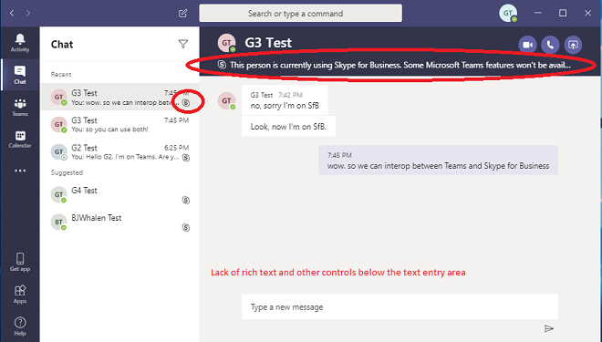
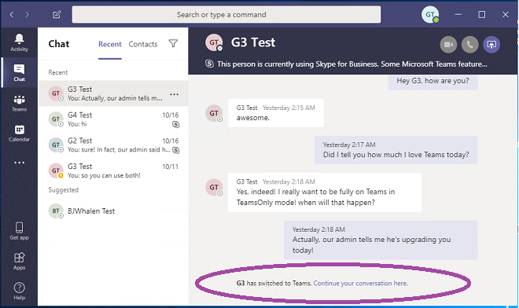

# <a name="upgrade-from-skype-for-business-to-teams-mdash-for-it-administrators"></a>비즈니스용 Skype에서 IT 관리자를 위한 &mdash; 팀으로 업그레이드

## <a name="overview"></a>개요

비즈니스용 Skype에서 팀으로 업그레이드할 때 일부 조직에서는 IT 부서가 계획 하 고 관리 하는 점진적 롤아웃을 필요로 합니다. 이 문서는 주로 대규모의 온-프레미스 조직에서 IT 관리자를 대상으로 하지만 일부 비즈니스용 Skype Online 조직에도 적용 될 수 있습니다.  이 문서를 읽기 전에 먼저 [팀 업그레이드 시작](upgrade-start-here.md) 및 [업그레이드 프레임 워크에 대해](upgrade-framework.md)알아보세요.

>[!NOTE]
>이 문서에서는 비즈니스용 Skype Online, 비즈니스용 Skype 온-프레미스, 비즈니스용 Skype 사용 약관을 설명 합니다.  후자의 용어는 온라인 및 온-프레미스 버전을 모두 의미 합니다.

팀으로 마이그레이션한 사용자는 비즈니스용 Skype에서 호스팅되는 모임에 참가 하는 경우를 제외 하 고는 비즈니스용 Skype 클라이언트를 더 이상 사용 하지 않습니다.  발신자가 팀과 비즈니스용 Skype를 사용 하는지 여부에 관계 없이 사용자의 팀 클라이언트에 있는 모든 수신 채팅 및 통화입니다. 마이그레이션된 사용자가 구성한 모든 새 모임은 팀 모임으로 예약 됩니다. 사용자가 비즈니스용 Skype 클라이언트를 사용 하려고 시도 하는 경우 채팅 및 통화에 대 한 시작이 차단 됩니다.  그러나 사용자는 계속 해 서 비즈니스용 Skype 클라이언트를 사용 하 여 초대 받은 모임에 참가할 수 있습니다. (2017 이전에 출시 된 이전 비즈니스용 Skype 클라이언트는 TeamsUpgradePolicy를 준수 하지 않습니다. 최신 비즈니스용 Skype 클라이언트를 사용 하 고 있는지 확인 합니다.
 
관리자는 [TeamsUpgradePolicy](https://docs.microsoft.com/powershell/module/skype/grant-csteamsupgradepolicy?view=skype-ps)의 속성인 [mode](migration-interop-guidance-for-teams-with-skype.md#coexistence-modes)라는 개념을 사용 하 여 팀으로의 전환을 관리 합니다. 위에서 설명한 팀으로 마이그레이션한 사용자는 "TeamsOnly" 모드에 있습니다.  팀으로 마이그레이션하는 조직의 경우 궁극적인 목표는 모든 사용자를 TeamsOnly 모드로 이동 하는 것입니다.

비즈니스용 Skype (온라인 또는 온-프레미스)의 기존 조직을 팀으로 마이그레이션하는 방법에는 다음 두 가지가 있습니다.

- **병렬 방법** (아일랜드 모드 사용): 기존 비즈니스용 Skype 조직의 사용자가 전환 단계 중에 두 클라이언트를 나란히 사용할 수 있도록 팀에 도입 되었습니다. 이 기간 동안에는 대부분의 경우 팀의 기능을 사용할 수 있습니다. 이 구성에 대 한 모드는 아일랜드 라고 하며,이는 비즈니스용 Skype를 사용 하는 기존 조직의 기본 모드입니다. 조직이 준비 되 면 관리자가 사용자를 TeamsOnly 모드로 이동 합니다.

- **관리 되는 방법** (비즈니스용 skype 모드 중 하나 이상을 사용): 관리자가 조직의 사용자에 대 한 채팅, 통화 및 모임 예약 기능의 전환을 관리 합니다 (비즈니스용 Skype에서 팀으로).  이러한 각 기능은 비즈니스용 Skype 또는 팀에서 사용할 수 있습니다. 관리자는 TeamsUpgradePolicy를 사용 하 여이 기능을 사용자를 위해 팀으로 전환할 시기를 제어 합니다. 아직 TeamsOnly 모드에 있지 않은 사용자는 계속 해 서 비즈니스용 Skype를 사용 하 여 채팅 및 통화를 하 고, 두 사용자 집합은 interop 기능을 통해 통신할 수 있습니다. 관리자는 더 많은 사용자를 팀 전용 모드로 점진적으로 마이그레이션하여 전환을 관리 합니다.  

이 문서에서는 두 방법을 모두 설명 하 고 각 방법의 장단점을 제시 하 여 조직에 적합 한 방법을 선택 하는 데 도움이 되는 정보를 제공 합니다. 

## <a name="side-by-side-method-using-islands-mode"></a>병렬 방법 (아일랜드 모드 사용)

Side-by-side 방법을 사용 하는 경우 사용자는 채팅, VoIP 통화, 모임에 대 한 비즈니스용 Skype 클라이언트를 모두 사용할 수 있습니다. 이 상태는 비즈니스용 Skype 및 팀에 대 한 통신 트래픽이 별도 유지 (같은 사용자에 게도 해당) 되 고 서로 다른 두 클라이언트가 서로 통신 하지 않기 때문에 "군도" 모드 라고 합니다 (같은 조직 내 사용자의 경우). 예를 들어 받는 사람 사용자 A가 아일랜드 모드에 있다고 가정 합니다.

- 다른 사용자의 비즈니스용 Skype 클라이언트에서 시작 된 통신은 항상 사용자 A의 비즈니스용 Skype 클라이언트에 연결 됩니다.
- 다른 사용자의 팀 클라이언트에서 시작 된 통신은 사용자 A의 팀 클라이언트에 연결 되며,이 *조직에는 항상 같은 조직이*있습니다. 
- 다른 사용자의 팀 클라이언트에서 시작 된 통신은 사용자 A의 비즈니스용 Skype 클라이언트에 항상 연결 되며,이는 *페더레이션 조직에 있을 경우*에만 해당 됩니다.

아일랜드 모드는 아직 TeamsOnly 아닌 기존 조직의 기본 모드입니다. Office 365 라이선스를 할당 하면 팀과 비즈니스용 Skype Online 라이선스가 모두 기본적으로 할당 됩니다. (비즈니스용 Skype Server에서 사용자가 온-프레미스에 있는 경우에도 마찬가지입니다. 사용자가 온-프레미스 또는 온라인 상태 인지 여부에 상관 없이, 현재 전체 팀 기능에 필요 하므로 비즈니스용 Skype Online 라이선스를 사용 하도록 설정 합니다. 사실 기본 구성을 변경 하는 단계를 수행 하지 않은 경우에는 조직에서 팀을 이미 사용 하 고 있을 수 있습니다.  이는 side-by-side 방식의 이점 중 하나입니다. 이를 통해 조직 내에서 신속 하 고도 사용자 중심을 채택할 수 있습니다.

이 방법이 효과적으로 작동 하려면 모든 사용자가 두 클라이언트를 동시에 실행 해야 합니다. 아일랜드 모드의 조직 내에서 사용자에 게 들어오는 채팅 및 통화는 비즈니스용 Skype 또는 팀 클라이언트에 있을 수 있으며,이는 받는 사람을 제어 하는 중이 아닙니다. 통신을 시작 하는 데 보낸 사람이 사용 하는 클라이언트에 따라 달라 집니다. 보낸 사람과 받는 사람이 서로 다른 조직에 있는 경우, 사용자에 대 한 수신 통화 및 채팅은 항상 비즈니스용 Skype 클라이언트에 있습니다.  

예를 들어 아일랜드 모드 받는 사람이 비즈니스용 Skype를 실행 하지만 팀에서 메시지를 보내는 경우에는 아일랜드 모드 받는 사람에 게 메시지가 표시 되지 않지만 결과적으로 팀에서 메시지가 누락 되었다는 전자 메일을 받게 됩니다. 마찬가지로, 사용자가 팀을 운영 하 고 비즈니스용 Skype를 사용 하지 않고 다른 사용자가 비즈니스용 Skype에서 메시지를 보내는 경우 사용자는 해당 채팅을 볼 수 없습니다.  부재 중 메시지를 알리는 전자 메일을 받게 됩니다. 이러한 각 경우의 동작은 통화와 유사 합니다. 사용자가 두 클라이언트를 모두 실행 하지 않으면 쉽게 문제가 발생할 수 있습니다.

사용자 A가 군도 모드일 때, 팀의 다른 사용자가 표시 하는 사용자 A의 현재 상태와 비즈니스용 Skype는 독립적입니다.

- 팀을 사용 하는 다른 사용자는 팀의 사용자 활동을 기준으로 현재 상태를 볼 수 있습니다. 
- 비즈니스용 Skype를 사용 하는 다른 사용자는 비즈니스용 Skype에서 사용자의 활동을 기준으로 현재 상태를 볼 수 있습니다. 

즉, 다른 사용자가 사용 하는 클라이언트에 따라 사용자 A에 대해 다른 현재 상태를 볼 수 있습니다. 자세한 내용은 [현재 상태](#presence)를 참조 하세요.

팀 전용 모드로 사용자를 업그레이드할 준비가 되 면 사용자를 개별적으로 업그레이드 하거나 테 넌 트 전체 정책을 사용 하 여 전체 테 넌 트를 한 번에 업그레이드할 수 있습니다. 사용자가 팀의 유일한 모드로 업그레이드 되 면 모든 수신 채팅 및 전화 통화를 받게 됩니다. (비즈니스용 Skype 모임이 팀으로 진행 되는 것은 테 넌 트 기준에 따라 개별 사용자에 게 TeamsUpgradePolicy를 적용 하는 경우에만 트리거됩니다. 자세한 내용은 [모임 마이그레이션을](#meeting-migration) 참조 하세요.

그러나 아일랜드 모드의 업그레이드 되지 않은 수신자는 비즈니스용 Skype 또는 팀 클라이언트에 있는 TeamsOnly 사용자의 채팅 및 통화를 계속 받을 수 있습니다.  이는 팀 클라이언트가 팀 간, 팀 간 통신을 위해 별도의 대화 스레드를 유지 관리 하기 때문입니다 (동일한 사용자의 경우에도).  ( [팀 대화 참조-Interop와 네이티브 스레드 비교](#teams-conversations---interop-versus-native-threads)  예를 들어 군도 사용자 A가 팀을 사용 하 여 사용자 B만 메시지를 메시지로 가정 합니다. 사용자 B가 해당 채팅에 회신 하면 사용자 A의 팀 클라이언트에 게 통신이 전달 됩니다. 이제 사용자 A가 비즈니스용 Skype 클라이언트를 메시지 팀에 사용 한다고 가정 합니다. 사용자 B는 팀에서 채팅을 받지만 다른 대화에 비해 사용자 B의 팀 클라이언트에서 별도의 대화가 됩니다. 사용자 B가 사용자 A와의이 대화에 회신 한 경우 사용자 A의 비즈니스용 Skype 클라이언트에 있는 것입니다. 

다음 표에는 아일랜드 모드와 TeamsOnly 모드 모두에 대 한 팀 환경이 요약 되어 있습니다.  

| 팀 환경 | 아일랜드 모드 | TeamsOnly 모드 |
|:------------------ | :------------------- | :------------------ |
| 수신 되는 채팅 및 통화:|  비즈니스를 위한 팀 또는 비즈니스용 Skype | Teams |
| 다음에 수신 된 PSTN 통화: | 비즈니스용 Skype <br>(팀에서 PSTN 기능 사용은 군도 모드에서 지원 되지 않습니다.)    | Teams |   
 |늘어  | 비즈니스용 Skype와 팀의 현재 상태는 독립적입니다. 사용자는 사용 하는 클라이언트에 따라 동일한 제도 사용자에 대해 다른 상태가 표시 될 수 있습니다. | 현재 상태는 팀의 사용자 활동만을 기반으로 합니다. 사용 하는 클라이언트에 관계 없이 다른 모든 사용자가 현재 상태를 볼 수 있습니다. | 
 | 모임 예약   | 사용자는 팀 또는 비즈니스용 Skype에서 모임을 예약할 수 있습니다. Outlook에서 두 추가 기능을 모두 볼 수 있습니다. |   사용자는 팀 에서만 모임을 예약할 수 있습니다. Outlook에서는 팀 추가 기능만 사용할 수 있습니다. | 

다음 표에는 side-by-side 메서드를 사용 하 여 조직을 팀으로 마이그레이션하는 장단점이 요약 되어 있습니다.

| 전문가가     |       단점 |
| :------------------ | :---------------- |
| 조직 내에서 빠른 채택을 허용 합니다.| 유사한 기능을 가진 클라이언트가 두 개 있지만 사용자 인터페이스가 다르기 때문에 최종 사용자의 혼란이 발생할 수 있습니다. 또한, 귀하는 걸려오는 채팅/전화를 사용 하는 클라이언트를 제어할 수 없습니다. |
| 사용자가 팀에 대해 배우고 비즈니스용 Skype에 대 한 모든 액세스 권한을 가질 수 있습니다. | 사용자가 두 클라이언트를 모두 실행 하지 않는 경우 누락 된 메시지로 인해 최종 사용자 불만족이 발생할 수 있습니다. 사용자가 메시지를 받지 못하는 문제가 발생할 수 있습니다.|
| 팀에서 시작 하기 위해 최소 관리 노력을가지고 있습니다. | 조직에 모든 사용자가 팀을 사용 하 고 있지 않은 경우, 특히 팀에서 활성화 되어 있지 않은 경우 "아일랜드 아웃" 모드를 유지 하 고 TeamsOnly 모드로 전환 하는 것은 어려울 수 있습니다. 예를 들어 사용자의 하위 집합이 팀 전용 모드로 업그레이드 된 후에는 해당 사용자 들만이 메일을 보낼 수 있습니다. 아일랜드 모드의 나머지 모집단의 경우 이러한 메시지는 항상 팀에 있습니다. 그러나 해당 모집단 중 일부는 팀을 실행 하지 않는 경우에는 이러한 메시지를 놓치지 않은 것으로 보고 합니다. |
|  | 팀을 사용 하는 경우 비즈니스용 Skype 서버에 온-프레미스 계정이 있는 사용자는 interop 또는 페더레이션 지원이 없습니다.  이 경우 비즈니스용 Skype Online에 거주 하는 사용자와 비즈니스용 Skype 온-프레미스를 사용 하는 경우 혼란이 발생할 수 있습니다.   |

## <a name="managed-transition-method-using-skype-for-business-modes"></a>관리 전환 방법 (비즈니스용 Skype 모드 사용)

일부 조직에서는 조직이 비즈니스용 Skype에서 팀으로 전환 됨에 따라 더 간단 하 고 예측 가능한 환경을 제공 하는 것이 좋습니다. 이 모델에서는 IT 관리자가 TeamsUpgradePolicy에서 비즈니스용 Skype 모드 중 하나를 사용 하 여 비즈니스용 Skype에 남아 있는 사용자를 명시적으로 지정 하 고 팀의 유일한 모드로 마이그레이션하기 전에, 선택한 사용자를 팀 전용 모드로 이동할 준비가 되 면 관리자는 해당 사용자에 대 한 모드를 TeamsOnly로 업데이트 합니다.  배포가 진행 됨에 따라 더 많은 사용자가 비즈니스용 Skype에서 TeamsOnly 모드로 전환 됩니다.  전환 중:

- 비즈니스용 Skype에 있는 사용자는 다른 사용자의 팀 또는 비즈니스용 Skype 클라이언트에서 보낸 통신에 관계 없이 비즈니스용 skype 클라이언트의 모든 수신 채팅 및 통화를 받습니다. 또한 이러한 비즈니스용 Skype 사용자의 경우 최종 사용자의 혼란을 방지 하 고 적절 한 라우팅을 위해 팀 클라이언트의 통화 및 채팅 기능을 사용할 수 없습니다. 

- 팀 전용 모드의 사용자는 통신의 원본 위치, 비즈니스 Skype 또는 모든 종류의 페더레이션 사용자에 관계 없이 팀 클라이언트의 모든 수신 채팅 및 통화를 받습니다. 

제도 방법과 달리 관리 전환 방법에서는 비즈니스용 Skype 사용자 및 팀을 위해 사용자만 서로 통신할 수 있습니다. 비즈니스용 Skype 사용자와 팀 사용자 간의 통신을 상호 운용성 또는 "interop" 라고 합니다. ( [상호 운용성](#interoperability)을 참조 하세요.) Interop 통신은 비즈니스용 Skype 사용자와 팀의 다른 사용자 간 채팅 및 통화에 대 한 일대일 기반으로 가능 합니다. 또한, 초대 받은 사용자는 항상 비즈니스용 Skype 또는 팀 모임에 참가할 수 있지만, 모임 유형에 해당 하는 클라이언트를 사용 해야 합니다. 자세한 내용은 [모임](#meetings)을 참조 하세요.

관리 전환의 사용자는 일반적으로 아일랜드 모드에 있지 않기 때문에 다른 사용자가 사용 하는 클라이언트에 관계 없이 사용자에 대 한 현재 상태는 일관성을 유지 합니다. 사용자가 비즈니스용 Skype 모드 중 하나에 있는 경우 다른 모든 사용자는 비즈니스용 Skype에서 해당 사용자의 활동을 기준으로 현재 상태를 볼 수 있습니다. 마찬가지로, 사용자가 팀 전용 모드일 경우 다른 모든 사용자는 해당 사용자의 활동에 따라 현재 상태를 볼 수 있습니다. 자세한 내용은 [현재 상태](#presence)를 참조 하세요.

팀 사용을 아직 시작 하지 않은 조직의 경우 관리자는 테 넌 트 범위 모드를 아일랜드에서 SfbWithTeamsCollab로 변경 해야 합니다. (일부 팀 사용이 이미 있는 조직의 경우 관리자가 팀에서 이미 활성화 된 사용자를 "grandfather" 하 여 변경 내용이 적용 되지 않았는지 확인 해야 합니다. 자세한 내용은 [고립 모드에서 팀을 이미 사용 중인 조직에 대해 관리 되는 업그레이드](#a-managed-upgrade-for-an-organization-that-is-already-using-teams-in-islands-mode)를 참조 하세요.

모드가 아일랜드에서 SfbWithTeamsCollab로 변경 되는 경우 팀이 전혀 사용 하지 않은 사용자는 비즈니스용 Skype를 사용 하는 방법의 차이를 볼 수 없습니다. 그러나 사용자가 팀을 사용 하기 시작 하면 팀 & 채널 및 파일과 같은 기능에만 노출 됩니다. 관리자가 해당 기능에 대 한 원하는 클라이언트로 비즈니스용 Skype를 지정 했기 때문에 팀에서는 채팅, 통화 및 모임 예약을 사용할 수 없습니다.  

참고: 사용자가 아일랜드에서 비즈니스용 Skype 모드 중 하나로 변경 되는 경우 사용자 a와 통신 하는 다른 사용자의 팀 클라이언트는 사용자 a의 모드가 변경 되어 해당 사용자 a의 적절 한 클라이언트에 게 통신을 라우팅할 수 있도록 해야 합니다.  사용자 A와의 기본 팀 간 채팅을 이미 설정한 사용자의 경우, 다른 사용자의 팀 클라이언트에 게 아일랜드에서 비즈니스용 Skype 모드로의 모드 변경을 인식 하는 데 최대 36 시간이 걸릴 수 있습니다.   반면, 기존 사용자에 대 한 팀 전용 모드 변경은 2 시간 내에 다른 클라이언트에서 검색 됩니다.

관리자가 준비 되 면 사용자의 모드를 TeamsOnly로 업데이트 하 여 특정 사용자에 대 한 채팅, 통화 및 모임 일정을 한 번에 모두 팀으로 전환할 수 있습니다.  

또는 관리자가 SfBWithTeamsCollabAndMeetings 모드를 사용 하 여 비즈니스용 Skype에서 채팅 및 통화 기능을 종료 하면서 모임 예약을 먼저 팀으로 전환할 수 있습니다. 이 모드에서는 조직에서 모임에 대 한 팀으로 전환할 수 있습니다--사용자가 아직 팀 전용 모드로 이동할 준비가 되지 않은 경우 (일반적으로 기존 PSTN 기능을 마이그레이션하는 데 더 많은 시간이 필요할 수 있으므로) 이 전환 시나리오를 [먼저 모임](meetings-first.md)이라고 합니다.


다음 표에는 비즈니스용 Skype 모드를 팀의 유일한 모드에 대 한 전환 단계로 사용할 때의 장단점을 요약 하 여 설명 합니다.


| 전문가가     |       단점 |
| :------------------ | :---------------- |
| 최종 사용자를 위한 예측 가능한 라우팅  모든 통화와 채팅은 관리자 선택에 따라 비즈니스용 Skype 또는 팀 (둘 다 제외)에 있습니다.  | Interop 대화에는 서식 있는 텍스트, 파일 공유 및 화면 공유가 지원 되지 않습니다.  이 작업은 주문형 모임에서 처리 될 수 있지만,이는 원활 하지 않습니다.  |
| 특정 기능을 하나의 클라이언트 에서만 사용할 수 있기 때문에 최종 사용자의 혼란을 제거 합니다.  | 사용자는 동일한 기능 집합에 대해 두 클라이언트를 나란히 볼 수 없습니다. 이는 사용자가 비즈니스를 위해 비즈니스용 Skype에서 팀으로 전환 하는 것이 주요 패러다임의 변화 인 경우 특히 문제가 될 수 있습니다. |
| 팀의 점진적 소개를 허용 합니다.  |  | |
| 관리자는 비즈니스용 Skype에서 팀으로의 전환을 완벽 하 게 제어할 수 있습니다. |  | | 
| 아직 팀 전용 모드로 완전히 이동할 준비가 되지 않은 경우에도 조직에서 모임에 대해 팀을 사용할 수 있도록 허용 합니다. |  | |
| 다른 사람이 볼 수 있는 지정 된 사용자가 사용 하는 클라이언트에 관계 없이 동일한 상태입니다.  |  | |

## <a name="summary-of-upgrade-methods"></a>업그레이드 방법 요약

다음 표에는 업그레이드 방법이 요약 되어 있습니다.

| 나란히 (제도 모드 사용)     |      관리 됨 (비즈니스용 Skype 모드 사용) |
| :------------------ | :---------------- |
| 팀만을 대상으로 업그레이드 하기 전에 사용자는 들어오는 채팅 및 호출이 두 클라이언트에서 모두 동시에 실행 되어야 합니다.   | 받는 사람 모드에 따라 한 대의 클라이언트 에서만 채팅 및 통화가 가능 합니다. 업그레이드 되지 않은 사용자는 두 클라이언트를 모두 실행할 수 있지만, 기능적으로 중복 되는 것은 없습니다 (통화 및 채팅은 팀에서 사용할 수 없습니다).  관리자는 사용자가 팀 또는 비즈니스용 Skype에서 모임을 예약할 지 여부를 제어할 수도 있습니다.   |
| 사용자는 동일한 기능에 대해 비즈니스용 Skype 및 팀을 나란히 사용할 수 있습니다.   | 관리자가 비즈니스용 Skype에 있는 것과 동일한 기능을 제공 하지 않고 최종 사용자 (팀 및 채널)에 게 팀의 새로운 기능을 도입할 수 있도록 합니다.   |
|두 사용자가 모두 군도 모드에 있는 동안 비즈니스용 Skype와 팀 간의 상호 운용성이 없습니다. 일부 사용자가 팀 전용으로 업그레이드 되 면 해당 사용자와 다른 사용자 간에는 interop 대화가 계속 해 서 고립 모드로 발생할 수 있습니다. 그러나 군도 사용자는 팀을 사용 하 여 interop 대화를 방지할 수 있습니다. | Interop는 비즈니스용 Skype와 팀 사용자 간의 통신에 필요 합니다.   |

## <a name="tools-for-managing-the-upgrade"></a>업그레이드 관리 도구

위에서 설명한 방법 중 하나를 사용 하는 경우 관리자는 사용자의 공존 모드를 제어 하는 [TeamsUpgradePolicy](https://docs.microsoft.com/powershell/module/skype/grant-csteamsupgradepolicy?view=skype-ps)를 통해서만 teamsonly로 전환을 관리 합니다. 각 모드에 대 한 자세한 내용은 [공존 모드](migration-interop-guidance-for-teams-with-skype.md#coexistence-modes)를 참조 하세요.

관리자가 비즈니스용 Skype 모드를 사용 하 여 관리 전환을 수행 하는지, 아니면 기본 군도 구성에서 팀 전용 모드로만 업그레이드 하는 경우 TeamsUpgradePolicy는 기본 도구입니다.  팀의 다른 정책과 마찬가지로 TeamsUpgradePolicy 사용자에 게 직접 할당할 수 있으며, 테 넌 트 전체 기본값으로 설정할 수도 있습니다. 사용자에 게 할당 하는 모든 작업은 테 넌 트 기본 설정 보다 우선 합니다.  팀 관리 콘솔과 PowerShell에서 관리할 수 있습니다.

관리자는 비즈니스용 skype online에 이미 있는 사용자 에게만 자신을 배정할 수 있다는 점을 제외 하 고, 비즈니스용 Skype Online 또는 온-프레미스 중 사용자에 게 TeamsUpgradePolicy 모드를 할당할 수 있습니다. 이는 비즈니스용 skype 사용자 및 페더레이션이 있는 interop는 사용자가 비즈니스용 Skype Online에서 홈을 사용 하는 경우에만 가능 하기 때문입니다.

비즈니스용 skype 계정을 사용 하는 사용자는 비즈니스용 skype 온-프레미스 도구 모음에서 이동-CsUser를 사용 하 여 온라인 (비즈니스용 Skype Online 또는 팀에 직접)으로 [이동 해야 합니다](https://docs.microsoft.com/SkypeForBusiness/hybrid/move-users-from-on-premises-to-teams) . 이러한 사용자는 1 개 또는 2 개 단계 에서만 TeamsOnly로 이동할 수 있습니다.

-   1 단계: CsUser 이동에서-MoveToTeams 스위치를 지정 합니다. 이를 위해서는 비즈니스용 Skype 서버 2019 또는 CU8의 비즈니스용 Skype 서버 2015이 필요 합니다.

-   2 단계: CsUser Move를 실행 한 후 TeamsUpgradePolicy를 사용 하 여 사용자에 게 TeamsOnly 모드를 부여 합니다.

다른 정책과는 달리, Office 365에서 새 TeamsUpgradePolicy 인스턴스를 만들 수 없습니다. 모든 기존 인스턴스가 서비스에 빌드됩니다.  (Mode는 정책 인스턴스의 이름이 아니라 TeamsUpgradePolicy 내에 있는 속성입니다.) 일부 경우에는 그렇지 않고 정책 인스턴스의 이름은 mode와 동일 합니다. 특히, 팀 전용 모드를 사용자에 게 할당 하는 경우 TeamsUpgradePolicy의 "UpgradeToTeams" 인스턴스가 해당 사용자에 게 부여 됩니다. 다음 명령을 실행 하 여 모든 인스턴스 목록을 볼 수 있습니다.

```
Get-CsTeamsUpgradePolicy|ft Identity, Mode, NotifySfbUsers
```

온라인 사용자를 팀 전용 모드로 업그레이드 하려면 "UpgradeToTeams" 인스턴스를 할당 합니다. 

```
Grant-CsTeamsUpgradePolicy -PolicyName UpgradeToTeams -Identity $user 
```

온-프레미스 비즈니스용 Skype 사용자를 팀 전용 모드로 업그레이드 하려면 온-프레미스 도구 모음에서-CsUser Move 사용자를 사용 합니다.

```
Move-CsUser -identity $user -Target sipfed.online.lync.com -MoveToTeams -credential $cred
```

특정 사용자별 권한 부여 (우선 순위)가 있는 경우를 제외 하 고 테 넌 트에서 모든 사용자에 대 한 모드를 변경 하려면 다음 명령을 실행 합니다.

```
Grant-CsTeamsUpgradePolicy -PolicyName SfbWithTeamsCollab -Global
```


>[!NOTE]
>비즈니스용 Skype 계정을 보유 하 고 있는 사용자가 있는 경우, 온-프레미스 Skype 계정으로 모든 사용자에 게 다른 모드를 명시적으로 할당 하지 않는 한, 테 넌 트 수준에서 TeamsOnly 모드를 할당 해서는 안 됩니다.


### <a name="using-notifications-in-skype-for-business-clients"></a>비즈니스용 Skype 클라이언트에서 알림 사용

관리자는 다음 다이어그램에 표시 된 것 처럼 사용자에 게 곧 팀으로 업그레이드할 것을 알리기 위해 비즈니스용 Skype 클라이언트에서 최종 사용자 알림을 제공 하는 옵션을 사용할 수 있습니다. 예를 들어 관리자가 팀 전용 모드로 사용자 그룹을 업그레이드 하기 전에 관리자는 해당 사용자 그룹에 대해 이러한 알림을 설정 하 려 할 수 있습니다. 이러한 알림은 NotifySfbUsers = true 인 TeamsUpgradePolicy 인스턴스를 사용 하 여 사용할 수 있습니다.  TeamsOnly 이외의 모든 모드에서는 실제로 두 개의 NotifySfbUsers 값에 해당 하는 mode 당 두 개의 인스턴스가 있습니다.  TeamsOnly 이외의 모든 모드에서는 실제로 두 개의 NotifySfbUsers 값에 해당 하는 mode 당 두 개의 인스턴스가 있습니다. 


사용자가 비즈니스용 Skype Online에서 사용 되는 경우 사용자와 동일한 모드의 정책 인스턴스를 할당 하 되 NotifySfbUsers = true를 사용 합니다. 

사용자가 비즈니스용 Skype Server 온-프레미스에 있는 경우 온-프레미스 도구 모음을 사용 해야 하며 비즈니스용 skype server 2019 또는 CU8 for Business Server 2015의 경우이 필요 합니다. 온-프레미스 PowerShell 창에서 NotifySfbUsers = true를 사용 하 여 TeamsUpgradePolicy의 새 인스턴스를 만듭니다.

```
New-CsTeamsUpgradePolicy -Identity EnableNotification -NotifySfbUsers $true
```

그런 다음, 온-프레미스 PowerShell 창을 사용 하 여 원하는 사용자에 게 새 정책을 할당 합니다.

```
Grant-CsTeamsUpgradePolicy -Identity $user -PolicyName EnableNotification
```

### <a name="meeting-migration"></a>모임 마이그레이션

사용자가 팀 전용 모드로 마이그레이션될 때 기본적으로 자신이 구성한 비즈니스용 Skype 모임이 팀으로 변환 됩니다. 사용자에 게 팀 전용 모드를 할당할 때 선택적으로 기본 동작을 사용 하지 않도록 설정할 수 있습니다. 온-프레미스에서 사용자를 이동 하는 경우 온라인 사용자 계정에 대 한 모임을 작동 하도록 클라우드로 마이그레이션해야 하지만,-MoveToTeams를 지정 하지 않으면 모임이 팀으로 변환 되지 않고 비즈니스용 Skype 모임으로 마이그레이션됩니다. 

테 넌 트 수준에서 TeamsOnly 모드를 할당할 때 모임 마이그레이션은 사용자에 대해 트리거되지 않습니다. 테 넌 트 수준에서 TeamsOnly 모드를 할당 하 고 모임을 마이그레이션하면 PowerShell을 사용 하 여 테 넌 트의 사용자 목록을 가져올 수 있습니다 (예: 필요한 필터와 함께 CsOnlineUser 사용) 한 다음 이러한 각 사용자를 반복 하 여 모임을 트리거합니다. 시작-CsExMeetingMigration을 사용 하 여 마이그레이션. 자세한 내용은 [MMS (모임 마이그레이션 서비스) 사용](https://docs.microsoft.com/skypeforbusiness/audio-conferencing-in-office-365/setting-up-the-meeting-migration-service-mms)을 참조 하세요.


### <a name="additional-considerations-for-organizations-with-skype-for-business-server-on-premises"></a>비즈니스용 Skype Server 온-프레미스를 사용 하는 조직에 대 한 추가 고려 사항

- 비즈니스용 Skype 하이브리드을 설정 하는 것은 팀 전용 모드로 마이그레이션하는 필수 사항입니다. 통합 없이 아일랜드 모드에서 팀을 사용할 수 있지만, 사용자가 비즈니스용 Skype 온-프레미스에서 비즈니스용 Skype Online ( [Move-CsUser](https://docs.microsoft.com/SkypeForBusiness/hybrid/move-users-between-on-premises-and-cloud)사용)으로 이동할 때 까지는 TeamsOnly 모드 전환 기능을 설정할 수 없습니다. 자세한 내용은 [하이브리드 연결 구성을](https://docs.microsoft.com/skypeforbusiness/hybrid/configure-hybrid-connectivity)참조 하세요.

- 비즈니스용 Skype 계정이 있는 (즉, 이동-CsUser를 사용 하 여 클라우드로 아직 이동 하지 않은) 팀 사용자는 비즈니스용 Skype 사용자와 상호 운용할 수 없으며 외부 사용자와 페더레이션 할 수도 없습니다. 이 기능은 사용자를 클라우드로 이동한 후에만 사용할 수 있습니다 (예를 들어, 아일랜드 모드에서 또는 Team사용자만 해당). 

- 비즈니스용 Skype 계정을 보유 하 고 있는 사용자가 있는 경우, 온-프레미스 Skype 계정으로 모든 사용자에 게 다른 모드를 명시적으로 할당 하지 않는 한, 테 넌 트 수준에서 TeamsOnly 모드를 할당 해서는 안 됩니다. 

- 올바른 비즈니스용 Skype 특성을 사용 하 여 사용자가 Azure AD로 적절 하 게 동기화 되었는지 확인 해야 합니다. 이러한 특성은 모두 "msRTCSIP"이 포함 된 접두사입니다. 사용자가 Azure AD에 올바르게 동기화 되지 않은 경우 팀의 관리 도구에서 이러한 사용자를 관리할 수 없게 됩니다. 자세한 내용은 [팀 및 비즈니스용 Skype에 대 한 AZURE AD Connect 구성을](https://docs.microsoft.com/SkypeForBusiness/hybrid/configure-azure-ad-connect)참조 하세요.

- 하이브리드 조직에서 새 팀 또는 비즈니스용 Skype Online 사용자를 만들려면 *먼저 비즈니스용 Skype Server 온-프레미스에서 사용자를 사용 하도록 설정*하 고 사용자를 이동-csuser를 사용 하 여 온-프레미스에서 클라우드로 이동 합니다.  온-프레미스에서 사용자를 만들면 남아 있는 나머지 온-프레미스 비즈니스용 Skype 사용자가 새로 만든 사용자에 게 경로를 지정할 수 있게 됩니다. 모든 사용자가 온라인으로 이동한 후에는 온-프레미스에서 사용자를 활성화 하는 데 더 이상 필요 하지 않습니다.

- 사용자가 온-프레미스에서 클라우드로 이동 하는 경우, 해당 사용자가 구성한 모임은 비즈니스용 Skype Online 또는 팀으로 마이그레이션됩니다--MoveToTeams 스위치가 지정 되었는지 여부에 따라 달라 집니다.

- 온-프레미스 사용자 용 Skype for Business 클라이언트에 알림을 표시 하려는 경우 온-프레미스 도구 모음에서 TeamsUpgradePolicy를 사용 해야 합니다. NotifySfbUsers 매개 변수만 온-프레미스 사용자와 관련이 있습니다.  온-프레미스 사용자는 TeamsUpgradePolicy의 온라인 인스턴스에서 자신의 모드를 받습니다. [허용-CsTeamsUpgradePolicy](https://docs.microsoft.com/powershell/module/skype/grant-csteamsupgradepolicy?view=skype-ps)의 메모를 참조 하세요. 

>[!NOTE]
> 9 월 3 2019 일 이후에 만들어진 모든 새 테 넌 트는 관리자가 다운 그레이드할 수 있는 기능 없이 팀만 테 넌 트에만 생성 됩니다. Skype for Business Server 온-프레미스를 사용 하 여 이전에 office 365 2019 구독이 설치 되어 있지 않은 경우에는 Office 365에 대 한 구독을 얻은 후 테 넌 트가 다운 그레이드 하도록 Microsoft 지원에 문의 해야 합니다. 


## <a name="perform-the-upgrade-for-your-organization"></a>조직에 대 한 업그레이드 수행

이 섹션에서는 다음과 같은 업그레이드 옵션에 대해 설명 합니다.

- 병렬 업그레이드 (아일랜드 모드 사용)
- 아직 팀 사용을 시작 하지 않은 조직에 대 한 관리 업그레이드
- 이미 아일랜드 모드에서 팀을 사용 중인 조직에 대해 관리 되는 업그레이드

### <a name="side-by-side-upgrade-using-islands-mode"></a>병렬 업그레이드 (아일랜드 모드 사용)

Side-by-side 업그레이드 옵션:

- 전체 조직에 대해 빠른 업그레이드를 수행할 수 있는 경우이 옵션을 고려 하세요.  두 클라이언트를 실행 하는 데 혼란을 초래할 수 있으므로이 기간을 최소화 하는 것이 가장 좋습니다. 사용자가 두 클라이언트를 모두 실행 한다는 것을 확인 해야 합니다.

- 이 옵션은 box 모델 이며, Office 365 라이선스를 할당 하는 경우를 제외 하 고 팀을 시작 하는 데 관리자 작업이 필요 하지 않습니다. 사용자가 이미 비즈니스용 Skype Online을 사용 하 고 있는 경우이 모델에 이미 있을 수 있습니다.

- 병렬 모드를 종료 하 고 TeamsOnly으로 이동 하는 것은 어려울 수 있습니다. 업그레이드 된 사용자는 팀을 통해서만 통신 하기 때문에 해당 사용자와 통신 하는 조직의 다른 사용자는 팀을 사용 해야 합니다.  팀 사용을 시작 하지 않은 사용자가 있는 경우에는 누락 된 메시지에 노출 됩니다. 또한 비즈니스용 Skype에서 온라인 으로만 팀에 있는 사용자만 볼 수 있습니다. 일부 조직에서는 모든 사용자를 업그레이드할 준비가 될 때까지 대기 해야 하는 테 넌 트 전역 정책을 사용 하 여 테 넌 트 전체 업그레이드를 선택 합니다.


### <a name="a-managed-upgrade-for-an-organization-that-has-not-yet-started-using-teams"></a>아직 팀 사용을 시작 하지 않은 조직에 대 한 관리 업그레이드

조직에서 아직 팀에 활성 사용자가 없는 경우 첫 번째 단계는 TeamsUpgradePolicy에 대 한 기본 테 넌 트 전역 정책을 비즈니스용 Skype 모드 중 하나 (예: SfbWithTeamsCollab)로 설정 하는 것입니다.  팀 사용을 아직 시작 하지 않은 사용자는 동작의 차이를 볼 수 없습니다. 그러나 테 넌 트 수준에서이 정책을 설정 하면 사용자를 팀 전용 모드로 업그레이드 하 고 업그레이드 된 사용자가 업그레이드 되지 않은 사용자와 계속 통신할 수 있습니다.  파일럿 사용자를 식별 한 후에는이를 팀 전용으로 업그레이드할 수 있습니다.  온-프레미스 인 경우 CsUser Move를 사용 합니다. 온라인 상태인 경우에는 TeamsUpgradePolicy를 사용 하 여 팀 전용 모드를 할당 하면 됩니다.  기본적으로 이러한 사용자가 예약한 모든 비즈니스용 Skype 모임은 팀으로 마이그레이션됩니다.

다음은 주요 명령입니다.

1. 다음과 같이 테 넌 트 전체 기본값을 mode SfbWithTeamsCollab로 설정 합니다.

   ```
   Grant-CsTeamsUpgradePolicy -PolicyName SfbWithTeamsCollab -Global
   ```

2. 다음과 같은 경우에만 사용자를 TeamsOnly로 업그레이드 합니다.

   - 사용자가 이미 온라인 상태 이면 다음을 수행 합니다.

     ```
     Grant-CsTeamsUpgradePolicy -PolicyName UpgradeToTeams -Identity $username 
     ```

   - 사용자가 온-프레미스 인 경우:

     ```
     Move-CsUser -identity $user -Target sipfed.online.lync.com -MoveToTeams -credential $cred 
     ```

상속자
 
- 테 넌 트 전체 정책을 SfbWithTeamsCollab로 설정 하는 대신 SfbWithTeamsCollabAndMeetings로 설정할 수 있습니다. 이렇게 하면 모든 사용자가 팀의 모든 새 모임을 예약 합니다.
- 이동-CsUser는 온-프레미스 도구에서 cmdlet입니다. MoveToTeams 스위치에는 비즈니스용 Skype Server 2019 또는 CU8의 비즈니스용 Skype 서버 2015이 필요 합니다. 이전 버전을 사용 하는 경우 먼저 사용자를 비즈니스용 Skype Online으로 이동한 다음 해당 사용자에 게 팀의 유일한 모드를 부여할 수 있습니다.
- 기본적으로 비즈니스용 Skype 모임은 팀의 유일한 모드로 업그레이드 하거나 SfbWithTeamsCollabAndMeetings 모드를 할당할 때로 마이그레이션됩니다.  

아래 다이어그램은 이전에 팀을 사용 하지 않고 조직에 대해 관리 되는 업그레이드의 구상 단계를 보여줍니다. 막대의 높이는 사용자 수를 나타냅니다. 업그레이드 단계 중에는 모든 사용자가 서로 통신할 수 있습니다.  비즈니스용 Skype 사용자는 Interop를 사용 하는 사용자만 통신 하며 그 반대의 경우도 마찬가지입니다.


### <a name="a-managed-upgrade-for-an-organization-that-is-already-using-teams-in-islands-mode"></a>이미 아일랜드 모드에서 팀을 사용 중인 조직에 대해 관리 되는 업그레이드

조직의 일부 사용자가 아일랜드 모드에서 활발 하 게 팀을 사용 하 고 있는 경우 기존 사용자의 기능을 제거 하는 것이 원하지 않을 수 있습니다. 따라서 테 넌 트 전체 정책을 변경 하기 전에 추가 단계가 필요 합니다. 이 솔루션은 테 넌 트 전체 정책을 SfbWithTeamsCollab로 설정 하기 전에 이러한 기존 활성 팀 사용자를 아일랜드 모드로 "grandfather" 하는 것입니다.  이 작업을 완료 한 후에는 위에서 설명한 대로 배포를 진행할 수 있지만, 팀에서 활성 상태인 사용자는 아일랜드 모드에 있고 나머지 사용자는 SfbWithTeamsCollab 모드에 있는 두 그룹의 사용자가 있습니다. 이러한 사용자를 TeamsOnly 모드로 점진적으로 이동할 수 있습니다.

1. 다음과 같이 팀에서 활성 상태인 사용자를 찾습니다.

   1. Office 365 관리 포털의 왼쪽 탐색에서 보고서로 이동한 다음 사용 현황을 클릭 합니다. 
   2. "보고서 선택" 드롭다운에서 Microsoft 팀, 사용자 활동을 차례로 선택 합니다. 팀에서 활성화 된 내보낼 수 있는 사용자 테이블을 제공 합니다. 
   3. 내보내기, Excel 열기, 필터링을 차례로 클릭 하 여 팀에서 활성 상태인 사용자만 표시 합니다.

2. 1 단계에서 찾은 각 활성 팀 사용자에 대해 원격 PowerShell에 아일랜드 모드를 할당 합니다. 이를 통해 다음 단계로 이동 하 여 사용자 환경을 변경 하지 않도록 할 수 있습니다.  

   ```
   $users=get-content “C:\MyPath\users.txt” 
    foreach ($user in $users){ 
    Grant-CsTeamsUpgradePolicy -identity $user -PolicyName Islands} 
   ```

3. SfbWithTeamsCollab에 대해 테 넌 트 전체 정책을 설정 합니다.

   ```
   Grant-CsTeamsUpgradePolicy -Global -PolicyName SfbWithTeamsCollab 
   ```

4. 선택한 사용자를 TeamsOnly 모드로 업그레이드 합니다. 아일랜드 모드에서 사용자를 업그레이드 하 여 사용자가 아일랜드 모드일 때 발생할 수 있는 혼동을 최소화 하는 것이 좋지만,이 경우에는 아일랜드 모드 또는 SfbWithTeamsCollab 모드에서 사용자를 업그레이드할 수 있습니다.   

   비즈니스용 Skype Online에 속한 사용자의 경우:  

   ```
   Grant-CsTeamsUpgradePolicy -Identity $user -PolicyName UpgradeToTeams 
   ```

   비즈니스용 Skype Server 온-프레미스에 속한 사용자의 경우:  

   ```
   Move-CsUser -Identity $user -Target sipfed.online.lync.com -MoveToTeams -credential $cred 
   ```

아래 다이어그램은 시작 시 활성 제도 사용자가 있는 관리 전환의 개념적 단계를 보여 줍니다. 막대의 높이는 사용자 수를 나타냅니다. 업그레이드 단계 중에는 모든 사용자가 서로 통신할 수 있습니다.  비즈니스용 Skype 사용자는 interop를 사용 하는 사용자만 통신 하며 그 반대의 경우도 마찬가지입니다.


   

## <a name="considerations-for-pstn-calling"></a>PSTN 통화에 대 한 고려 사항

PSTN 호출 기능이 관련 되어 있으면 팀 전용 모드로 이동할 때 네 가지 시나리오가 발생할 수 있습니다.

- *Microsoft 전화 요금제를 사용 하 여 비즈니스용 Skype Online의 사용자*입니다. 업그레이드 되 면이 사용자는 계속 Microsoft 통화 요금제를 보유 하 게 됩니다.

- 비즈니스용 skype Online의 Skype for Business for 온 *-프레미스 음성 기능을 사용 하는 사용자* 팀으로의 사용자 업그레이드는 사용자가 자신에 게 PSTN 기능을가지고 있는지를 확인 하기 위해 자신을 마이그레이션하도록 조정 해야 합니다.

- *비즈니스용 Skype 온-프레미스에서 엔터프라이즈 음성을 사용 하 여 온라인으로 전환 하 고 온-프레미스 PSTN 연결을 유지 하는 사용자*입니다.  이 사용자를 팀으로 마이그레이션하면 사용자의 온-프레미스 비즈니스용 Skype 계정을 클라우드로 이동 하 고 사용자의 직접 라우팅에 맞게 이동 하도록 조정 해야 합니다. 

- Enterprise Voice를 사용 하는 *비즈니스용 Skype 온-프레미스 사용자*로 서, 온라인으로 이동 하 고 Microsoft의 통화 요금제를 사용 하 게 됩니다.  이 사용자를 팀으로 마이그레이션하면 사용자의 온-프레미스 비즈니스용 Skype 계정을 클라우드로 이동 하 고 해당 사용자의 전화 번호를 Microsoft 전화 플랜 또는 B로 이동 하는 것을 조정 해야 합니다 .의 새 구독자 번호 지정 사용 가능한 지역.

이 문서에서는 상위 수준의 개요만 제공 합니다.  자세한 내용은 [전화 시스템 다이렉트 라우팅](direct-routing-landing-page.md) 및 [통화 계획](calling-plan-landing-page.md)을 참조 하세요. 또한, 팀에 전화 시스템을 사용 하는 것은 사용자가 TeamsOnly 모드에 있는 경우에만 지원 됨을 참고 하세요.  사용자가 군도 모드에 있는 경우, 전화 시스템은 비즈니스용 Skype 에서만 지원 됩니다. 

### <a name="from-skype-for-business-online-with-microsoft-calling-plans"></a>Microsoft 통화 요금제를 사용 하 여 비즈니스용 Skype Online에서 

이는 음성 관련 가장 간단한 업그레이드 시나리오입니다. 

1. 사용자에 게 팀 라이선스가 할당 되었는지 확인 합니다. 기본적으로 Office 365 라이선스를 할당 하면 팀을 사용할 수 있으므로 이전에 팀 라이선스를 사용 하지 않도록 설정한 경우가 아니면 작업을 수행 하지 않아도 됩니다.

2.  사용자가 이미 전화 번호를 사용 하는 Microsoft 호출 계획이 있는 경우, TeamsUpgradePolicy에 사용자 팀 전용 모드를 할당 하는 것 으로만 변경 해야 합니다.  팀 전용 모드를 할당 하기 전에 들어오는 PSTN 통화가 사용자의 비즈니스용 Skype 클라이언트에 배치 됩니다. 팀 전용 모드로 업그레이드 한 후에는 들어오는 PSTN 통화가 사용자의 팀 클라이언트에 배치 됩니다.  

### <a name="from-skype-for-business-online-with-on-premises-voice"></a>온-프레미스 음성으로 비즈니스용 Skype Online에서

이 시나리오에서는 사용자가 이미 비즈니스용 Skype Online에 있지만, 하이브리드 모드 또는 클라우드 커넥터 에디션에 비즈니스용 Skype Server를 사용 하 여 PSTN 연결이 온-프레미스입니다. PSTN 기능을 사용 하 여이 사용자를 팀 전용 모드로 마이그레이션하면 PSTN trunks가 클라우드의 직접 라우팅 서비스에 직접 연결 하 여 온-프레미스 세션 경계 컨트롤러 (SBC)를 통해 직접 라우팅에 사용할 수 있도록 합니다.

기본 단계는 다음과 같습니다.  1-4 단계는 제안 된 순서 대로 나열 되지만 순서에 관계 없이 수행할 수 있습니다. 중요 한 것은 5 단계 이전에 모두 완료 되어야 한다는 것입니다.

1. 테 넌 트 전체 정책을 비즈니스용 Skype 모드 중 하나로 설정 하는 경우 앞에서 설명한 대로 해당 아일랜드 모드를 명시적으로 할당 하 여 기존 아일랜드 사용자에 게 grandfather 합니다.

2. 직접 라우팅을 위해 테 넌 트를 구성 합니다. [직접 라우팅의 테 넌 트 단위 구성 요약을](#summary-of-per-tenant-configuration-of-direct-routing)참조 하세요.

3. 필요한 경우 이러한 사용자에 대 한 다양 한 팀 정책을 구성 합니다 (예: TeamsMessagingPolicy, TeamsMeetingPolicy 등). 언제 든 지이 작업을 수행할 수 있지만, 사용자를 업그레이드할 때 올바른 구성을 유지 하려면 사용자가 TeamsOnly 모드로 업그레이드 하기 전에이 작업을 수행 하는 것이 가장 좋습니다.

4. 음성 마이그레이션을 위해 사용자 선택 준비: 
   - 필요한 경우 팀 라이선스를 할당 합니다.  비즈니스용 Skype Online 온-프레미스 음성에서 사용자가 이미 기능을 사용 하 고 있는 경우, 사용자는 이미 비즈니스용 Skype 요금제 2와 Microsoft 전화 시스템을 보유 하 고 있는 것으로 간주 합니다. 비즈니스용 Skype Online 요금제 2 라이선스를 포함 하 여 사용 하도록 설정 된 계획을 모두 유지 합니다.  
   - 원하는 OnlineVoiceRoutingPolicy를 할당 합니다. 

5. 사용자 업그레이드: 이러한 단계는 조정 해야 합니다. 

   - Office 365에서 사용자를 TeamsOnly 모드 (CsTeamsUpgradePolicy)로 업그레이드 합니다.
   - SBC에서 온-프레미스 중재 서버 대신 다이렉트 라우팅에 대 한 통화를 보내 들어오는 전화를 사용할 수 있도록 음성 라우팅을 구성 합니다.


### <a name="from-skype-for-business-server-on-premises-with-enterprise-voice-to-direct-routing"></a>비즈니스용 Skype Server 온-프레미스에서 엔터프라이즈 음성을 사용 하 여 직접 라우팅

이 시나리오에서는 사용자가 계속 비즈니스용 Skype 온-프레미스에 있고, PSTN 연결도 온-프레미스입니다. PSTN 기능을 사용 하 여이 사용자를 팀 전용 모드로 마이그레이션하는 것은 직접 라우팅에 대해 사용 하도록 설정한 다음 사용자를 클라우드로 이동 하는 것을 의미 합니다. 
 
기본 단계는 다음과 같습니다.  1-5 단계는 제안 된 순서 대로 나열 되지만 순서에 관계 없이 수행할 수 있습니다. 중요 한 것은 6 단계 이전에 모두 완료 되어야 한다는 것입니다.

1. 테 넌 트 전체 정책을 비즈니스용 Skype 모드 중 하나로 설정 하는 경우 앞에서 설명한 대로 해당 아일랜드 모드를 명시적으로 할당 하 여 기존 아일랜드 사용자를 grandfather 야 합니다.

2. 아직 수행 하지 않은 경우 [비즈니스용 Skype 하이브리드에 맞게 조직을 구성](https://docs.microsoft.com/SkypeForBusiness/hybrid/configure-hybrid-connectivity)합니다.

3. 직접 라우팅을 위해 테 넌 트를 구성 합니다. [직접 라우팅의 테 넌 트 단위 구성 요약을](#summary-of-per-tenant-configuration-of-direct-routing)참조 하세요.

4. 필요한 경우, 이러한 사용자에 대해 다양 한 팀 정책을 구성 합니다 (예: TeamsMessagingPolicy, TeamsMeetingPolicy 등). 언제 든 지이 작업을 수행할 수 있지만, 업그레이드 시 사용자가 올바른 구성을 보유 하 고 있는지 확인 하려면 사용자가 TeamsOnly으로 업그레이드 하기 전에이 작업을 수행 하는 것이 가장 좋습니다.

5. 필요한 경우 Office 365 라이선스를 할당 합니다.  사용자는 휴대폰 시스템과 함께 팀과 비즈니스용 Skype Online 요금제 2를 보유 해야 합니다. 비즈니스용 Skype Online 요금제 2를 사용할 수 없는 경우 다시 사용 하도록 설정 합니다.  

6. 사용자 업그레이드: 이러한 단계는 조정 해야 합니다. 

   - 온-프레미스 비즈니스용 Skype 도구를 사용 하 여-MoveToTeams 스위치를 사용 하 여 CsUser Move 사용자를 실행 합니다. -MoveToTeams 스위치를 지원 하지 않는 비즈니스용 Skype Server 버전을 사용 하는 경우 먼저 이동-CsUser를 실행 한 다음 테 넌 트 원격 PowerShell 또는 팀 관리 콘솔에서 TeamsOnly 모드를 할당 합니다.

   - SBC에서 온-프레미스 중재 서버 대신 다이렉트 라우팅에 대 한 통화를 보내 들어오는 전화를 사용할 수 있도록 음성 라우팅을 구성 합니다. 

   - Office 365: 발신 전화를 사용할 수 있도록 관련 OnlineVoiceRoutingPolicy를 할당 합니다. 


### <a name="from-skype-for-business-server-on-premises-with-enterprise-voice-to-microsoft-calling-plan"></a>비즈니스용 Skype Server 온-프레미스에서 Enterprise Voice를 사용 하 여 Microsoft 통화 요금제로

이 시나리오에서는 사용자가 계속 비즈니스용 Skype 온-프레미스에 있고, PSTN 연결도 온-프레미스입니다. PSTN 기능을 사용 하 여 이러한 사용자를 팀 전용 모드로 마이그레이션하면 사용자를 클라우드로 이동 하 고 이전 캐리어에서 Microsoft 호출 계획으로 해당 번호를 이식 하거나 사용자에 게 새 번호를 할당 하는 것을 의미 합니다. 

기본 단계는 다음과 같습니다.1-5 단계는 제안 된 순서 대로 나열 되지만 순서에 관계 없이 수행할 수 있습니다. 중요 한 것은 6 단계 이전에 모두 완료 되어야 한다는 것입니다. 

1. 테 넌 트 전체 정책을 비즈니스용 Skype 모드 중 하나로 설정 하는 경우 앞에서 설명한 대로 해당 아일랜드 모드를 명시적으로 할당 하 여 기존 아일랜드 사용자를 grandfather 야 합니다. 

2. 아직 수행 하지 않은 경우 [비즈니스용 Skype 하이브리드에 맞게 조직을 구성](https://docs.microsoft.com/SkypeForBusiness/hybrid/configure-hybrid-connectivity)합니다. 

3. 필요한 경우 이러한 사용자에 대 한 다양 한 팀 정책을 구성 합니다 (예: TeamsMessagingPolicy, TeamsMeetingPolicy 등). 언제 든 지이 작업을 수행할 수 있지만, 업그레이드 시 사용자가 올바른 구성을 보유 하 고 있는지 확인 하려면 사용자가 TeamsOnly으로 업그레이드 하기 전에이 작업을 수행 하는 것이 가장 좋습니다. 

4. 필요한 경우 Office 365 라이선스를 할당 합니다.사용자는 휴대폰 시스템과 함께 팀과 비즈니스용 Skype Online 요금제 2를 보유 해야 합니다. 비즈니스용 Skype Online 요금제 2를 사용할 수 없는 경우 다시 사용 하도록 설정 합니다.  

5. 사용자의 전화 번호를 가져옵니다. (자세한 내용은 [조직의 전화 번호 관리](https://docs.microsoft.com/MicrosoftTeams/manage-phone-numbers-for-your-organization/manage-phone-numbers-for-your-organization)를 참조 하세요.)

   - 번호를 다시 사용 하는 경우에는 해당 통신 업체에 포팅 요청을 제출 합니다.  
   - 또는 Microsoft에서 직접 새 번호를 받을 수 있습니다. 

6. 사용자를 업그레이드 합니다. 온-프레미스 비즈니스용 Skype 도구를 사용 하 여-MoveToTeams 스위치와 함께 CsUser Move를 실행 합니다.  

    - Microsoft로 번호를 포팅 하는 경우 포트가 발생할 때이 작업이 발생 하는 시기를 조정 해야 합니다. 

    - Microsoft에서 새 번호를 사용 하는 경우 사용자의 LineUri를 변경 해야 합니다.프레미스 도구에서이 작업을 수행 하 고 Azure AD Connect를 통해 클라우드와 동기화 해야 합니다. Azure AD Connect에서 변경 내용을 동기화 할 때 CsUser 작업이 동시에 수행 되도록 하는 시간을 사용 해야 합니다. 

### <a name="summary-of-per-tenant-configuration-of-direct-routing"></a>직접 라우팅의 테 넌 트 단위 구성 요약 

1. [이 목록을](direct-routing-border-controllers.md)검토 하 여 SBC (세션 경계 컨트롤러)가 직접 라우팅이 지원 되는지 확인 합니다. 또한 올바른 펌웨어 버전이 있는지 확인 해야 합니다.  

2. 온-프레미스 SBC를 팀 다이렉트 라우팅 서비스와 쌍으로 연결 합니다. 자세한 내용은 [전화 시스템의 다이렉트 라우팅 서비스에 SBC 페어링](direct-routing-configure.md#pair-the-sbc-to-the-direct-routing-service-of-phone-system)을 참조 하세요. 

3. 이 구성은 본질적으로 온-프레미스 구성의 미러입니다. 온라인 구성은 다음으로 구성 됩니다. 
   - OnlineVoiceRoutingPolicy (비즈니스용 Skype Online에서 사용자를 마이그레이션하는 경우 온-프레미스 VoiceRoutingPolicy를 기반으로 하며, 사용자를 Enterprise Voice를 통해 온-프레미스에서 마이그레이션하는 경우 VoicePolicy에 기반을 둔 경우).
   - OnlinePSTNUsage 개체 (온-프레미스 PSTN 사용 기준). 
   - OnlineVoiceRoute 개체 (기반 온-프레미스 VoiceRoute). 

자세한 내용은 [직접 라우팅 구성을](direct-routing-configure.md)참조 하세요. 

### <a name="manage-enterprisevoiceenabled-property-during-migration"></a>마이그레이션 중 EnterpriseVoiceEnabled 속성 관리 

직접 라우팅 또는 Microsoft 호출 계획을 사용 하는 경우 사용자는 사용자가 PSTN 기능을 사용할 수 있도록 Azure AD에서 EnterpriseVoiceEnabled = true를 가져야 합니다.  EnterpriseVoiceEnabled ("EV 사용")는 온-프레미스 디렉터리와 클라우드에 모두 존재 하는 속성 (정책 아님)입니다. 클라우드의 가치는 팀에 중요 한 역할을 합니다.  EV 사용이 true로 설정 되는 방법에 대 한 정확한 논리는 다음 시나리오에 따라 달라 집니다. 

- 사용자가 온-프레미스 비즈니스용 Skype 서버에서 EV를 사용 하도록 설정 되어 있고 사용자를 이동-CsUser와 함께 클라우드로 이동 하기 전에 사용자에 게 할당 된 전화 시스템 라이선스가 있는 경우, 온라인 사용자는 EV 사용 = true를 사용 하 여 프로 비전 됩니다. 

- 기존 팀 또는 비즈니스용 Skype Online 사용자에 게 전화 시스템 라이선스가 할당 되 면 기본적으로 EV 사용이 true로 설정 되지 않습니다.  이는 전화 시스템 라이선스를 할당 하기 전에 온-프레미스 사용자가 클라우드로 이동 하는 경우에도 해당 됩니다. 두 경우 모두 관리자는 다음 cmdlet을 지정 해야 합니다. 

  ```
  Set-CsUser -EnterpriseVoiceEnabled $True 
  ```

## <a name="coexistence-of-teams-with-skype-for-business"></a>비즈니스용 Skype로 팀 공존

이 섹션에서는 모드와 사용 되는 업그레이드 방법에 관계 없이 동일한 조직의 비즈니스용 Skype 클라이언트와 팀을 모두 실행할 때 발생할 수 있는 문제에 대해 간략하게 설명 합니다.

- [Meeting](#meetings)
- [운용할](#interoperability)
- [팀 대화-상호 운용성 및 네이티브 스레드](#teams-conversations---interop-versus-native-threads)
- [늘어](#presence)
- [Federation](#federation)
- [연락처](#contacts)

### <a name="meetings"></a>Meeting

이 모드에 관계 없이 사용자는 자신이 초대 하는 모든 유형의 모임에 언제 든 지 참가할 수 있습니다 (비즈니스용 Skype 또는 팀).  그러나 사용자는 모임 형식과 일치 하는 해당 클라이언트를 사용 하 여 모임에 참가 해야 합니다.

- 모임이 팀에 참가 하는 경우 모든 참가자 (예를 들어 출장만, 군도 또는 비즈니스용 Skype 사용자)는 팀 클라이언트를 사용 하 여 모임에 참석 합니다. 팀이 설치 되어 있지 않은 경우, 모임에 참가 하려고 할 때 사용자가 웹으로 전송 됩니다.

- 모임이 비즈니스용 Skype 모임 인 경우 모든 참가자 (이 팀이 TeamsOnly, 군도 또는 비즈니스용 Skype 사용자 인지 여부)에는 비즈니스용 Skype 클라이언트를 사용 하 여 모임에 참가 합니다. 비즈니스용 Skype 클라이언트가 설치 되어 있지 않으면 사용자가 Skype 모임 앱을 통해 참가 하도록 웹으로 전송 됩니다.

모임을 구성할 때 예약 된 모임 유형은 다음 표에 표시 된 대로 이끌이의 모드를 기반으로 합니다.

| 구성 도우미 모드    |      결과가 |
| :------------------ | :---------------- |
| TeamsOnly, SfbWithTeamsCollabAndMeetings |    팀에서 예약 된 모든 모임 Outlook에서는 비즈니스용 Skype 추가 기능을 사용할 수 없습니다. | 
| SfbWithTeamsCollab, SfbOnly   | 비즈니스용 Skype에서 예약 된 모든 모임 Outlook에서는 팀 추가 기능을 사용할 수 없습니다. | 
| 분리 |     회의는 비즈니스용 Skype 또는 팀에서 예약할 수 있습니다. 두 추가 기능은 모두 Outlook에서 사용할 수 있습니다. | 


### <a name="interoperability"></a>운용할

팀은 특정 시나리오에서 비즈니스용 Skype와의 상호 운용성 ("interop")을 지원 합니다. Interop 통신은 비즈니스용 Skype 사용자와 팀 사용자 간의 채팅 또는 통화를 의미 합니다.  Interop 통신은 두 사용자 간에만 가능 합니다. 여러 명의 파티 채팅/통화 또는 추가 사용자 추가는 지원 되지 않습니다.

두 사용자 간 interop 채팅 또는 통화는 다음 각 조건이 충족 될 때 만들어집니다.

- 한 명의 사용자가 팀을 사용 하는 경우와 다른 하나는 비즈니스용 Skype를 사용 하 고 있습니다.

- 최초 통신의 받는 사람 모드는 아일랜드가 되지 않습니다 (그렇지 않은 경우 두 사용자가 같은 조직에 있는 경우 통신은 동일한 클라이언트에 연결 됨). 페더레이션 시나리오에서 보내는 사용자는 팀을 사용 하 고 있으며 받는 사람이 TeamsOnly 모드에 있지 않습니다. 

- 또한 팀 사용자는 비즈니스용 Skype 계정을 온-프레미스로가지고 있지 않습니다. 

Interop 통신 내에서 채팅은 일반 텍스트 전용입니다. 또한 *interop 채팅 자체에서는*파일 공유 및 화면 공유를 사용할 수 없습니다. 그러나 interop 대화의 사용자는 아래에 설명 된 대로 interop 채팅 내에서 주문형 모임을 만들어 파일 및/또는 화면 공유를 쉽게 달성할 수 있습니다.

- 팀 사용자가 자신의 화면을 공유 하려고 시도 하는 경우 주문형 팀 모임이 자동으로 만들어지고 해당 모임에 대 한 초대 링크가 비즈니스용 Skype 사용자의 클라이언트로 전송 됩니다. 링크를 클릭 하면 비즈니스용 Skype 사용자가 팀을 열고 모임에 참가 합니다. 이제 두 사용자 모두 팀 모임에 있으며 필요에 따라 공유할 수 있습니다.

- 비즈니스용 Skype 사용자가 2018 이상에서 클라이언트를 사용 하는 경우 콘텐츠를 공유 하려고 하면 주문형 비즈니스용 Skype 모임이 자동으로 만들어지고 해당 모임에 대 한 초대 링크가 팀 사용자의 클라이언트로 전송 됩니다. 링크를 클릭 하면 팀 사용자가 비즈니스용 Skype 모임에 참가 하려고 시도 합니다. 팀 사용자가 비즈니스용 Skype 클라이언트를 설치한 경우, 로그인 하 라는 메시지가 사용자에 게 표시 됩니다 (아직 로그인 하지 않은 경우).  팀 사용자에 게 비즈니스용 Skype 클라이언트가 설치 되어 있지 않으면 사용자에 게 웹 버전을 사용 하 라는 메시지가 표시 됩니다. 두 사용자가 모두 로그인 한 후에는 비즈니스용 Skype 모임에 있으며 필요에 따라 공유할 수 있습니다.

### <a name="teams-conversations---interop-versus-native-threads"></a>팀 대화-상호 운용성 및 네이티브 스레드

Interop 통신은 네이티브 팀 대화의 모든 기능을 지원 하지 않으므로 팀 클라이언트는 팀과 팀 간 또는 팀에서 비즈니스용 Skype 통신에 대해 별도의 대화 스레드를 유지 관리 합니다. 이러한 대화는 사용자 인터페이스에서 다르게 렌더링 됩니다. Interop 스레드는 다음과 같이 일반 네이티브 팀 스레드와 차별화 될 수 있습니다.

- 서식 있는 텍스트, 파일/화면 공유에 대 한 컨트롤이 부족 하 여 사용자를 추가 하지 못하는 경우
- 비즈니스용 Skype에 대 한 "S"를 표시 하는 대상 사용자의 아이콘 수정입니다.

이러한 차이점은 다음 스크린샷에 나와 있습니다.

사용자 G3 테스트에 대 한 기본 팀 간 대화


동일한 사용자 G3 테스트를 사용 하는 interop 대화



대화 스레드를 만든 후에는 해당 형식이 변경 되지 않습니다. 생성 된 팀의 interop 스레드는 항상 대상 사용자의 비즈니스용 Skype 클라이언트로 라우팅합니다. 네이티브 스레드는 항상 대상 사용자의 팀 클라이언트로 라우팅 됩니다.  받는 사람 사용자의 모드가 변경 되 면 해당 사용자에 대 한 기존 팀 스레드가 더 이상 작동 하지 않으며 다음 스크린샷에 표시 된 대로 새 기본 대화를 시작 하는 링크가 포함 된 메모가 해당 채팅에 표시 됩니다. 자세한 내용은 [기존 스레드 이전에 나오는 채팅 및 통화](coexistence-chat-calls-presence.md#chats-and-calls-from-pre-existing-threads)를 참조 하세요.




### <a name="presence"></a>늘어

지정 된 사용자에 대 한 현재 상태는 클라이언트를 통한 서비스의 사용자 활동을 기반으로 합니다. 그런 다음 다른 사용자가 볼 수 있도록 현재 상태가 게시 됩니다.  비즈니스용 Skype와 팀은 별도의 클라이언트가 있는 별도의 서비스 이므로 각 서비스에는 사용자에 대 한 고유한 현재 상태가 있습니다.   또한 팀의 현재 상태 서비스와 비즈니스용 Skype Online 간에 동기화가 있습니다.  이렇게 하면 한 서비스가 필요한 경우 다른 서비스의 사용자 현재 상태를 게시할 수 있습니다. 

현재 상태 게시 동작은 사용자의 모드를 기반으로 합니다. 다음과 같은 세 가지 기본 경우가 있습니다.

- 사용자가 팀 전용 모드일 경우 다른 모든 사용자는 사용 하는 클라이언트에 관계 없이 해당 사용자에 대 한 팀 현재 상태를 볼 수 있습니다.

- 사용자가 비즈니스용 Skype 모드에 있는 경우 다른 사용자는 사용 하는 클라이언트에 관계 없이 해당 사용자에 대 한 비즈니스용 Skype의 현재 상태를 볼 수 있습니다.

- 사용자가 군도 모드에 있는 경우 비즈니스용 Skype 및 팀에 게시 된 상태는 독립적 이므로 같은 조직 내의 사용자에 게 표시 되는 현재 상태는 다른 사용자의 클라이언트에 따라 달라 집니다. 페더레이션 조직의 사용자는 비즈니스용 Skype에서 고립 모드 사용자에 게 연결 된 페더레이션 트래픽을 통해 비즈니스용 Skype 활동을 기준으로 해당 사용자의 현재 상태를 볼 수 있습니다.

예를 들어 사용자 A가 군도 모드 라고 가정 합니다. 사용자 A가 팀에서 활성 상태 이지만 비즈니스용 Skype에 로그인 되어 있지 않은 경우에는 다른 사용자가 팀 클라이언트에서 사용자 A의 활성 상태로 표시 되지만 비즈니스용 Skype 클라이언트에서는 사용자 A가 오프 라인으로 표시 됩니다. 이것은 사용자 A가 클라이언트를 실행 하지 않는 경우에 도달할 수 없기 때문에 의도적으로 설계 된 것입니다. 

자세한 내용은 [현재 상태](coexistence-chat-calls-presence.md#presence)를 참조 하세요.

### <a name="federation"></a>Federation

비즈니스용 Skype를 사용 하 여 팀에서 다른 사용자에 게 페더레이션 하려면 비즈니스용 Skype에서 팀 사용자를 온라인으로 홈에 설치 해야 합니다. TeamsUpgradePolicy는 들어오는 페더레이션된 채팅 및 통화에 대 한 라우팅을 제어 합니다. 페더레이션된 라우팅 동작은 아일랜드 모드를 제외 하 고 동일한 테 넌 트 시나리오와 동일 합니다. 받는 사람이 아일랜드 모드일 때:

- 받는 사람이 페더레이션 테 넌 트에 있는 경우 비즈니스용 Skype의 팀에서 시작한 채팅 및 통화입니다.
- 받는 사람이 동일한 테 넌 트에 있는 경우 팀에서 팀에서 시작한 채팅 및 통화입니다.
- 비즈니스용 skype에서 시작 된 채팅 및 통화는 항상 비즈니스용 Skype에 있습니다.

팀 사용자와 비즈니스용 Skype 간의 페더레이션된 채팅은 interop 스레드 이므로 서식 있는 텍스트와 공유를 할 수 없습니다. 사용자 인터페이스는 사용자가 외부 임을 나타내는 메모가 있다는 점을 제외 하 고 동일한 테 넌 트 interop 스레드와 비슷한 방식으로 페더레이션 채팅을 제공 합니다.

팀이 처음으로 페더레이션 하는 경우 두 팀 사용자 간의 페더레이션된 채팅도 interop 스레드 이지만, 나중에는 기본 팀 페더레이션이 도입 되어 팀 전용 모드의 사용자 간 대화에 대 한 전체 기능을 제공 합니다. . 

자세한 내용은 [새 채팅 또는 통화에 대 한 페더레이션된 라우팅을](coexistence-chat-calls-presence.md#federated-routing-for-new-chats-or-calls)참조 하세요.

### <a name="contacts"></a>연락처

팀과 비즈니스용 Skype에는 별도의 연락처 목록이 있습니다. 즉, 한 시스템에서 이루어진 연락처 추가, 제거, 수정 내용이 다른 시스템과 동기화 되지 않습니다. 그러나 비즈니스용 Skype의 연락처는 다음 두 가지 특정 이벤트 중 하나가 발생할 때 자동으로 팀에 복사 됩니다. 

- 비즈니스용 Skype Online 사용자는 처음으로 팀에 로그온 할 때 비즈니스용 Skype의 연락처가 팀에 복사 됩니다.  비즈니스용 Skype 서버에서 온-프레미스 계정을 사용 하는 사용자는이 동작을 사용할 수 없습니다.  

- 사용자가 TeamsUpgradePolicy 또는 Move-CsUser-MoveToTeams를 통해 자신을 업그레이드 한 후에는 다음에 사용자가 팀에 로그인 할 때 비즈니스용 Skype의 기존 연락처가 이미 팀에 있는 기존 연락처와 병합 됩니다. 이 동작은 사용자의 비즈니스용 Skype 계정이 온-프레미스 또는 온라인 인지에 관계 없이 발생 합니다. 

두 경우 모두 비즈니스용 Skype에서 팀으로 연락처를 전송 하는 것이 비동기적 이므로 연락처가 팀에 표시 되기까지 몇 분이 걸릴 수 있습니다. 위의 두 가지 이벤트는 복사본을 트리거하는 것입니다.  

## <a name="related-links"></a>관련 링크

[비즈니스용 Skype로 팀을 함께 사용 하는 조직에 대 한 마이그레이션 및 상호 운용성 지침](migration-interop-guidance-for-teams-with-skype.md) 

[비즈니스용 Skype 서버와 Office 365 하이브리드 연결 구성](https://docs.microsoft.com/SkypeForBusiness/hybrid/configure-hybrid-connectivity)

[온-프레미스와 클라우드 간에 사용자 이동](https://docs.microsoft.com/SkypeForBusiness/hybrid/move-users-between-on-premises-and-cloud)

[공존 및 업그레이드 설정 설정](setting-your-coexistence-and-upgrade-settings.md)

[부여-CsTeamsUpgradePolicy](https://docs.microsoft.com/powershell/module/skype/grant-csteamsupgradepolicy?view=skype-ps)

[MMS (모임 마이그레이션 서비스) 사용](https://docs.microsoft.com/skypeforbusiness/audio-conferencing-in-office-365/setting-up-the-meeting-migration-service-mms)

