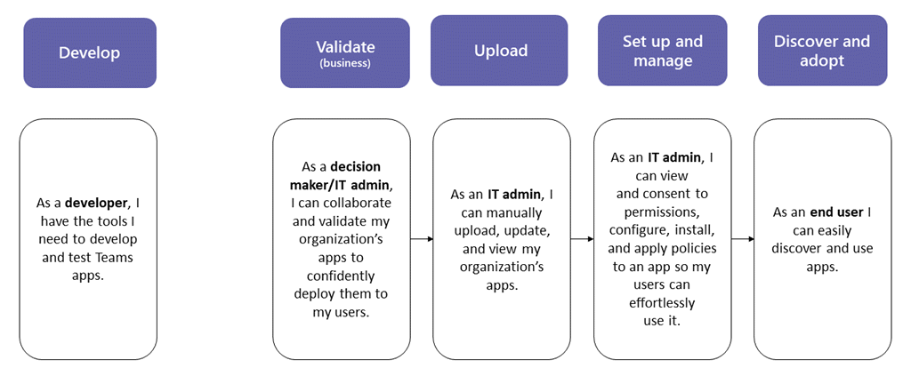

# 앱 패키지를 업로드하여 사용자 지정 앱 게시

> [!NOTE]
> 사용자 지정 Teams 앱을 게시하면 조직의 앱 스토어에 있는 사용자가 사용할 수 있습니다. 사용자 지정 앱을 게시하는 방법에는 두 가지가 있으며, 사용하는 방법은 앱을 가져오는 방법에 따라 달라집니다. **이 문서에서는 개발자가 사용자에게 보내는 앱 패키지를 .zip 형식으로 업로드하여 사용자 지정 앱을 게시하는 방법에 중점을 둡니다**. 사용자 지정 앱을 승인하는 다른 방법은 개발자가 Teams 앱 제출 API를 통해 [앱 관리](manage-apps.md) 페이지에 직접 앱을 제출할 때 사용됩니다. 해당 메서드에 대한 자세한 내용은 [Teams 앱 제출 API를 통해 제출된 사용자 지정 앱 게시를](submit-approve-custom-apps.md) 참조하세요.

이 문서에서는 Teams 앱을 개발에서 배포, 검색으로 수행하는 방법에 대한 엔드 투 엔드 지침을 제공합니다. 이 지침은 앱의 Teams 측면에 중점을 두고 있으며 관리자 및 IT 전문가를 위한 것입니다. Teams 앱 개발에 대한 자세한 내용은 [Teams 개발자 설명서를 참조하세요](/microsoftteams/platform/).

## 앱 만들기

Microsoft Teams 개발자 플랫폼을 사용하면 개발자가 사용자 고유의 앱과 서비스를 쉽게 통합하여 생산성을 향상시키고, 의사 결정을 더 빠르게 내리고, 기존 콘텐츠 및 워크플로를 중심으로 공동 작업을 만들 수 있습니다. Teams 플랫폼에서 빌드된 앱은 Teams 클라이언트와 서비스 및 워크플로 간의 브리지로, 협업 플랫폼의 컨텍스트로 직접 연결됩니다. 자세한 내용은 [Teams 개발자 설명서를 참조하세요](/microsoftteams/platform/).

## 확인

### 앱 패키지 가져오기

앱이 프로덕션 환경에서 사용할 준비가 되면 개발자는 앱 패키지를 생성해야 합니다. [App Studio](/microsoftteams/platform/concepts/build-and-test/app-studio-overview)를 사용할 수 있습니다. 파일을 .zip 형식으로 보냅니다.

Teams 스토어의 모든 앱은 글로벌 Teams 앱 스토어의 품질 및 보안 표준을 준수하기 위해 필수 앱 [유효성 검사를](overview-of-app-validation.md) 전달합니다. 또한 Microsoft는 앱 개발자가 향상된 규정 준수, 보안 및 개인 정보 제어를 나타내는 선택적 [앱 준수 프로그램에](overview-of-app-certification.md) 참여하도록 강력히 권장합니다. 자세한 내용은 [Teams 앱 유효성 검사 지침을 참조하세요](/microsoftteams/platform/concepts/deploy-and-publish/appsource/prepare/teams-store-validation-guidelines).

### 신뢰할 수 있는 사용자가 사용자 지정 앱을 업로드하도록 허용

앱이 프로덕션 테넌트에서 올바르게 작동하는지 확인하려면 자신 및/또는 신뢰할 수 있는 사용자가 프로덕션 테넌트에서 사용자 지정 앱을 업로드하도록 허용해야 합니다. [앱 설정 정책을](teams-app-setup-policies.md) 사용하여 이 작업을 수행합니다.

> [!NOTE]
> 자신 또는 신뢰할 수 있는 사용자에 대해서도 유효성 검사를 위해 프로덕션 테넌트에 앱을 업로드하는 것이 불편할 경우 이 단계를 건너뛰고 [업로드](#upload) 단계를 수행하고 섹션[을 설정 및 관리](#set-up-and-manage)하여 검증되지 않은 앱을 조직의 앱 스토어에 게시할 수 있습니다. 그런 다음, 해당 앱에 대한 액세스를 자신과 신뢰할 수 있는 사용자로만 제한합니다. 그런 다음, 이러한 사용자는 조직의 앱 스토어에서 앱을 가져와 유효성 검사를 수행할 수 있습니다. 앱의 유효성을 검사한 후 동일한 권한 정책을 사용하여 액세스를 열고 프로덕션 사용을 위해 앱을 롤아웃합니다.

신뢰할 수 있는 사용자가 사용자 지정 앱을 업로드할 수 있도록 하려면 다음 단계를 수행합니다.

1. **사용자 지정 앱 조직 전체 앱 설정과의 상호 작용 허용** 을 켭니다. 이렇게 하려면 다음을 수행합니다.

    1. Microsoft Teams 관리 센터의 왼쪽 탐색 영역에서 **Teams 앱****관리 앱** > 으로 이동한 다음 **조직 전체 앱 설정을** 클릭합니다.
    
    2. **사용자 지정 앱** 에서 **사용자 지정 앱과의 상호 작용 허용을** 켜고 **저장** 을 클릭합니다.
    
1. 전역 앱 설정 정책에서 **업로드 사용자 지정** 앱 설정을 해제합니다. 이렇게 하려면 다음을 수행합니다.

    1. Microsoft Teams 관리 센터의 왼쪽 탐색 영역에서 **Teams 앱** > **설정 정책** 으로 이동한 다음 **전역(조직 전체 기본값)** 정책을 클릭합니다.
    
    2. **업로드 사용자 지정 앱을** 끄고 **저장** 을 클릭합니다.
    
1. 사용자 지정 앱을 업로드하고 신뢰할 수 있는 사용자 집합에 할당할 수 있는 새 앱 설정 정책을 만듭니다. 이렇게 하려면 다음을 수행합니다.

    1. Microsoft Teams 관리 센터의 왼쪽 탐색 영역에서 **Teams 앱** > **설정 정책** 으로 이동한 다음 **추가** 를 클릭합니다. 새 정책에 이름과 설명을 지정하고 **업로드 사용자 지정 앱을** 켜고 **저장** 을 클릭합니다.
    
    2. 만든 새 정책을 선택한 다음 **사용자 관리를** 클릭합니다. 사용자를 검색하고 **추가** 를 클릭한 다음 **적용** 을 클릭합니다. 이 단계를 반복하여 모든 신뢰할 수 있는 사용자에게 정책을 할당합니다.

       

이제 이러한 사용자는 앱 매니페스트를 업로드하여 앱이 프로덕션 테넌트에서 올바르게 작동하는지 확인할 수 있습니다.

## 업로드

조직의 앱 스토어에서 사용자가 앱을 사용할 수 있도록 하려면 앱을 업로드합니다.

1. Microsoft Teams 관리 센터의 왼쪽 탐색 영역에서 **Teams 앱****[관리 앱](https://admin.teams.microsoft.com/policies/manage-apps)** > 으로 이동합니다.
1. **업로드 선택하고 업로드** **클릭하고 개발자** 로부터 받은 앱 패키지를 선택한 다음 **열기** 를 선택합니다.

   

## 설정 및 관리

### 앱에 대한 액세스 제어

기본적으로 조직의 모든 사용자는 조직의 앱 스토어에서 앱에 액세스할 수 있습니다. 앱을 사용할 수 있는 권한이 있는 사용자를 제한하고 제어하려면 앱 사용 권한 정책을 만들고 할당할 수 있습니다. 자세한 내용은 [Teams에서 앱 권한 정책 관리](teams-app-permission-policies.md)를 참조하세요.

### 사용자가 검색할 수 있도록 앱 고정 및 설치

기본적으로 사용자가 조직의 앱 스토어로 이동하여 앱을 찾아보거나 검색해야 하는 앱을 찾습니다. 사용자가 앱에 쉽게 액세스하도록 하려면 Teams 앱 표시줄에 앱을 고정할 수 있습니다. 이렇게 하려면 앱 설정 정책을 만들고 사용자에게 할당합니다. 자세한 내용은 [Teams에서 앱 설정 정책 관리](teams-app-setup-policies.md)를 참조하세요.

### Teams 앱 이벤트에 대한 감사 로그 검색

감사 로그를 검색하여 조직에서 Teams 앱 활동을 볼 수 있습니다. 감사 로그를 검색하고 감사 로그에 기록된 Teams 활동 목록을 확인하는 방법에 대한 자세한 내용은 [Teams 이벤트에 대한 감사 로그 검색](audit-log-events.md)을 참조하세요.

감사 로그를 검색하려면 먼저 [보안 및 준수 센터](https://sip.protection.office.com/homepage)에서 감사를 켜야 합니다. 자세한 내용은 [감사 로그 검색 설정 및 해제](/microsoft-365/compliance/turn-audit-log-search-on-or-off)를 참조하세요. 감사 데이터는 감사가 켜진 시점부터만 사용할 수 있습니다.

## 검색 및 채택

앱에 대한 권한이 있는 최종 사용자는 조직의 앱 스토어에서 찾을 수 있습니다. 앱 페이지에서 ***조직 이름* 에 맞게 빌드** 된 앱으로 이동하여 조직의 사용자 지정 앱을 찾습니다.

:::image type="content" source="media/custom-app-lifecycle-discovery.png" alt-text="조직에 대해 게시된 사용자 지정 앱을 보여 주는 Teams 저장소의 스크린샷" lightbox="media/custom-app-lifecycle-discovery.png":::

앱 설정 정책을 만들고 할당한 경우 정책이 할당된 사용자에게 쉽게 액세스할 수 있도록 앱이 Teams 앱 표시줄에 고정됩니다.

## 업데이트

앱을 업데이트하기 위해 개발자는 [앱 만들기](#create-your-app) 및 [유효성 검사](#validate) 섹션의 단계를 따릅니다.

Microsoft Teams 관리 센터의 앱 관리 페이지에서 앱을 업데이트할 수 있습니다. 이렇게 하려면 Microsoft Teams 관리 센터의 왼쪽 탐색에서 **Teams 앱****관리 앱** > 으로 이동합니다. 앱 이름을 클릭한 다음 **업데이트를** 클릭합니다. 이렇게 하면 기존 앱이 대체되고 모든 앱 권한 정책 및 앱 설정 정책이 업데이트된 앱에 계속 적용됩니다.

### 최종 사용자 업데이트 환경

대부분의 경우 앱 업데이트를 완료한 후 최종 사용자에 대해 새 버전이 자동으로 표시됩니다. 자세한 내용은 [최종 사용자 업데이트 환경을 참조하세요](apps-update-experience.md).

## 관련 항목

* [Teams 앱 제출 API를 통해 제출된 사용자 지정 앱 게시](submit-approve-custom-apps.md)
* [Microsoft Teams 관리 센터에서 앱 관리](manage-apps.md)
* [Teams에서 사용자 지정 앱 정책 및 설정 관리](teams-custom-app-policies-and-settings.md)
* [Teams에서 앱 사용 권한 정책 관리](teams-app-permission-policies.md)
* [Teams에서 앱 설정 정책 관리](teams-app-setup-policies.md)
