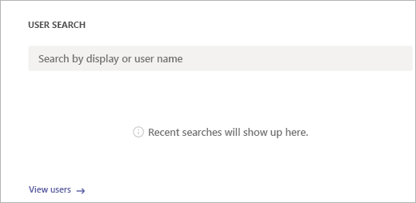
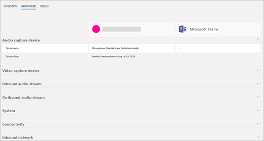

# 통화 분석을 사용하여 통화 품질 저하 문제 해결Use Call Analytics to troubleshoot poor call quality

통화 분석을 통해 Microsoft 팀과 비즈니스용 Skype의 통화 또는 연결 문제를 해결할 수 있습니다.Call Analytics helps you troubleshoot call or connection problems with Microsoft Teams and Skype for Business. 통화 분석에서는 Microsoft 365 또는 Office 365 계정에 있는 각 사용자의 통화 및 모임에 대 한 장치, 네트워크 및 연결에 대 한 자세한 정보를 보여 줍니다.Call Analytics shows detailed information about the devices, networks, and connectivity for the calls and meetings of each user in your Microsoft 365 or Office 365 account. 빌드, 사이트 및 테 넌 트 정보가 통화 분석에 추가 된 경우 각 통화와 세션에 대해서도 표시 됩니다.If building, site, and tenant information has been added to Call Analytics, it will also be shown for each call and session. 통화 분석을 통해 사용할 수 있는 정보는 사용자의 통화 또는 모임 환경이 좋지 않은 이유를 파악 하는 데 도움이 될 수 있습니다.Information available via Call Analytics can help you figure out why a user had a poor call or meeting experience. 
  
## 통화 분석 사용 권한Call Analytics permissions

관리자는 통화 분석의 모든 기능에 대 한 모든 권한을 얻을 수 있습니다.As the admin, you get full access to all the features of Call Analytics. 또한 지원 직원에 게 Azure Active Directory 역할을 할당할 수 있습니다.In addition, you can assign Azure Active Directory roles to support staff. 통화 분석을 제한 된 보기를 사용 해야 하는 사용자에 게 팀 의사 소통 지원 전문가 역할을 배정 합니다.Assign the Teams communications support specialist role to users who should have a limited view of Call Analytics. 통화 분석의 전체 기능에 대 한 액세스 권한이 필요한 사용자에 게 팀 의사 소통 지원 엔지니어 역할을 할당 합니다.Assign the Teams communications support engineer role to users who need access to the full functionality of Call Analytics. 두 사용 권한 수준 모두에서 나머지 Microsoft 팀 관리 센터에 대 한 액세스를 방지 합니다.Both permission levels prevent access to the rest of the Microsoft Teams admin center.

통신 지원 전문가는 기본 통화 품질 문제를 처리 합니다.Communications support specialists handle basic call-quality problems. 모임 관련 문제를 조사 하지 않습니다.They don't investigate issues with meetings. 그 대신 관련 정보를 수집한 다음 통신 지원 엔지니어로 승격 합니다.Instead, they collect related information and then escalate to a communications support engineer. 통신 지원 엔지니어가 통신 지원 전문가에 게 서 숨겨진 자세한 콜 로그의 정보를 확인 합니다.Communications support engineers see information in detailed call logs that's hidden from communications support specialists. 다음 표에서는 통화 분석을 사용할 때 통신 지원 엔지니어가 제공 하는 정보에 대 한 개요를 제공 합니다.The following table gives an overview of information available to communications support specialists and communications support engineers when they use Call Analytics.

사용자에 게 할당 된 사용 권한 수준은 통화 분석에서 액세스할 수 있는 정보 유형을 결정 합니다.The permissions level assigned to you determines what type of information you have access to in Call Analytics:
  
- **팀 서비스 관리자 또는 팀 통신 관리자**: 통화 분석 및 Microsoft 팀 관리 센터의 모든 정보에 액세스할 수 있습니다.**Teams service administrator or Teams communications administrator**: You have access to all the information in Call Analytics and in the Microsoft Teams admin center.
    
- **팀 의사 소통 지원 전문가**: 통화 분석에서 제한 된 데이터 집합을 볼 수 있습니다.**Teams communications support specialist**: You see a limited set of data in Call Analytics. 통화 문제를 해결할 수 있지만, 팀 의사 소통 지원 엔지니어에 대 한 모임 문제는 해결 하겠습니다.You can troubleshoot calls, but you'll hand off problems with meetings to a Teams communications support engineer. 나머지 Microsoft 팀 관리 센터에 액세스할 수 있는 권한이 없습니다.You don't have access to the rest of the Microsoft Teams admin center.
    
- **팀 의사 소통 지원 엔지니어**: 통화 분석에서 사용할 수 있는 모든 데이터를 볼 수 있으며, 통화와 모임 모두의 문제를 해결 하는 데 도움이 됩니다.**Teams communications support engineer**: You see all available data in Call Analytics and can help troubleshoot problems with both calls and meetings. 나머지 Microsoft 팀 관리 센터에 액세스할 수 있는 권한이 없습니다.You don't have access to the rest of the Microsoft Teams admin center.
    
> [!NOTE]
> 커뮤니케이션 지원 전문가 역할은 계층 1 지원과 같으며 통신 지원 엔지니어 역할은 계층 2 지원과 동일 합니다.The communications support specialist role is equivalent to tier 1 support and the communications support engineer role is equivalent to tier 2 support.

팀 관리자 역할에 대 한 자세한 내용은 [Microsoft 팀 관리자 역할을 사용 하 여 팀 관리](using-admin-roles.md)를 참조 하세요.For more information about Teams admin roles, see [Use Microsoft Teams admin roles to manage Teams](using-admin-roles.md). 팀 의사 소통 지원 전문가 및 팀 의사 소통 지원 엔지니어 역할에 대 한 자세한 비교는 [통화 분석 설정을](set-up-call-analytics.md#set-call-analytics-permissions) 참조 하세요.For a detailed comparison of the Teams communications support specialist and Teams communications support engineer roles, see [Set up Call Analytics](set-up-call-analytics.md#set-call-analytics-permissions) 
  
사용 권한에 대 한 도움이 필요한 경우 팀과 비즈니스용 Skype 관리자에 게 문의 하세요.See your Teams and Skype for Business admin if you need help with permissions.
  
## 통화 분석을 사용 하 여 통화 품질 문제 해결Troubleshoot call quality problems using Call Analytics

1. 팀 통신 지원 또는 팀 관리자 자격 증명을 사용 하 여 로그인 합니다.Sign in with your Teams communications support or Teams admin credentials.

2. 웹 브라우저에서으로 이동 *https://admin.teams.microsoft.com* 합니다.In your web browser go to *https://admin.teams.microsoft.com*.
    
3. **대시보드의** **사용자 검색**에서 문제를 해결할 사용자의 이름 또는 sip 주소를 입력 하거나 사용자 **보기** 를 선택 하 여 사용자 목록을 표시 합니다.On the **Dashboard**, in **User Search**, start typing either the name or sip address of the user whose calls you want to troubleshoot or select **View users** to see a list of users.
    
    
  
4. 목록에서 사용자를 선택 합니다.Select the user from the list.

5. **통화 내역**을 선택한 다음 문제를 해결할 통화 또는 모임을 선택 합니다.Select **Call history**, and then select the call or meeting that you want to troubleshoot.  최대 500 개의 레코드가 반환 됩니다.A maximum of 500 records will be returned.
    
    
  
6. **고급** 탭을 선택 하 고 잘못 된 통화 음질 또는 연결 문제를 나타내는 노란색 및 빨간색 항목을 찾습니다.Select the **Advanced** tab, and then look for yellow and red items which indicate poor call quality or connection problems.
    
    각 통화 또는 모임에 대 한 세션 세부 정보에서 경미한 문제는 노란색으로 표시 됩니다.In the session details for each call or meeting, minor issues appear in yellow. 예를 들어 다음 스크린샷은 평균 지터, 최대 지터 및 평균 패킷 손실률에 대 한 값이 노란색으로 되어 있습니다. 노란색이 있는 것은 정상 범위를 벗어나므로 문제가 될 수 있지만 문제의 주요 원인이 되는 경우는 거의 없습니다.(For example, in the following screenshot, the values are in yellow for Average jitter, Max jitter, and Average packet loss rate.) If something is yellow, it's outside of normal range, and it may be contributing to the problem, but it's unlikely to be the main cause of the problem. 무언가 빨간색 인 경우 중대 한 문제가 될 수 있으며,이 세션에 대 한 통화 품질이 좋지 않을 수 있습니다.If something is red, it's a significant problem, and it's likely the main cause of the poor call quality for this session. 
    
    
  
드문 경우 지만 오디오 세션에 대 한 경험 치 데이터를 받지 못하는 경우가 있습니다.In rare cases, quality of experience data isn't received for audio sessions. 이 오류는 일반적으로 호출을 끊는 것이 고 클라이언트를 종료 하는 연결 때문에 발생 합니다.Often this is caused by the call dropping and connection with the client terminating. 이 문제가 발생 하면 세션 등급을 **사용할 수 없습니다**.When this occurs, the session rating is **unavailable**.
  
체감 품질 (환경 품질) 데이터를 사용 하는 오디오 세션의 경우 다음 표에서는 세션을 **불량**으로 정규화 하는 주요 문제에 대해 설명 합니다.For audio sessions that do have quality of experience (QoE) data, the following table describes major issues that qualify a session as **poor**.
  
|**문제****Issue**|**지역을****Area**|**설명****Description**|
|:-----|:-----|:-----|
|전화 걸기 설정Call setup    |세션Session    |오류 코드 Ms-diag 20-29는 통화 설정이 실패 했음을 나타냅니다.The error code Ms-diag 20-29 indicates the call setup failed. 사용자가 통화 또는 모임에 참가할 수 없습니다.The user couldn't join the call or meeting.    |
|오디오 네트워크에서 낮은 통화 분류Audio network classified poor call    |세션Session    |네트워크 품질 문제 (예: 패킷 손실, 지터, NMOS 성능 저하, RTT 또는 숨겨진 비율)가 발생 했습니다.Network quality issues (such as packet loss, jitter, NMOS degradation, RTT, or concealed ratio) were encountered. 불량 통화를 분류 하는 데 사용 되는 조건에 대 한 자세한 내용은이 [Microsoft 블로그 게시물](https://go.microsoft.com/fwlink/p/?linkid=852133)을 참조 하세요.For more information about the conditions used to classify poor calls, see this [Microsoft blog post](https://go.microsoft.com/fwlink/p/?linkid=852133).    |
|장치가 작동 하지 않음Device not functioning    |장치Device    | 장치가 제대로 작동 하지 않습니다.A device isn't functioning correctly. 장치 작동 비율이 아닌 이유는 다음과 같습니다.Device not functioning ratios are :    DeviceRenderNotFunctioningEventRatio >= 0.005DeviceRenderNotFunctioningEventRatio >= 0.005    DeviceCaptureNotFunctioningEventRatio >= 0.005DeviceCaptureNotFunctioningEventRatio >= 0.005   |
   
## 관련 항목Related topics
[통화 분석 설정Set up Call Analytics](set-up-call-analytics.md)

[통화 분석 및 통화 품질 대시보드Call Analytics and Call Quality Dashboard](difference-between-call-analytics-and-call-quality-dashboard.md)

  
 
