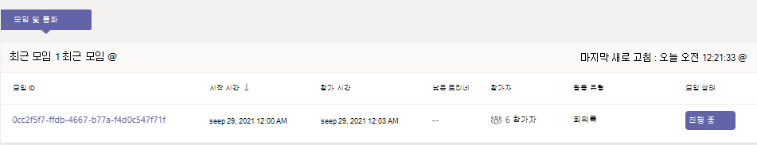
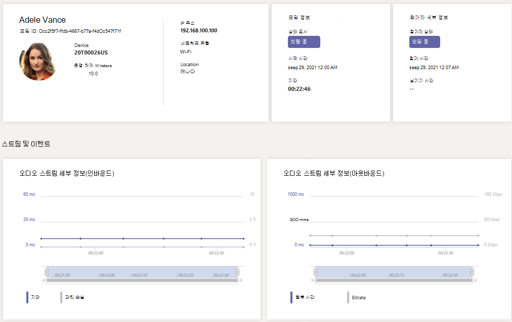

# 실시간 원격 분석을 사용하여 열악한 모임 품질 문제 해결

> [!NOTE]
> 이 기능은 현재 2021년 말까지 공개 미리 보기로 제공됩니다. 이 시간 이후에는 실시간으로 보려 하는 각 Microsoft Teams 사용자에 대한 고급 통신 추가 기능도 필요합니다. 자세한 내용은 [Microsoft Teams를 위한 고급 통신 추가 기능](/MicrosoftTeams/teams-add-on-licensing/advanced-communications)을 참조하세요.

이 문서에서는 RTA(Real-Time)를 사용하여 개별 사용자의 모임 Microsoft Teams 문제를 해결하는 방법을 설명합니다. 다음 역할 중 Real-Time 있는 경우 분석 분석에 액세스할 수 있습니다.

- Teams 관리자
- Teams 통신 지원 전문가
- Teams 커뮤니케이션 지원 엔지니어

관리자 역할에 대한 Teams 자세한 내용은 [관리자](/MicrosoftTeams/using-admin-roles)Microsoft Teams 관리자 역할 사용 을 Teams.

Real-Time 분석을 통해 IT 관리자는 중요한 사용자의 예약된 모임을 보고 오디오, 비디오, 콘텐츠 공유 및 네트워크 관련 문제를 볼 수 있습니다. 관리자는 이 원격 분석 을 사용하여 모임 중에 이러한 문제를 조사하고 실시간으로 문제를 해결할 수 있습니다.

## 분석이란 Real-Time 무엇입니까?

현재 개별 모임 문제 해결은 모임이 Teams 후에 [Call Analytics를](use-call-analytics-to-troubleshoot-poor-call-quality.md) 통해 관리자에게 제공됩니다. Real-Time 분석에서는 관리자가 예약된 모임을 진행하는 동안 문제를 해결할 수 있습니다.

Real-Time 분석은 실시간으로 업데이트된 Teams 계정의 각 Office 365 모임에 대한 자세한 정보를 보여줍니다. 여기에는 디바이스, 네트워크, 연결, 오디오, 비디오 및 콘텐츠 공유 문제에 대한 정보가 포함되어 있으며, 관리자가 통화 품질 문제를 보다 효과적으로 해결하는 데 도움이 됩니다.

관리자 Teams 각 사용자의 모든 실시간 원격 분석 데이터에 대한 모든 액세스 권한을 얻을 수 있습니다. 또한 직원 지원에 Azure Active Directory 역할을 할당할 수 있습니다. 이러한 역할에 대한 자세한 내용은 지원 및 지원 센터 직원에 대한 권한 [부여를 참조합니다.](set-up-call-analytics.md#give-permission-to-support-and-helpdesk-staff)

## 사용자당 실시간 문제 해결 원격 분석 찾기 위치

사용자에 대한 모든 모임 정보 및 데이터를 표시하려면 Teams [관리 센터로 이동하세요.](https://admin.teams.microsoft.com) 사용자 **관리** 아래에서 사용자를 선택하고 사용자의 프로필 페이지에서 & 모임 탭을  >  니다.  최근 **모임에서** 진행 중 모임을 포함하여 실시간 원격 분석이 가능한 지난 24시간 이내에 사용자가 참석한 모임 목록이 표시됩니다.  모임이 진행 중이 아니거나 실시간 원격 분석 데이터가 없는 경우 과거 모임에 **표시됩니다.**

디바이스, 네트워크 및 오디오 통계를 포함하여 진행 중인 모임의 참가자에 대한 추가 정보를  얻하려면 최근 모임에서 모임을 찾아 참가자 열 아래 링크를 **선택합니다.**

디바이스, 네트워크, 오디오, 비디오 및 콘텐츠 공유 세부 정보를 포함한 진행 중 모임에 대한 특정 사용자의 원격 분석에서 모임 ID 를 **선택합니다.**

## 실시간 원격 분석에 지원되는 클라이언트 플랫폼

- Windows
- macOS
- Linux
- Android
- iOS

## Teams 원격 분석에 대한 지원이 있는 디바이스

- MTR - Surface Hub
- MTR - Teams 디스플레이
- MTR - 공동 작업 표시줄
- IP 전화 디바이스

## 제한 사항

- 실시간 원격 분석은 예약된 모임에만 사용할 수 있습니다. 지금 모임, PSTN, 1:1 통화 및 그룹 통화와 같은 추가 모임의 경우 실시간 원격 분석은 사용할 수 없습니다.
- 실시간 원격 분석은 예약된 라이브 이벤트의 발표자만 사용할 수 있습니다. 현재 라이브 이벤트 참석자에 대해 사용할 수 없습니다.
- 실시간 원격 분석 데이터는 모임이 종료된  후 24시간 동안 최근 모임에서 모임에 사용할 수 있습니다. 24시간 후에 데이터에 액세스할 수 없습니다. 모임이 지난 모임으로 **이동합니다.** 모임이 3시간보다 길면 실시간 원격 분석은 지난 *3시간 동안만 사용할 수 있습니다.*
- 이전 버전의 데이터를 사용할 때 원격 분석은 실시간으로 사용할 수 Teams. 원격 분석이 사용할 수 없는 경우 클라이언트를 업데이트해 시도합니다.
- 외부 참가자 또는 익명 사용자가 모임에 참가하는 경우  해당 표시 이름은 테넌트 간 개인 정보를 유지할 수 없음으로 표시됩니다.

## 관련 주제

[사용자당 통화 분석 설정](set-up-call-analytics.md)

[관리자 Microsoft Teams 을 사용하여 를 관리 Teams.](/MicrosoftTeams/using-admin-roles)
