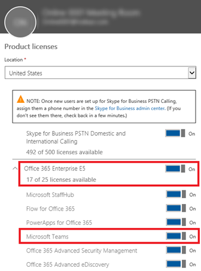
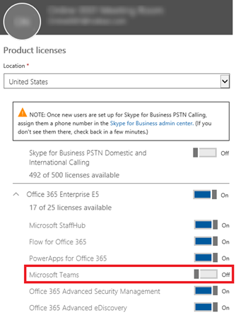

Microsoft 팀에 대 한 사용자 액세스 관리Manage user access to Microsoft Teams
=====================================
> [!IMPORTANT]
> [!INCLUDE [new-teams-sfb-admin-center-notice](includes/new-teams-sfb-admin-center-notice.md)]

사용자 수준에서 microsoft 팀 제품 라이선스를 할당 하거나 제거 하 여 사용자 기준으로 Microsoft 팀에 대 한 액세스를 사용 하거나 사용 하지 않도록 설정할 수 있습니다.At the user level, access to Microsoft Teams can be enabled or disabled on a per-user basis by assigning or removing the Microsoft Teams product license.

팀 관리 센터에서 관리 되는 메시징 정책을 사용 하 여 팀의 사용자가 사용할 수 있는 채팅 및 채널 메시징 기능을 제어 합니다.Use messaging policies, managed from the Teams Admin Center, to control what chat and channel messaging features are available to users in Teams. 기본 정책을 사용 하거나 조직의 사용자를 위해 하나 이상의 사용자 지정 메시징 정책을 만들 수 있습니다.You can use the default policy or create one or more custom messaging policies for people in your organization. 자세한 내용은 [팀에서 메시징 정책 관리](messaging-policies-in-teams.md)를 참고 하세요.To learn more, read [Manage messaging policies in Teams](messaging-policies-in-teams.md).

> [!NOTE]
>팀에서 프로젝트 및 기타 동적 이니셔티브에 대 한 organically를 만들 수 있도록 회사의 모든 사용자에 대해 팀을 설정 하는 것이 좋습니다.Microsoft recommends that you turn on Teams for all users in a company so that teams can be formed organically for projects and other dynamic initiatives. 파일럿을 결정 하는 경우에도 팀이 모든 사용자에 게 사용 하도록 설정 하는 것이 좋지만, 사용자의 파일럿 그룹에 대 한 대상 통신만을 유지 하는 것이 유용할 수 있습니다.Even if you are deciding to pilot, it may still be helpful to keep Teams enabled for all users, but only target communications to the pilot group of users.

## Microsoft 365 관리 센터를 통해 팀 관리Manage Teams through the Microsoft 365 admin center

팀 사용자 수준 라이선스는 Microsoft 365 관리 센터 사용자 관리 인터페이스를 통해 직접 관리 됩니다.Teams user-level licenses are managed directly through the Microsoft 365 admin center user management interfaces. 관리자는 새 사용자 계정이 만들어지거나 기존 계정이 있는 사용자에 게 라이선스를 할당할 수 있습니다.An administrator can assign licenses to new users when new user accounts are created, or to users with existing accounts. 관리자가 Microsoft 팀 라이선스를 관리 하려면 전역 관리자 또는 사용자 관리 관리자 권한이 있어야 합니다.The administrator must have Global Administrator or User Management Administrator privileges to manage Microsoft Teams licenses.

E3 또는 E5와 같은 라이선스 SKU가 사용자에 게 할당 되 면 Microsoft 팀 라이선스가 자동으로 할당 되며 사용자가 Microsoft 팀에 대해 사용 하도록 설정 됩니다.When a license SKU like E3 or E5 is assigned to a user, a Microsoft Teams license is automatically assigned, and the user is enabled for Microsoft Teams. 관리자는 모든 Office 365 서비스 및 라이선스를 세부적으로 제어할 수 있으며 특정 사용자 또는 사용자 그룹의 Microsoft 팀 라이선스를 사용 하거나 사용 하지 않도록 설정할 수 있습니다.Administrators can have a granular control over all the Office 365 services and licenses, and the Microsoft Teams license for a specific user or a group of users can be enabled or disabled.

 

팀 사용자 라이선스는 언제 든 지 비활성화할 수 있습니다.A Teams user license can be disabled at any time. 라이선스를 사용 하지 않도록 설정 하면 Microsoft 팀에 대 한 사용자 액세스가 차단 되 고 사용자가 Office 365 앱 시작 관리자 및 홈페이지에서 팀을 더 이상 볼 수 없게 됩니다.Once the license is disabled, the users access to Microsoft Teams will be prevented and the user will no longer be able to see Teams in the Office 365 app launcher and homepage.

## PowerShell을 통해 관리Manage via PowerShell

> [!IMPORTANT]
> MsolLicenseOptions는 사용자 지정 된 스크립트에서 명시적으로 식별 하지 않는 한 이전에 비활성화 한 모든 서비스를 사용 하도록 설정 합니다.New-MsolLicenseOptions will enable all services that were previously disabled unless explicitly identified in your customized script. 예를 들어, 더 이상 팀을 사용 하지 않도록 설정 하는 동안 Exchange & Sway를 모두 사용 하지 않도록 설정 하려면 스크립트에이를 포함 하거나 Exchange & 모두 사용자가 확인 하 여 Sway를 사용할 수 있도록 설정 해야 합니다.As an example, if you wanted to leave both Exchange & Sway disabled while additionally disabling Teams, you'd need to include this in the script or both Exchange & Sway will become enabled for those users you've identified. GUI를 사용 하 여이 기능을 관리 하려면 [Office 365 라이선스 보고 및 관리 도구-자세한 내용은 라이선스 제거를 대량으로 할당](https://gallery.technet.microsoft.com/Office365-License-cfd9489c) 을 참조 하세요.To use a GUI to manage this functionality, see [Office 365 License Reporting and Management Tool -Assign Remove Licenses in Bulk](https://gallery.technet.microsoft.com/Office365-License-cfd9489c) for more information.

다른 작업을 수행 하는 것 처럼 PowerShell을 통해 팀을 작업 부하 라이선스로 사용 하지 않도록 설정할 수 있습니다.Enabling and disabling Teams as a workload license through PowerShell is done just as any other workload. Microsoft 팀에 대 한 서비스 계획 이름은 TEAMS1입니다.The service plan name is TEAMS1 for Microsoft Teams. GCC의 경우 서비스 계획 이름은 TEAMS_GOV입니다.For GCC the service plan name is TEAMS_GOV. GCC High의 경우 서비스 계획 이름은 TEAMS_GCCHIGH입니다.For GCC High the service plan name is TEAMS_GCCHIGH. DoD의 경우 서비스 계획 이름이 TEAMS_DOD 합니다 (자세한 내용은 [Office 365 PowerShell을 사용 하 여 서비스에 대 한 액세스 비활성화](https://docs.microsoft.com/office365/enterprise/powershell/disable-access-to-services-with-office-365-powershell) 를 참조 하세요.)For DoD the service plan name is TEAMS_DOD (See [Disable access to services with Office 365 PowerShell](https://docs.microsoft.com/office365/enterprise/powershell/disable-access-to-services-with-office-365-powershell) for more information.)

**샘플:** 다음은 특정 라이선스 유형의 모든 사용자에 대해 팀을 비활성화 하는 방법에 대 한 간단한 예제입니다.**Sample:** The following is just a quick sample on how you would disable Teams for everyone in a particular license type. 먼저이 작업을 수행한 다음 파일럿을 위해 액세스 해야 하는 사용자에 대해 개별적으로 사용 하도록 설정 해야 합니다.You'll need to do this first, then individually enable it for the users who should have access for piloting purposes.

조직 내에 있는 구독 유형을 표시 하려면 다음 명령을 사용 합니다.To display the subscription types you have within your organization, use the following command:

      Get-MsolAccountSku

조직의 이름과 학교에 대 한 요금제 (ContosoSchool: ENTERPRISEPACK_STUDENT)를 포함 하는 계획의 이름을 입력 하 고 다음 명령을 실행 합니다.Fill in the name of your plan that includes your organization name and the plan for your school (such as ContosoSchool:ENTERPRISEPACK_STUDENT), and then run the following commands:

      $acctSKU="<plan name>
      $x = New-MsolLicenseOptions -AccountSkuId $acctSKU -DisabledPlans "TEAMS1"
지정 된 요금제에 대 한 활성 라이선스가 있는 모든 사용자에 대해 팀을 사용 하지 않도록 설정 하려면 다음 명령을 실행 합니다.To disable Teams for all users with an active license for your named plan, run the following command:

      Get-MsolUser | Where-Object {$_.licenses[0].AccountSku.SkuPartNumber -eq  ($acctSKU).Substring($acctSKU.IndexOf(":")+1,  $acctSKU.Length-$acctSKU.IndexOf(":")-1) -and $_.IsLicensed -eq $True} |  Set-MsolUserLicense -LicenseOptions $x

| | | |
|---------|---------|---------|
|     |의사 결정 지점Decision Point         |<ul><li>조직에서 온 팀에 대 한 조직의 계획은 무엇 인가요?What is your organization's plan for Teams onboarding across the organization?  (파일럿 또는 열기)(Pilot or Open)</li></ul>         |
|     |다음 단계Next Steps         |<ul><li>폐쇄형 파일럿을 통해 온 보 딩이 있는 경우 라이선스를 통해 수행할 것인지 또는 대상을 지정 하 여 의사 소통을 할지 결정 하세요.If onboarding via a closed Pilot, decide if you would like to do so via licensing, or targeted communication.</li><li>의사 결정에 따라 팀에 액세스할 수 있도록 허용 된 파일럿 사용자만 (필요한 경우) 해야 하는지 여부를 확인 하는 단계를 수행 합니다.Depending on decision, take steps to make sure only Pilot users who are allowed to access Teams (if needed).</li><li>팀에 대 한 액세스 권한이 있는 사용자를 위한 지침을 문서화 합니다.Document the guidelines for which users who will (or will not) have access to Teams.</li></ul>         |

## Office 365 조직 수준에서 팀 관리Manage Teams at the Office 365 organization level
[!INCLUDE [global-switch-expiry-note](includes/global-switch-expiry-note.md)]

