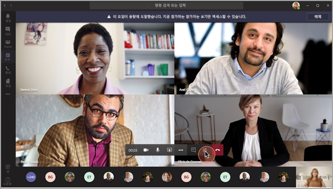
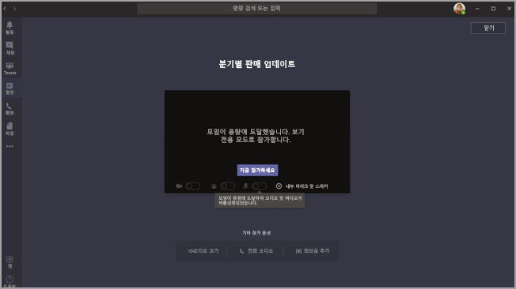

# <a name="teams-view-only-meeting-experience"></a>Teams 보기 전용 모임 환경

> [!Note]
> 보기 전용 브로드캐스트는 Microsoft 365 E3/E5 및 Microsoft 365 A3/A5에서 사용할 수 있습니다. 이 기능은 2021년 3월 1일을 기본값 해제로 사용하도록 설정됩니다. Microsoft 365 정부 커뮤니티 클라우드(GCC)의 기능 배포는 2021년 3월 말에 시작됩니다. 정부 커뮤니티 클라우드 높음(GCCH) 및 국방부(DoD)는 차후에 배포될 예정입니다. 이 기능의 사용을 기본값으로 하려면 해당 날짜 이후에 기본 정책을 변경해야 합니다. PowerShell을 통해 정책 설정을 사용 `Set-CsTeamsMeetingPolicy -Identity Global -StreamingAttendeeMode Enabled`.

> [!Note]
> 모임이 최대 수용인원에 도달할 경우 10,000명 규모의 보기 전용 브로드캐스트 환경까지 수용할 수 있도록 Teams가 원활하게 규모를 조정합니다. 또한 원격 작업 증가 기간 중, 올해 말까지는 이보다 더 많은 규모인 20,000명의 브로드캐스트를 활용할 수 있습니다. 웨비나는 현재 보기 전용 브로드캐스트 환경을 지원하지 않습니다.

> [!Note]
> Teams 모임은 TLE(Teams Live Event)이 아니며 Microsoft eCDN을 활용하지 않습니다. 자세한 내용은 [Microsoft eCDN 온보딩 검사 목록을 참조하세요](/ecdn/integration/onboarding-checklist-for-tle-customers).

Microsoft Teams에서 최대 10,000명 참석자가 Teams 모임에 참가할 수 있습니다. 사용자 1000명이 입장하여 주 모임이 최대 허용 인원에 도달하면, 추가 참석자는 보기 전용 환경을 통해 참가하게 됩니다.

주 모임의 최대 허용 인원까지 먼저 모임에 참가한 참석자에게는 모든 기능을 포함한 Teams 모임 환경이 제공됩니다. 즉, 음성 및 비디오 공유, 공유 비디오 시청, 모임의 채팅 참여가 가능합니다.

주 모임이 최대 허용 인원에 도달한 후 참가한 참석자에게는 보기 전용 환경이 제공됩니다.

참석자는 데스크톱, 웹, Teams 모바일(Android 및 iOS)을 통해 보기 전용 환경에 참가할 수 있습니다.

> [!Note]
> "주 모임"의 현재 제한 용량(즉, 완전한 대화형 사용자 수)은 1000명이며, 여기에는 GCC와 웨비나가 포함됩니다.

## <a name="teams-view-only-experience-controls"></a>Teams 보기 전용 모임 환경 제어

[SkypeForBusiness PowerShell 모듈](/powershell/module/skype/) 또는 [MicrosoftTeams 모듈](https://www.powershellgallery.com/packages/MicrosoftTeams) 버전 2.0.0 이상에서 [`Set-CsTeamsMeetingPolicy`](/powershell/module/skype/set-csteamsmeetingpolicy) cmdlet을 사용하여 보기 전용 환경을 사용 설정합니다.

`MicrosoftTeams` 권장 모듈을 사용하려면 다음을 수행합니다.

```PowerShell
Install-Module -Name "MicrosoftTeams" -MinimumVersion 2.0.0
Connect-MicrosoftTeams
```

다음 PowerShell 코드 조각을 사용하여 보기 전용 환경을 사용 설정합니다.

```PowerShell
Set-CsTeamsMeetingPolicy -Identity Global -StreamingAttendeeMode Enabled
```

보기 전용 환경을 사용하지 않도록 설정할 때도 PowerShell을 사용합니다.

```PowerShell
Set-CsTeamsMeetingPolicy -Identity Global -StreamingAttendeeMode Disabled
```

나중에는 Teams 관리 센터에서 보기 전용 환경을 사용하거나 사용하지 않도록 설정할 수 있습니다.

## <a name="impact-to-users"></a>사용자에게 미치는 영향

사용자의 환경은 여러 요인에 따라 달라집니다.

주 모임의 최대 허용 인원에 도달하면, 다음 중 해당 사항이 있는 참석자는 모임에 참가할 수 없습니다.

- 관리자가 이끌이 또는 전체 테넌트가 Teams 보기 전용 환경을 사용하지 않도록 설정했습니다.
- 보기 전용 참석자는 로비를 우회할 수 없습니다. 예를 들어 모임 이끌이가 **내 조직 사용자만** 로비를 우회하도록 선택한 경우 조직 외부 참석자가 보기 전용 참석자로 참가하려고 하면 참가할 수 없습니다.

주 모임의 최대 허용 인원에 도달하면, 모임 이끌이와 발표자에게 새 참석자는 보기 전용 참석자로 참가한다는 배너가 표시됩니다.

  

주 모임의 최대 허용 인원에 도달하면, 모임 참석자는 사전 참가 화면에서 보기 전용 모드로 참가했다는 알림을 받게 됩니다.

  

공석이 있는 경우 사용자는 항상 주 모임에 참가합니다. 주 모임이 최대 허용 인원에 도달하고 한명 이상의 참석자가 주 모임을 떠나는 경우 주 모임에 수용 가능 인원이 생깁니다. 모임이 다시 최대 허용 인원에 도달할 때까지 모임에 참가(또는 재참가)하는 참석자는 주 모임에 참가합니다. 보기 전용 환경을 사용 중인 참석자는 주 모임으로 자동으로 승격되지 않으며, 주 모임으로 수동으로 승격할 수 없습니다.

발표자와 참석자 역할이 설정되어 있는 상태에서 주 모임 최대 허용 인원에 도달하고 난 후 발표자가 모임에 참가하려고 하면 보기 전용 참석자로 참가하게 되며, 해당 참석자에게는 다른 보기 전용 참석자와 동일한 제한 사항이 적용됩니다. 모든 발표자가 주 모임에 참가할 수 있도록 하는 지원은 나중에 출시될 예정입니다. 주 모임 내 이끌이 자리는 항상 보장됩니다.

## <a name="impact-to-meeting-presenters-and-organizers"></a>모임 발표자와 이끌이에게 미치는 영향

모임 발표자와 이끌이에 대한 제한 사항:

- 보기 전용 참석자에 대한 정보는 제공하지 않습니다. 보기 전용 참석자에 대해 E-discovery를 지원하지 않습니다.
- 주 모임의 사용자는 보기 전용 참석자를 볼 수 없습니다.
- 모임에서 보기 전용 참석자를 제거할 수 없습니다.

> [!Note]
> 참석자 수는 보기 전용 방의 인원을 제외하고 주 모임에 있는 인원만 반영합니다. 따라서 발표자는 보기 전용 환경의 참석 인원을 정확히 알 수 없습니다.

## <a name="experience-for-view-only-attendees"></a>보기 전용 참석자 환경

Teams 보기 전용 환경 참석자들은 다음을 할 수 있습니다.

- 주 Teams 모임의 참가자 듣기
- 현재 발표자에 대한 비디오 피드 보기(현재 발표자가 비디오를 공유하고 있는 경우)
- 공유 데스크톱 또는 화면 기능을 사용하여 공유되는 콘텐츠 보기

보기 전용 참석자는 모임에서 다음과 같은 옵션을 경험할 수 없습니다.

- 참석자가 설정된 로비 정책 또는 옵션에 따라 대기실을 지나칠 수 있는 권한이 없는 경우 모임에 참가
- 오디오 회의를 사용하여 보기 전용 공간에 참가
- Microsoft Teams 룸 시스템 또는 CVI(Cloud Video Interop) 서비스를 사용하여 보기 전용 방에 참가
- 오디오 또는 비디오 공유
- 모임 채팅을 보거나 참여하기
- 참가자가 현재 발표자가 아닌 경우 모임 참가자의 비디오 피드 보기
- PowerPoint Live 기능 또는 개별 응용 프로그램 공유(데스크톱 또는 화면 공유 외)를 사용하여 공유되는 PowerPoint 파일 보기
- 모임에서 손 들기
- 반응 보내기 또는 확인하기
- 투표를 비롯한 Teams 모임에 통합된 모든 3P 앱과의 상호 작용
- 모임 녹음/녹화에 액세스합니다.

## <a name="view-only-feature-limitations"></a>보기 전용 기능 제한 사항

- 보기 전용 참석자는 데스크톱 및 웹에서만 라이브 캡션을 볼 수 있습니다. 현재 영어 캡션만 지원됩니다.
- 보기 전용 참석자는 웨비나에 등록할 수 없습니다.
- 보기 전용 참석자에게 스트리밍 기술이 지원됩니다.
- 보기 전용 참석자는 참석자 보고서에 포함되지 않습니다.
- 보기 전용 참석자는 단일 비디오 환경을 이용하게 됩니다. 현재 발표자 또는 공유되고 있는 콘텐츠 중 하나는 볼 수 있지만 두가지를 동시에 볼 수 없습니다.
- 현재는 보기 전용 참석자를 위한 **갤러리**, **대형 갤러리**, 또는 **함께 모드** 레이아웃을 지원하지 않습니다.
- 보기 전용 참석자는 '내 조직에서 사람', '조직 및 게스트에서 사람', '조직, 신뢰할 수 있는 조직 및 게스트의 사람', '모두'와 같은 로비 정책에서만 지원됩니다. 보기 전용 참석자를 지원하지 않는 로비 정책을 사용하는 경우 보기 전용 참석자가 모임에서 거부됩니다. 
- 보기 전용 참석자의 대기 시간은 일반 참석자와 동일하지 않습니다. <sup>1</sup>

  <sup>1</sup> 보기 전용 참석자는 회의에서 비디오 및 오디오가 30초 지연되어 제공됩니다.  
