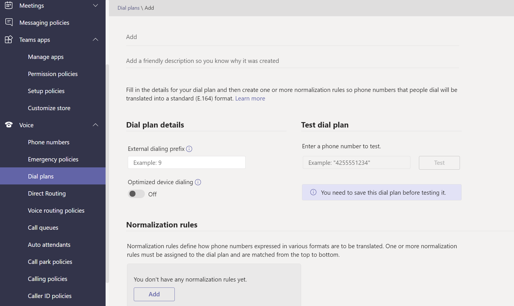

# 음성 및 통화 정책 관리 Microsoft Teams

음성 및 통화 정책은 음성 및 통화를 제어하는 데 Microsoft Teams.

## 긴급 통화 정책

긴급 호출 [정책을](manage-emergency-calling-policies.md) 사용하여 조직의 사용자가 긴급 통화를 할 때 발생하는 기능을 구성합니다. 이러한 정책은 관리 센터 또는 Teams 관리 센터에서 관리 Windows PowerShell.

## 긴급 통화 라우팅 정책

조직에서 직접 라우팅을 전화 시스템 경우 긴급 통화 라우팅  정책을 사용하여 긴급 통화가 라우팅되는 위치, 향상된 응급 서비스를 사용할 수 있는지 여부 및 긴급 서비스에 사용되는 숫자를 확인할 수 있습니다.  이러한 정책은 PowerShell을 사용하여 관리되거나 관리 Microsoft Teams 관리됩니다.

## 발신자 ID 정책

[발신자 ID 정책은](caller-id-policies.md) 발신자 ID를 변경하거나 차단하는 데 사용됩니다.

## 음성 라우팅 정책

음성 [라우팅 정책은](manage-voice-routing-policies.md) PSTN(공용 전환 전화 네트워크) 사용 레코드에 대한 컨테이너입니다. 조직에서 직접 라우팅을 배포한 경우 이러한 **정책을 전화 시스템 수 있습니다.** PowerShell 또는 관리 센터에서 음성 라우팅 정책을 관리할 Teams 있습니다.

## 통화 정책

[통화 정책은](teams-calling-policy.md) 사용자가 개인 통화를 할 수 있는지, 통화 그룹에 전화를 보내고, 음성 메일로 통화를 라우팅할 수 있는지 여부를 포함하여 사용자가 사용할 수 있는 통화 및 통화 전달 기능을 제어합니다.

## 통화 공원 및 정책 검색

[통화 공원 및 검색을](call-park-and-retrieve.md) 사용하면 사용자가 다른 사용자를 보류하고 동일한 사용자 또는 다른 사용자가 통화를 계속할 수 있습니다.

## 다이얼 플랜 만들기 및 관리

[전화 요금제는](create-and-manage-dial-plans.md) 통화 권한 부여 및 라우팅을 위해 전화 걸기 전화 번호를 변환합니다. PowerShell 또는 관리 센터에서 전화 걸기 계획을 만들고 관리할 Microsoft Teams 있습니다.

## 관련 항목

* [긴급 통화 정책 관리 Microsoft Teams](manage-emergency-calling-policies.md)
* [긴급 전화 라우팅 정책 관리](manage-emergency-call-routing-policies.md)
* [Microsoft Teams에서 발신자 ID 정책 관리](caller-id-policies.md)
* [음성 라우팅 정책 관리](manage-voice-routing-policies.md)
* [Microsoft Teams](teams-calling-policy.md)
* [통화 공원을 호출하고 Microsoft Teams](call-park-and-retrieve.md)
* [다이얼 플랜 만들기 및 관리](create-and-manage-dial-plans.md)
* [정책으로 Teams 관리](manage-teams-with-policies.md)
