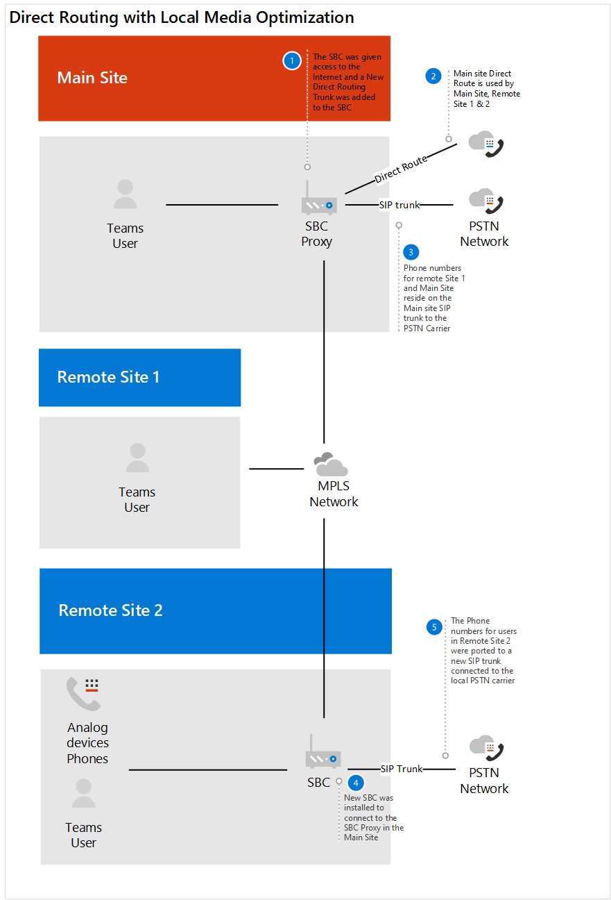
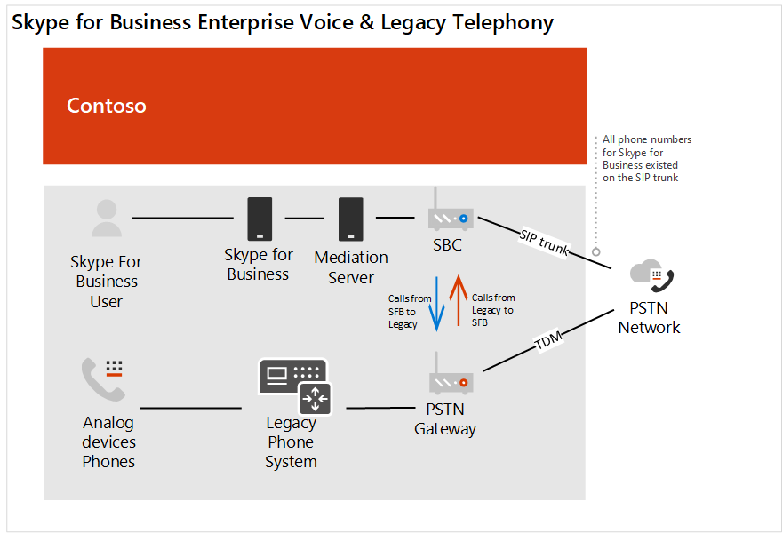

# Contoso 사례 연구: 전화 시스템

지리적 위치 및 기타 요인에 따라 Contoso는 다음 전화 통신 솔루션을 사용 하는 사무실을 보유 하 고 있습니다.

- 사이트 종류 A: 비즈니스용 Skype Enterprise Voice

- 사이트 유형 B: 기존 레거시 전화 통신 시스템

- 사이트 종류 C: 비즈니스용 Skype Enterprise Voice와 기존 기존 전화 통신 시스템의 조합

전체 조직에 대 한 Microsoft 전화 시스템 솔루션을 구현 하기 위해 Contoso는 &mdash; &mdash; 다음 옵션 중 전화 시스템에 사용 하 여 PSTN (공공 교환 전화 네트워크)에 연결 하도록 각 사이트 유형을 결정 해야 했습니다.

- 통화 요금제가 포함 되어 있는 전화 시스템 

- 직접 라우팅을 통한 자체 PSTN 캐리어가 있는 전화 시스템 

- 직접 라우팅을 통해 자체 PSTN 캐리어가 있는 통화 요금제 및 전화 시스템의 조합
 
조직의 올바른 솔루션을 확인 하기 위해 Contoso는 microsoft [전화 통신 솔루션](https://docs.microsoft.com/SkypeForBusiness/hybrid/msft-telephony-solutions) 및 [Microsoft 팀에서](https://myignite.techcommunity.microsoft.com/sessions/83170?source=sessions)Ignite 2019 세션 통화를 사용 했습니다.  

## 사이트 종류 A: 비즈니스용 Skype Enterprise Voice 

Contoso 비즈니스용 Skype Enterprise Voice는 허브 및 스포크로 설정 되었습니다. 국가별 비즈니스용 Skype Enterprise 사용자 용 PSTN에 대 한 연결을 제공 하는 지역에서 PSTN 게이트웨이를 유지 관리 하는 중앙 위치에 있습니다. 일반적으로 이러한 위성 사무실에는 고유한 인터넷 송신이 설치 되어 있지 않습니다. 이러한 사용자의 번호는 기존 SBC에 연결 된 SIP 트렁크에 있습니다. 

이미 배포 된 SBC이 직접 라우팅과 미디어 바이패스에 대해 인증 되었는지 확인 하기 위해 Contoso는 [직접 라우팅에 대해 인증 된 세션 경계 컨트롤러 목록을](direct-routing-border-controllers.md)확인 했습니다.  

사용자의 전화 걸기 습관은 사용자가 피어 투 피어 오디오에 사용할 수 있는 비즈니스용 Skype 클라이언트를 보유 하 고 있는 경우에도 확장을 사용 하 여 레거시 전화 통신 시스템에서 사용자에 게 전화를 거는 것입니다. 

Contoso는 다음 질문에 따라 결정 됩니다.

- Q&a. 온-프레미스 배포에서 제공 하는 기능을 유지 해야 하나요? 
  에서. 아니요 

- Q&a. 타사 PBX 시스템 및 기타 전화 장비와 상호 작용 해야 하나요? 
  에서. 아니요 

- Q&a. 현재 제 3 자 캐리어가 유지 해야 하나요?  A. 예 (규정 국가) 및 아니요 

- Q&a. SBCs의 ROI를 배포 해야 하나요?  A. 예 및 아니요  

- Q&a. 이 지역에서 Microsoft PSTN 통화 요금제를 사용할 수 있나요?  A. 예 및 아니요 

Contoso는 질문에 대 한 답변을 토대로 다음을 결정 했습니다.

- 통화 요금제를 사용 하 여 PSTN 통화 요금제를 사용할 수 있는 지역에 있는 사용자를 이동 합니다. 

- PSTN 통화 요금제를 사용할 수 있는 지역에 있지 않은 사용자, SBCs의 ROI가 아직 충족 되지 않은 사이트에 위치한 사용자, 직접 라우팅이 있는 전화 시스템에 전화 접속 규정이 있는 국가 내 사용자를 이동 합니다. 

다음 다이어그램은 초기 비즈니스용 Skype Enterprise Voice 배포와이 배포를 Microsoft 호출 계획 및 직접 라우팅 둘 다로 마이그레이션하는 방법을 보여줍니다.

## 사이트 유형 B: 기존 레거시 전화 통신 시스템

Contoso는 레거시 전화 통신 시스템을 이용 하는 많은 사무실을 보유 하 고 있습니다. 일부 사용자는 E 1.64 전화 번호를가지고 있고 다른 사람들은 확장명만 있었습니다. 이러한 번호는 PSTN 게이트웨이에 대 한 TDM 트렁크에 있습니다. 내부에서 전화를 거는 위치를 결정 하기 위해 확장 앞에 사이트 코드를 활용 하 여 사이트 내 다이얼 인을 구성 했습니다. 사용자의 전화 걸기 습관은 내선 번호를 기준으로 합니다.   

Contoso는 다음 질문에 따라 결정 됩니다.

- Q&a. 온-프레미스 배포에서 제공 하는 기능을 유지 해야 하나요? 
  에서. 아니요 

- Q&a. 타사 PBX 시스템 및 기타 전화 장비와 상호 작용 해야 하나요?  A. 예

- Q&a. 현재 제 3 자 캐리어가 유지 해야 하나요?  A. 아니요 

- Q&a. Microsoft PSTN의 통화 요금제는이 지역에서 사용할 수 있나요?  A. 예 및 아니요 

Contoso는 질문에 대 한 답변을 토대로 다음을 결정 했습니다. 

- 통화 요금제를 사용 하 여 PSTN 통화 요금제를 사용할 수 있는 지역에 있는 사용자를 이동 합니다. 

- 다이렉트 라우팅이 있는 휴대폰 시스템에서 PSTN 통화 요금제를 사용할 수 있는 지역에 없는 사용자를 이동 합니다. 

- 비즈니스에 중요 한 아날로그 장치에 대 한 PSTN 연결을 유지 합니다.

다음 다이어그램은 원격 사이트와의 원래 레거시 시스템 배포와 로컬 미디어 최적화를 사용 하 여 직접 라우팅 배포로의 마이그레이션을 보여 줍니다.

**원본 레거시 배포**  
 

**직접 라우팅으로 배포**

 
## 사이트 종류 C: 비즈니스용 Skype Enterprise Voice 및 전통적인 레거시 전화 통신 시스템의 조합

Contoso 비즈니스용 Skype Enterprise Voice 사용자의 번호는 통신 회사의 SBC에 대 한 SIP 트렁크에 있습니다. 기존 전화 통신 시스템의 숫자가 PSTN 게이트웨이에 대 한 TDM 트렁크에 상주 합니다.   

Contoso는 다음 질문에 따라 결정 됩니다.

- Q&a. 온-프레미스 배포에서 제공 하는 기능을 유지 해야 하나요? 
  에서. 아니요 

- Q&a. 타사 PBX 시스템 및 기타 전화 장비와 상호 작용 해야 하나요?  A. 아니요 

- Q&a. 현재 제 3 자 캐리어가 유지 해야 하나요?  A. 아니요 

- Q&a. SBCs의 ROI를 배포 해야 하나요?  A. 예 및 아니요  

- Q&a. 이 지역에서 Microsoft의 PSTN 통화 요금제를 사용할 수 있나요?  A. 아니요 

Contoso는 질문에 대 한 답변을 바탕으로 다음을 결정 했습니다. 

- 직접적인 라우팅에 사용 되는 레거시 전화 통신 사용자의 경우,이 SBC는 직접 라우팅에 대 한 자격을가지고 있기 때문에 Contoso는 TDM 트렁크에서 SBC의 SIP 트렁크로 번호를 이식 했습니다. 

- 전화 시스템으로 이동 하는 사용자의 하위 집합을 지원 하 고 레거시 시스템을 통한 지속적인 라우팅이 가능 하도록 하기 위해 기존 전화 통신 시스템을 SBC에 대 한 다음 홉으로 설정 했습니다.   

- 또한 사용자 동작이 변경 되 고 사이트 내 확장 전화 접속에 대 한 종속성을 제거 하기 위해 Contoso는 모든 내부 통화를 위해 팀을 사용할 수 있는 지침을 제공 합니다.  

다음 다이어그램은 원본 비즈니스용 Skype Enterprise Voice와 레거시 전화 통신 시스템 배포 및 직접 라우팅을 사용 하는 혼합 배포로의 마이그레이션을 보여 줍니다.

**원본 혼합 배포** 
 

**직접 라우팅이** 
 

## 통화 플랜

통화 요금제에 대 한 구성 요구 사항을 결정 하기 위해 Contoso는 [호출 계획 핵심 배포 결정](calling-plan-landing-page.md#core-deployment-decisions)을 검토 했습니다. 그 결과 결정을 수행 했습니다. 

- Q&a. 사용자에 게 국제 통화가 필요 한가요?  A. 예 

- Q&a. 내 사용자에 게 직접 안쪽으로 전달 된 전화 번호가 있습니까?  A. 오늘이 아닙니다. 모든 사용자가을 (를) 받게 됩니다. 

- Q&a. 발신자 ID를 마스킹 또는 사용 하지 않도록 설정 하 시겠습니까?  A. 사용자의 발신자 ID는 Contoso의 지역 번호로 마스킹된 것입니다. 

## 직접 라우팅

Contoso는 전화 시스템 및 다이렉트 라우팅과 함께 제공 되는 Office 365 기능을 최신 상태로 유지할 수 있도록 Ignite을 유인 했습니다. 기술 리더십 및 설계자는 Ignite 2019 중 제공 된 지침을 사용 하 여 방향을 결정 합니다.  사용 된 키 세션: 

- [Microsoft 팀의 성공 계획 직접 라우팅](https://myignite.techcommunity.microsoft.com/sessions/80381?source=sessions)

- [직접 라우팅에 대 한 업데이트](https://myignite.techcommunity.microsoft.com/sessions/80381?source=sessions)

## 구성

### 통화 계획 사이트

라이선스를 얻고 전화 번호를 사용자에 게 할당 하기 위해 Contoso는 [통화 계획 설정](set-up-calling-plans.md)의 단계를 팔 로우 합니다. 

전화 번호를 할당 해야 하는 사용자 수 때문에 Contoso는 PowerShell을 사용 하 여 전화 번호를 할당 하기로 결정 했습니다. &mdash; &mdash; [팀 powershell 개요](teams-powershell-overview.md)를 사용 하는 다른 설정 외에 PowerShell을 사용 하 여 번호를 할당 하는 방법에 대해 알아보세요.  

### 다이렉트 라우팅 사이트

Contoso의 온-프레미스 전화 통신 인프라를 Microsoft 팀에 연결 하기 위해 Contoso의 관리자는 [직접 라우팅 구성](direct-routing-configure.md) 단계를 따라 [Microsoft 팀의 비디오 다이렉트 라우팅을](https://www.youtube.com/watch?v=1ASftX_Msb8&index=10&list=PLaSOUojkSiGnKuE30ckcjnDVkMNqDv0Vl) 검토 했습니다.  Contoso는 또한 인증 된 SBC 공급 업체의 직접적인 라우팅 배포 문서 라고도 합니다. 

SBC 및 Microsoft 전화 시스템 간에 직접 라우팅이 구성 된 후에는 Contoso가 구성을 테스트 해야 했습니다. 이를 위해 Contoso 관리자는 [Ignite 2019에서 다이렉트 라우팅 세션에 대 한 업데이트](https://myignite.techcommunity.microsoft.com/sessions/83178?source=sessions)에서 설명한 SIP 테스터 클라이언트를 사용 했습니다. 직접 라우팅 세션 경계 컨트롤러 연결을 테스트 하기 위해 SIP 테스터 클라이언트 스크립트와 문서가 PowerShell 스크립트에서 다운로드 되었습니다.   

### 로컬 미디어 최적화

Contoso는 전세계 여러 지역에서 로컬 미디어 최적화를 활용할 수 있는 기회를 보았습니다. Contoso에 대해 지원 되는 시나리오는 [직접적인 라우팅에 대 한 로컬 미디어 최적화](direct-routing-media-optimization.md)에 설명 되어 있습니다. SBC 공급 업체와 Microsoft가 제공 하는 지침에 따라 로컬 미디어 최적화의 구성을 완료 했습니다. 로컬 미디어 최적화를 위한 구성 단계에는 다음이 포함 됩니다. 

- 사용자 및 SBC 사이트 구성 

- SBC 공급 업체 사양에 따라 SBC를 구성 합니다. 

- 로컬 미디어 최적화에 사용 되는 각 사이트에 외부의 신뢰할 수 있는 IP 주소 추가    

- 네트워크 토폴로지 정의 

- 가상 네트워크 토폴로지 정의 

- 모드 결정: 항상 무시 하거나 로컬 사용자만 

## 네트워킹 고려 사항

Contoso에는 전화 시스템을 사용 하도록 설정한 후 오랜 시간 동안 원격으로 작업 해야 하는 많은 사용자가 있었습니다. 사용자가 VPN을 사용 하 여 특정 lob 응용 프로그램에 액세스 합니다. VPN을 진행 하는 동안 전화 시스템 사용자는 통화 품질의 저하를 경험 했습니다. 

품질 문제를 해결 하기 위해 Contoso는 VPN 분할 터널링을 구현 하 여 내부 앱에 대 한 연결이 VPN에 남아 있는 동안 해당 Office 365 트래픽이 인터넷을 통과할 수 있도록 했습니다. VPN 분할 터널링을 구현 하기 위해 Contoso는 [Office 365 vpn 분할 터널링을 구현](https://docs.microsoft.com/office365/enterprise/office-365-vpn-implement-split-tunnel)하는 지침을 팔 로우 합니다.  

 

