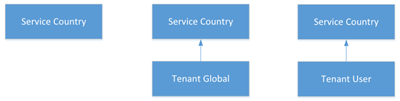

# 다이얼 플랜 이란?

다이얼 플랜은 통화 권한 부여 및 통화 라우팅과 같은 목적으로 개별 사용자가 사용 하는 전화 번호를 대체 형식 (일반적으로 E)으로 변환 하는 정규화 규칙의 명명 된 집합입니다.

다이얼 플랜은 다양 한 형식으로 표현 된 전화 번호가 대체 형식으로 변환 되는 방식을 정의 하는 하나 이상의 정규화 규칙으로 구성 됩니다. 같은 다이얼 문자열은 다른 다이얼 플랜에서 다르게 해석 및 번역 될 수 있으므로 지정 된 사용자에 게 지정 된 다이얼 플랜에 따라 동일한 전화 번호를 번역 하 여 회람할 수 있습니다.

[다이얼 플랜 만들기 및 관리](create-and-manage-dial-plans.md) 를 참조 하 여 테 넌 트 다이얼 플랜을 만들고 관리 합니다.

## 테 넌 트 다이얼 플랜 범위

다이얼 플랜의 범위는 다이얼 플랜을 적용할 수 있는 계층 수준을 결정 합니다. 범위는 비즈니스용 Skype Server 온-프레미스 배포와 다릅니다. 클라이언트는 사용자가 비즈니스용 Skype Online에 로그온 할 때 자동으로 제공 되는 프로비저닝 설정을 통해 적절 한 다이얼 플랜을 가져옵니다. 관리자는 원격 PowerShell을 사용 하 여 다이얼 플랜 범위 수준을 관리 하 고 할당할 수 있습니다.

비즈니스용 Skype Online에는 서비스 범위와 테 넌 트 (조직의 경우) 범위의 다이얼 플랜이 두 가지 종류가 있습니다. 서비스 범위 다이얼 플랜은 Office 365 전화 시스템을 사용할 수 있는 모든 국가 또는 지역에 대해 정의 됩니다. 각 사용자에 게는 사용자에 게 할당 된 Office 365 사용 위치와 일치 하는 서비스 국가 다이얼 플랜을 자동으로 할당 합니다. 서비스 국가 다이얼 플랜을 변경할 수는 없지만, 테 넌 트 범위 다이얼 플랜을 만들면 서비스 국가 다이얼 플랜이 증가 합니다. 클라이언트가 구축 됨에 따라 서비스 국가 다이얼 플랜 및 적절 하 게 범위가 지정 된 테 넌 트 다이얼 플랜의 조합인 "효과적인 다이얼 플랜"이 제공 됩니다. 따라서, 테 넌 트 다이얼 플랜에 모든 정규화 규칙을 정의할 필요는 없습니다.

테 넌 트 다이얼 플랜을 두 개의 범위 (테 넌 트 범위 또는 사용자 범위)로 나눌 수 있습니다. 테 넌 트가 사용자 범위 다이얼 플랜을 정의 하 고 할당 한 경우 해당 사용자는 사용자의 서비스 국가 다이얼 플랜 및 지정 된 사용자 다이얼 플랜의 효과적인 다이얼 플랜을 사용 하 여 프로 비전 됩니다. 테 넌 트가 테 넌 트 범위 다이얼 플랜을 정의 하지만 사용자 범위 다이얼 플랜을 할당 하지 않으면 해당 사용자는 사용자의 서비스 국가 다이얼 플랜 및 테 넌 트 다이얼 플랜에 대 한 효과적인 다이얼 플랜을 사용 하 여 프로 비전 됩니다.

다음은 팀과 비즈니스용 Skype Online의 다이얼 플랜에 대 한 상속 모델입니다.

다음과 같은 효과적인 다이얼 플랜을 사용할 수 있습니다.

 **서비스 국가** 테 넌 트 범위 다이얼 플랜이 정의 되어 있지 않고 프로 비전 된 사용자에 게 할당 된 테 넌 트 사용자 범위 지정 다이얼 플랜이 없는 경우 사용자는 해당 Office 365 사용 위치와 연결 된 서비스 국가에 매핑된 효과적인 다이얼 플랜을 받습니다.

 **테 넌 트 글로벌 서비스 국가** 테 넌 트 사용자 다이얼 플랜이 정의 되었지만 사용자에 게 할당 되지 않은 경우, 프로 비전 된 사용자는 병합 된 테 넌 트 다이얼 플랜 및 Office 365 사용 위치와 관련 된 서비스 국가 다이얼 플랜으로 구성 된 효과적인 다이얼 플랜을 받습니다.

 **테 넌 트 사용자-서비스 국가** 테 넌 트 사용자 다이얼 플랜이 정의 되 고 사용자에 게 할당 된 경우, 프로 비전 된 사용자는 병합 된 테 넌 트 사용자 다이얼 플랜 및 Office 365 사용 위치와 관련 된 서비스 국가 다이얼 플랜으로 이루어진 효과적인 다이얼 플랜을 받습니다.

[다이얼 플랜 만들기 및 관리](create-and-manage-dial-plans.md) 를 참조 하 여 테 넌 트 다이얼 플랜을 만듭니다.

## 테 넌 트 다이얼 플랜 계획

사용자 지정 다이얼 플랜을 계획 하려면 다음 단계를 따르세요.

- **1 단계** 사용자의 전화 걸기 환경을 향상 시키기 위해 사용자 지정 다이얼 플랜이 필요한 지 여부를 결정 합니다. 일반적으로 내선 번호와 같이 E가 아닌 비 164 전화 걸기를 지원 해야 합니다.

- **2 단계** 테 넌 트 전역 또는 테 넌 트 사용자 범위 다이얼 플랜이 필요한 지 여부 또는 둘 다를 결정 합니다. 사용자에 게 다른 로컬 전화 걸기 요구 사항이 있는 경우 사용자 범위 다이얼 플랜이 필요 합니다.

- **3 단계** 필요한 각 다이얼 플랜의 유효한 번호 패턴을 식별 합니다. 서비스 수준 국가 다이얼 플랜에 정의 되어 있지 않은 숫자 패턴만 필요 합니다.

- **4 단계** 다이얼 플랜의 이름을 지정 하기 위한 조직 차원의 스키마를 개발 합니다. 표준 명명 스키마를 채택 하면 조직 전체의 일관성을 보장 하 고 유지 관리 및 업데이트를 쉽게 할 수 있습니다.

[Fasttrack](https://fasttrack.microsoft.com/microsoft365/capabilities?view=voice) 에는 테 넌 트 다이얼 플랜을 구현 하는 데 도움이 되는 추가 리소스 및 파트너가 있습니다.

## 새 테 넌 트 다이얼 플랜 만들기

새 다이얼 플랜을 만들 때는 필요한 정보를 입력 해야 합니다.

### 이름 및 단순한 이름

사용자 다이얼 플랜의 경우 다이얼 플랜이 할당 되는 사용자를 식별 하는 설명적인 이름을 지정 해야 합니다. 다이얼 플랜의 단순한 이름에는 다이얼 플랜 이름에서 파생 된 문자열이 미리 채워져 있습니다. 간단한 이름 필드는 편집 가능 하며,이를 통해 다이얼 플랜에 대 한 보다 설명적인 명명 규칙을 만들 수 있습니다. 간단한 이름 값은 비워 둘 수 없으며 고유 해야 합니다. 전체 조직의 명명 규칙을 개발한 다음 모든 사이트와 사용자에 게 일관 되 게이 규칙을 사용 하는 것이 가장 좋습니다.

### 설명

해당 하는 다이얼 플랜이 적용 되는 지리적 위치 또는 사용자 그룹의 인식 가능한 일반적인 이름을 입력 하는 것이 좋습니다.

### 외부 액세스 접두사

외부 회선을 얻으려면 사용자가 하나 이상의 추가 선행 번호 (예: 9)로 전화를 걸어야 하는 경우 최대 4 자 (#, *, 0-9)로 외부 액세스 접두사를 지정할 수 있습니다.

> [!NOTE]
> 외부 액세스 접두사를 지정 하는 경우 접두사를 수용할 수 있는 추가 정규화 규칙을 만들 필요가 없습니다. 

[다이얼 플랜 만들기 및 관리](create-and-manage-dial-plans.md) 를 참조 하 여 테 넌 트 다이얼 플랜을 만듭니다.

## 정규화 규칙

정규화 규칙은 다양 한 형식으로 표시 되는 전화 번호를 번역 하는 방법을 정의 합니다. 같은 숫자 문자열은이를 거는 로케일에 따라 다르게 해석 하 고 번역할 수 있습니다. 사용자가 약어 내부 또는 외부 번호로 전화를 걸 수 있어야 하는 경우에는 정규화 규칙이 필요할 수 있습니다.

하나 이상의 정규화 규칙을 다이얼 플랜에 할당 해야 합니다. 정규화 규칙은 위에서 아래로 일치 하므로 테 넌 트 다이얼 플랜에 표시 되는 순서는 중요 합니다. 예를 들어, 테 넌 트 다이얼 플랜에 10 개의 정규화 규칙이 있는 경우, 두 번째 정규화 규칙 (일치 하는 항목이 없는 경우)에 대 한 전화 걸기 번호 일치 논리를 시작 하는 데 실패 하 게 됩니다. 일치 하는 항목이 있는 경우 해당 규칙이 사용 되 고 정의 된 다른 규칙을 일치 시킬 필요가 없습니다. 지정 된 테 넌 트 다이얼 플랜에는 최대 25 개의 정규화 규칙이 있을 수 있습니다.

### 필요한 정규화 규칙 결정

모든 테 넌 트 다이얼 플랜은 지정 된 사용자의 서비스 국가 다이얼 플랜에 효과적으로 병합 되므로, 필요한 테 넌 트 다이얼 플랜 정규화 규칙을 결정 하기 위해 서비스 국가 다이얼 플랜의 정규화 규칙을 평가 해야 할 수 있습니다. **CsEffectiveTenantDialPlan** cmdlet을이 용도로 사용할 수 있습니다. Cmdlet은 사용자의 id를 입력 매개 변수로 사용 하 고 사용자에 게 적용 되는 모든 정규화 규칙을 반환 합니다.

### 정규화 규칙 만들기

정규화 규칙에서는 검색 문자열을 변환 하는 데 사용 되는 숫자 일치 패턴을 지정 하기 위해 서버에서 역방향 번호 조회를 수행 하기 위한 목적으로이 정규식을 사용 합니다. 정규화 규칙은 일치 항목에 대 한 정규식과 일치 하는 항목을 발견 했을 때 수행할 번역을 지정 하 여 만들 수 있습니다. 완료 되 면 테스트 번호를 입력 하 여 정규화 규칙이 예상 대로 작동 하는지 확인할 수 있습니다.

.NET Framework 정규식을 사용 하는 방법에 대 한 자세한 내용은 [.Net Framework 정규식](https://go.microsoft.com/fwlink/p/?linkId=140927)을 참조 하세요.

[다이얼 플랜 만들기 및 관리](create-and-manage-dial-plans.md) 를 참조 하 여 테 넌 트 다이얼 플랜에 대 한 정규화 규칙을 만들고 관리 합니다.

### 예제 정규화 규칙

다음 표에는 .NET Framework 정규식으로 작성 된 예제 정규화 규칙이 나와 있습니다. 샘플은 예일 뿐 이며 고유한 정규화 규칙을 만들기 위한 규범적 참조 일 수 없습니다.

 **.NET Framework 정규식을 사용 하는 정규화 규칙**

||||||
|:-----|:-----|:-----|:-----|:-----|
|**규칙 이름**   |**설명**   |**번호 패턴**   |**변환용**   |**예**   |
|4digitExtension    |4 자리 확장명을 변환 합니다.    |^ (\\d{4}) $    |+ 1425555 $1    |0100는 + 14255550100로 변환 됩니다.    |
|5digitExtension    |다섯 자리 확장명을 변환 합니다.    |^ 5 (\\d{4}) $    |+ 1425555 $1    |50100는 + 14255550100로 변환 됩니다.    |
|7digitcallingRedmond    |7 자리 숫자를 Redmond 지역 번호로 변환 합니다.    |^ (\\d{7}) $    |+ 1425 $1    |5550100는 + 14255550100로 변환 됩니다.   |
|RedmondOperator    |0에서 레드먼드 연산자로 변환 합니다.    |^ $0    |+ 14255550100    |0이 + 14255550100로 변환 됩니다.    |
|RedmondSitePrefix    |A-net 접두사 (6) 및 Redmond 사이트 코드 (222)를 사용 하 여 숫자를 번역 합니다.    |^ 6222 (\\d{4}) $    |+ 1425555 $1    |62220100는 + 14255550100로 변환 됩니다.    |
|5digitRange    |3-7부터 10 까지의 숫자 범위로 시작 하는 5 자리 확장명을 변환 합니다.    |^ ([3-7]\\d{4}) $    |+ 142555 $1   |54567는 + 14255554567로 변환 됩니다.    |
|PrefixAdded    |첫 번째 및 세 번째 숫자에 대 한 제한 사항이 적용 된 9 자리 숫자 앞에 국가 접두사를 추가 합니다.    |^ ([2-9]\\d\\d [2-9]\\d{6}) $    |1 $1    |4255554567는 14255554567로 변환 됩니다.    |
|NoTranslation    |5 자리를 찾았지만 번역은 하지 않습니다.    |^ (\\d{5}) $    |$1    |34567는 34567로 변환 됩니다.    |

 **위의 정규화 규칙에 따라 Redmond 다이얼 플랜입니다.**

| 다음 표에서는 이전 표에 표시 된 표준화 규칙에 따라 Redmond, 인천, 미국에 대 한 예제 다이얼 플랜을 보여 줍니다. |
|:---------------------------------------------------------------------------------------------------------------------------------------------------------|
| **레드먼드 다이얼 플랜**                                                                                                                                |
| 5digitExtension                                                                                                                                      |
| 7digitcallingRedmond                                                                                                                                 |
| RedmondSitePrefix                                                                                                                                    |
| RedmondOperator                                                                                                                                      |

> [!NOTE]
> 앞의 표에 나와 있는 정규화 규칙 이름에는 공백이 포함 되지 않지만, 선택 하는 것이 중요 합니다. 예를 들어 표의 이름에는 "5 자리 내선" 또는 "5 자리 내선 번호"가 기록 되 고 여전히 유효 합니다. 

## 관련 항목

[다이얼 플랜 만들기 및 관리](create-and-manage-dial-plans.md)

[전화 번호 전송 일반적인 질문](transferring-phone-numbers-common-questions.md)

[통화 요금제에 사용 되는 다른 종류의 전화 번호](different-kinds-of-phone-numbers-used-for-calling-plans.md)

[조직의 전화 번호 관리](manage-phone-numbers-for-your-organization/manage-phone-numbers-for-your-organization.md)
[응급 통화 약관](emergency-calling-terms-and-conditions.md)

[비상 전화 고 지 사항 레이블](https://github.com/MicrosoftDocs/OfficeDocs-SkypeForBusiness/blob/live/Teams/downloads/emergency-calling/emergency-calling-label-(en-us)-(v.1.0).zip?raw=true)
