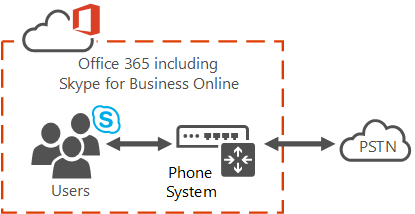

# Office 365의 전화 시스템 이란?What is Phone System in Office 365?

**전화 시스템** 은 비즈니스용 Skype Online 및 Microsoft 팀을 사용 하 여 Office 365 클라우드에서 통화 제어 및 PBX 기능을 사용 하도록 설정 하기 위한 Microsoft 기술입니다.**Phone System** is the Microsoft technology for enabling call control and PBX capabilities in the Office 365 cloud with Skype for Business Online and Microsoft Teams. 전화 시스템을 사용 하면 기존 PBX 시스템을 클라우드 환경에 긴밀 하 게 통합 된 Office 365에서 제공 하는 기능 집합으로 바꿀 수 있습니다.Phone System allows you to replace your existing PBX system with a set of features delivered from Office 365 that is tightly integrated into your cloud experience. 기능에 대 한 자세한 내용은 [Office 365에서 전화 시스템을 사용 하 여 얻을 수](here-s-what-you-get-with-phone-system.md)있는 기능을 참조 하세요.For more about the features, see [Here's what you get with Phone System in Office 365](here-s-what-you-get-with-phone-system.md).
  
전화 시스템을 통해 사용자는 비즈니스용 Skype Online 및 Microsoft 팀을 사용 하 여 전화를 걸고 받고, 통화를 전송 하 고, 전화를 음소거 또는 음소거 해제 할 수 있습니다.With Phone System, users can use Skype for Business Online and Microsoft Teams to place and receive calls, transfer calls, and mute or unmute calls. 전화 시스템 사용자는 주소록의 이름을 클릭 하 고 비즈니스용 Skype 또는 Microsoft 팀이 해당 사용자에 게 전화를 걸 수 있습니다.Phone System users can click a name in their address book, and Skype for Business or Microsoft Teams calls to that person. 전화를 걸고 받으려면 휴대폰 시스템 사용자가 모바일 장치, 랩톱이 나 PC와 함께 헤드셋을 사용 하거나 비즈니스용 Skype 및 Microsoft 팀에서 작동 하는 여러 IP 휴대폰 중 하나를 사용할 수 있습니다.To place and receive calls, Phone System users can use their mobile devices, a headset with a laptop or PC, or one of many IP phones that work with Skype for Business and Microsoft Teams. 전화 시스템 관리자는 메시징, 공동 작업 등의 동일한 콘솔에서 전화 옵션 및 설정을 관리할 수 있습니다.Phone System admins can manage calling options and settings from the same console used for messaging, collaboration, and so on.
  
기존 PBX 시스템을 사용 하는 경우 조직의 사용자 간 통화는 전화 시스템 내에서 내부적으로 처리 되며 PSTN으로 이동 하지 않습니다.With traditional PBX systems, calls between users in your organization are handled internally within Phone System, and never go to the PSTN. 이는 조직의 사용자 간 여러 지리적 영역에 해당 하는 통화에 적용 되며, 이러한 내부 통화에 대 한 장거리 비용을 제거 합니다.This applies to calls between users in your organization located in different geographical areas, removing long-distance costs on these internal calls.
  
유선전화 및 휴대폰으로 전화를 걸 수 있게 하려면 다음 두 가지 방법 중 하나를 사용 하 여 PSTN에 휴대폰 시스템을 연결 합니다.To enable calls to landlines and mobile phones, Phone System can be connected to the PSTN in one of two ways:
  
- Office 365에 대 한 전화 요금제 (국내 또는 국내 및 국제)를 구입 합니다.Purchase a Calling Plan (domestic or domestic and international) for Office 365. [전화 시스템 및 통화 요금제](calling-plan-landing-page.md) 보기See [Phone System and Calling Plans](calling-plan-landing-page.md)

- 온-프레미스 PSTN 연결을 사용 합니다. 여기서는 구내 소프트웨어가 기존 전화 통신 인프라와 연결 됩니다.Use on-premises PSTN connectivity, where software on premises connects with your existing telephony infrastructure. [Microsoft 전화 통신 솔루션](https://docs.microsoft.com/SkypeForBusiness/hybrid/msft-telephony-solutions)을 참조 하세요.See [Microsoft telephony solutions](https://docs.microsoft.com/SkypeForBusiness/hybrid/msft-telephony-solutions).

## 통화 요금제에 대 한 자세한 정보More about Calling Plans

Office 365에서 통화 요금제 추가 기능을 사용 하면 PSTN 연결을 통해 전 세계의 유선전화 및 휴대 전화로 전화를 걸 수 있습니다 (사용 허가 된 서비스 수준에 따라 다름).Using a Calling Plan add-on to Phone System in Office 365 enables PSTN connectivity for calling to landlines and mobile phones around the world (depending on the licensed service level). 사용자가 클라우드에 있고 Microsoft에서 제공 하는 통화 요금제 추가 기능을 사용 하 여 전화 시스템을 사용할 수 있습니다.Your users are homed in the cloud and are enabled for Phone System with the Calling Plan add-on provided by Microsoft. 통화 요금제에는 온-프레미스 서버 배포가 필요 하지 않습니다.Calling Plans don't require an on-premises server deployment. 통화 플랜은 Office 365의 전화 시스템 에서만 작동 하며 다른 PBX 시스템에서는 통화 요금제를 사용할 수 없습니다.Calling Plans only work with Phone System in Office 365, and you can't use Calling Plans with another PBX system.

호출 계획은 Office 365 내에서 작동 하기 때문에이는 온-프레미스 서버 배포가 필요 하지 않은 클라우드를 모두 제공 하는 것입니다.Because Calling Plans operate within Office 365, this is an all-cloud offering that doesn't require an on-premises server deployment. 전화를 걸 각 사용자에 게 할당 되는 국내 또는 국내 및 국제 통화 요금제를 사용 하는 것이 선택 되어 있습니다.You have the choice of using a Domestic or Domestic and International Calling Plan, which is assigned to each user that you want to make calls. [자세한 정보를 알고 싶은](calling-plan-landing-page.md)경우[Want to know more?](calling-plan-landing-page.md).
  
비즈니스용 Skype Online 또는 Office 365의 Microsoft 팀에서 홈을 사용 하는 사용자는 Office 365 음성 서비스에 액세스할 수 있습니다.Users who are homed in Skype for Business Online or Microsoft Teams in Office 365 have access to Office 365 voice services. Microsoft는 핵심 통화 및 PSTN 서비스의 공급자 이며 사용자의 전화 번호를 제공 하거나 이식 하는 것도 가능 합니다.Microsoft is the provider of both core calling and PSTN services, and can even provide or port your users' phone numbers.
  
Office 365의 통화 요금제를 사용 하 여 조직의 사용자에 게 전화 번호를 검색 하 고 취득 하 고 할당 하 여 조직 내부 및 외부 사용자와 전화를 걸고 받을 수 있습니다.Calling Plans in Office 365 allows you to search, acquire, and assign phone numbers to users in your organization so that users can make and receive phone calls with people inside and outside of your organization.
  
사용자가 음성 통화를 보내고 받을 수 있는 전화 번호를 사용 하는 모든 유형의 비즈니스는 비즈니스에 중요 한 요구 사항입니다.All types of business use a phone number that allows users to send and receive voice calls is an important requirement to do business. 전화 번호는 사용자를 식별 하 고 조직 간의 통신을 허용 하는 데 주로 사용 됩니다.Phone numbers are often used to identify a user and allow for communication across organizations. 전화 번호가 지정 된 사용자는 VoIP 전화기, Pc, 모바일 장치를 포함 하 여 모든 비즈니스용 Skype 및 Microsoft 팀 장치에서 음성 통화를 할 수 있습니다.Users who are assigned phone numbers are able to make voice calls across all Skype for Business and Microsoft Teams devices, including VoIP phones, PCs, and mobile devices.

통화 요금제 (국내 및 국제)는 특정 하지만 증가 하는 지리적 위치에서 사용할 수 있습니다.Calling Plans (domestic and international) are available in specific but growing geographic locations. 국가 또는 지역에서 [사용 가능 여부](country-and-region-availability-for-audio-conferencing-and-calling-plans/country-and-region-availability-for-audio-conferencing-and-calling-plans.md) 를 확인 합니다.Check for [availability](country-and-region-availability-for-audio-conferencing-and-calling-plans/country-and-region-availability-for-audio-conferencing-and-calling-plans.md) in your country or region.

**시작할 준비가 되셨습니까?****Ready to get started?**  사용자에 대 한 통화 요금제를 설정 하려면 [통화 요금제 설정을](set-up-calling-plans.md)참조 하세요.To set up your calling plans for your users, see [Set up Calling Plans](set-up-calling-plans.md).  

## 서비스를 사용 하는 전화 시스템Phone System with Services

 전화 시스템은 서비스 및 보이스 메일에도 사용할 수 있습니다.Phone System can also be used for services and voicemail:

- **자동 전화 교환**  Office 365 자동 전화 교환에서 전화 시스템을 사용 하 여 외부 및 내부 발신자가 메뉴 시스템에서 이동 하 여 조직의 회사 사용자 또는 부서에 게 전화를 걸거나 보내거나 양도할 수 있도록 하는 조직의 메뉴 시스템을 만듭니다.**Auto attendants**  Phone System in Office 365 auto attendants can be used to create a menu system for your organization that lets external and internal callers move through a menu system to locate and place or transfer calls to company users or departments in your organization. [클라우드 자동 전화 교환 기능](what-are-phone-system-auto-attendants.md) 보기See [What are Cloud auto attendants?](what-are-phone-system-auto-attendants.md)

- **통화 대기열**  전화 시스템을 사용 하면 다른 사람이 조직의 전화 번호로 전화할 때 사용 되는 통화 대기열 인사말을 만들 수 있습니다.**Call queues**  With Phone System, you can create call queue greetings that are used when someone calls in to a phone number for your organization. 여기에는 통화 대기를 자동으로 전환 하는 기능과 전화를 걸고 있는 사용자가 대기 중인 음악을 수신 대기 하는 동안 통화를 처리 하기 위해 사용할 수 있는 다음 통화 에이전트를 검색 하는 기능이 포함 됩니다.This includes the ability to automatically put the calls on hold and the ability to search for the next available call agent to handle the call while the people who call are listening to music on hold. 조직에 대 한 단일 또는 복수 통화 대기열을 만들 수 있습니다.You can create single or multiple call queues for your organization. [클라우드 통화 대기열 만들기를](/SkypeForBusiness/what-is-phone-system-in-office-365/create-a-phone-system-call-queue)참조 하세요.See [Create a Cloud call queue](/SkypeForBusiness/what-is-phone-system-in-office-365/create-a-phone-system-call-queue).

- 보이스 **메일** 사용자에 대 한 전화 시스템 라이선스를 받으면 해당 사용자는 발신자에 의해 남겨진 보이스 메일을 받을 수 있습니다.**Voicemail** When you get a Phone System license for a user, that user is able to get voicemail that has been left by callers. 전화 시스템 라이선스와 전화 번호를 할당 한 후 사용자에 대 한 클라우드 보이스 메일이 자동으로 설정 되 고 프로 비전 됩니다.Cloud Voicemail is automatically set up and provisioned for users after you assign a Phone System license and a phone number to them. [클라우드 보이스 메일 설정을](set-up-phone-system-voicemail.md)참조 하세요.See [Set up Cloud Voicemail](set-up-phone-system-voicemail.md).

시작할 준비가 되었으면 [조직의 전화 시스템 설정을](setting-up-your-phone-system.md)참조 하세요.If you're ready to get started, see [Setting up Phone System in your organization](setting-up-your-phone-system.md).

## 관련 항목Related topics

- [Microsoft 팀 추가 기능 라이선스Microsoft Teams add-on licensing](teams-add-on-licensing/microsoft-teams-add-on-licensing.md)
- [조직의 전화 번호 관리Manage phone numbers for your organization](manage-phone-numbers-for-your-organization/manage-phone-numbers-for-your-organization.md)
- [통화 요금제에 사용 되는 다른 종류의 전화 번호Different kinds of phone numbers used for Calling Plans](different-kinds-of-phone-numbers-used-for-calling-plans.md)
- [비즈니스용 Skype Online에서 전화 받기Getting phones for Skype for Business Online](/skypeforbusiness/what-is-phone-system-in-office-365/getting-phones-for-skype-for-business-online/getting-phones-for-skype-for-business-online)
